# Go LLM Gateway：从第一条代理请求开始

这是一个循序渐进的 Go 大模型网关实践项目。从最小代理开始，逐步实现模型路由、流式传输、并发管理、持久化任务、性能分析和请求限流，理解每个设计决策及其取舍。

项目可独立运行，内置 Mock LLM，无需模型账号即可完成全部教程与本地实验。源码仓库：[songofhawk/go-llm-gateway](https://github.com/songofhawk/go-llm-gateway)。

## 先看整体：同一个网关，两种交付方式



[查看 Mermaid 源图](docs/diagrams/overview.mmd)

先沿上方的聊天路径读：提出问题 → 网关选择模型 → 接收完整 JSON 或持续到来的数据块。再看后台路径：先拿任务号，稍后查询结果；客户端不必一直保持连接。查询任务时也要经过 HTTP 入口（图中未展开），客户端不会直接连接数据库。

**还不熟悉 Go 时，先读第 1 步的图并运行 Mock；遇到语法再查第 0 步。**每课都按“问题 → 图解 → 具体例子 → 代码与实验”展开。所有图均附可编辑的 Mermaid 源文件，同时提供 SVG，普通 Markdown 阅读器也能显示。

## 学习路线

| 顺序 | 入口 | 学完能回答什么 |
| --- | --- | --- |
| 0 | [Go 入门速查](docs/00-go-basics.md) | goroutine、channel、context、interface、defer 分别解决什么问题？ |
| 1 | [最小代理](docs/01-proxy.md) / `lessons/01-proxy` | 怎样用 Go 把一次请求转发出去，并逐块返回？ |
| 2 | [模型与 fallback](docs/02-routing.md) / `internal/gateway` | 为什么 provider 与模型档次分开？何时可以重试？ |
| 3 | [并发与生命周期](docs/03-concurrency.md) | 为什么长流收到 HTTP 头还不能释放名额？如何做背压？ |
| 4 | [持久化任务](docs/04-jobs.md) / `internal/jobs` | 请求返回后谁拥有任务？重启怎么恢复？ |
| 5 | [故障实验与设计复盘](docs/05-labs.md) | 怎样用失败实验，而不是“看起来正常”，证明设计？ |
| 6 | [Mock 与 pprof 压测](docs/06-pprof.md) | 真实长流负载下，CPU、内存和协程在做什么？ |
| 7 | [请求速率限流](docs/07-rate-limiting.md) | 令牌桶与并发限制有什么区别，如何控制突发？ |

第一课是独立、可运行的标准库代理。从第 2 步起逐步完善同一个 `cmd/gateway` 入口，按模块阅读与验证。[实施计划](PLAN.md) 记录实现阶段，[验收记录](VALIDATION.md) 记录实测结果。

## 运行准备

安装 Go 1.26 或更高版本，并确认 `go version` 可用。然后在此目录执行：

```sh
go mod download
go test ./...
go test -race ./...
go vet ./...
```

Go 安装包与安装说明见 [Go 官方下载页](https://go.dev/dl/)。

核心网关只使用标准库；异步任务使用 `database/sql` 和纯 Go SQLite 驱动 `modernc.org/sqlite`，不需要 C 编译器来运行项目（竞态检测的环境要求另见 Go 官方说明）。

## 不需要模型账号的本地演示

在三个独立终端分别启动可控的模拟供应商：

```sh
go run ./cmd/mock-provider -addr localhost:9090
go run ./cmd/mock-provider -addr localhost:9091
go run ./cmd/mock-provider -addr localhost:9092
```

在第四个终端运行完整网关：

```sh
go run ./cmd/gateway -config config.example.json
```

一次性调用：

```sh
curl -sS http://localhost:8080/v1/chat/completions \
  -H 'Content-Type: application/json' \
  -d '{"model":"economy","messages":[{"role":"user","content":"介绍一下 Go"}],"stream":false}'
```

流式调用只改 `stream`，同时给 curl 加 `-N` 关闭客户端缓冲：

```sh
curl -N -i http://localhost:8080/v1/chat/completions \
  -H 'Content-Type: application/json' \
  -d '{"model":"powerful","messages":[{"role":"user","content":"介绍一下 Go"}],"stream":true}'
```

异步提交立即返回 `202`、任务 `id` 和 `Location`，把返回的 ID 填入查询：

```sh
curl -sS http://localhost:8080/v1/jobs \
  -H 'Content-Type: application/json' \
  -d '{"model":"balanced","messages":[{"role":"user","content":"后台生成报告"}]}'
curl -sS http://localhost:8080/v1/jobs/返回的任务ID
```

任务结果保存在当前目录的 `gateway.db`。`done` 表示结果已保存，并且确定性的后处理（结果摘要和长度）已经写入数据库。异步接口要求 `stream=false`；流式是客户端交付方式，后台任务最终要一个完整结果。

按 Ctrl-C 停止网关：它停止接收请求，取消后台任务，前台最多等待 5 秒后强制取消。未完成后台任务在下次启动时恢复。

## 接入真实兼容供应商

复制 `config.example.json` 为已被 Git 忽略的 `config.local.json`。将端点 `base_url` 改成供应商的 Chat Completions 基础地址（通常以 `/v1` 结尾），将 `api_key_env` 设置为环境变量名，修改各档的真实 `model`。不要把密钥写进 JSON。

```sh
# 通过终端安全注入供应商密钥变量；配置中仅引用它的名字。
go run ./cmd/gateway -config config.local.json
```

配置结构：`endpoints` 定义供应商实例和总并发容量；`routes` 的每个档次是“候选组的列表”。同组按占用比例最小选择，组间按顺序 fallback。相同供应商可以映射不同模型，但共享并发容量。

客户端的 `model` 是 `economy`（经济型）、`balanced`（均衡型）或 `powerful`（高能力型），省略时默认 `balanced`。这些名称表示路由档次，具体供应商和模型由配置映射。`messages`、`tools`、`temperature` 等其余字段透传。流式输出保留供应商 SSE，必须以完整 `data: [DONE]` 事件结束。响应头 `X-Gateway-Provider` / `X-Gateway-Model` 展示实际选择。

模型兼容性由配置维护：fallback 模型也必须支持请求中的工具、多模态、推理参数。网关不偷偷删除这些参数，也不推断供应商模型能力。

## 当前实现的边界

- 支持 OpenAI Chat Completions **兼容协议**，未实现原生 Anthropic、Bedrock、Vertex、Responses API，也未声称完全兼容任一官方 SDK。
- 单进程网关、单进程独占 SQLite 文件。固定 worker 与容量控制用于教学；尚无多副本租约、分布式限流、租户隔离或生产运维系统。
- 有并发上限、负载均衡、有限 fallback；第 7 步提供可选的单进程全局请求速率限制；尚无 LLM token 配额、熔断器、自动扩容或“百万并发”保证。同步/异步共享供应商容量，尚无严格公平调度或保留配额。
- 默认仅监听 localhost。设置 `GATEWAY_TOKEN` 后所有接口需 `Authorization: Bearer ...`；非回环监听强制要求该变量。真实对外服务仍需要 TLS 和按用户授权。
- fallback、崩溃恢复都可能产生重复供应商调用/费用；提交端暂未实现幂等键。后处理示例是数据库内幂等更新，不能据此承诺外部邮件、扣款等副作用只发生一次。
- 活跃任务有容量上限，历史完成记录不会自动删除；持续运行应制定保留/清理策略。磁盘满会使 worker 报错并停止服务，避免虚报任务完成。
- 中文注释说明资源所有权与设计原因，教程结合语法、实验和取舍展开。模型路由、容量管理与任务状态迁移均使用明确的程序规则。

## 使用 Mock 做压力测试

运行 `bash scripts/stress.sh` 自动完成七类本机场景，并保存 pprof 原始采样及请求统计。已发布的精简结果位于 `docs/stress-results`，不含 196MB 本机临时构建产物。操作步骤见 [第六课](docs/06-pprof.md)，实测结果见 [压测报告](docs/STRESS-REPORT.md)。

## 第 7 步：开启请求速率限流

完整网关增加 `-rate 10 -burst 20` 即启用全局令牌桶，聊天调用与异步提交共享额度，超限返回 429 和 Retry-After。默认两个参数均为 0，关闭速率限流；原有并发与队列上限仍然生效。算法、长流规则与实验见 [第七步教程](docs/07-rate-limiting.md)。
