# 00：先认识代码中的 Go

不要先啃完一本语言手册。先运行第一课，再对照本页理解遇到的语法。

## 先抓住三个词：任务、共享状态、收尾

把网关想成一个同时处理多个问题的小程序：每个请求都要等待模型，但等待时不能挡住其他请求。



[查看 Mermaid 源图](diagrams/00-shared-work.mmd)

**沿着图走一遍：**请求 A 占好名额后就去等网络；B 可以马上占另一个名额，不必等 A 的答案。`goroutine` 是 Go 调度的轻量并发任务，`Mutex` 是保护共享计数的短锁。锁如果一直拿到 A 的模型返回，B 就会被白白挡住。

这里假设容量足够；容量不足时怎样拒绝，留到第 3 步。也不需要给每个 HTTP handler 再套一层 `go func()`，标准库 HTTP 服务本身已经并发处理请求。

## 遇到语法时再查这张表

| Go | 在本项目中的意思 | 容易误解的地方 |
| --- | --- | --- |
| `package gateway` | 同目录文件属于同一包 | `internal` 限制只能从父项目内导入 |
| `func f(...) (T, error)` | 返回结果和错误 | Go 没有把普通错误当异常，必须检查 `err` |
| `:=` | 声明并推断局部变量类型 | 后续赋值用 `=` |
| `struct` | 一组字段，比如 Request | Go 没有类继承，通常用组合 |
| `*Gateway` | 指向同一个 Gateway 的指针 | 多个 goroutine 可见同一状态，需要同步 |
| `map[string]Provider` | 字符串到 provider 的映射 | 普通 map 并发读写不安全；本项目启动后不修改路由 |
| `[]Target` | 一组可变长度候选 | slice 是底层数组的视图，复制 slice 不一定复制数据 |
| `interface` | 对行为的约束 | 方法符合就实现，无需显式 `implements` |
| `defer body.Close()` | 当前函数返回时关闭 body | 不是所在循环迭代结束时运行 |
| `go f()` | 启动 goroutine | 并不自动限流，也不自动随请求结束 |
| `chan struct{}` | 容量名额，不传业务数据 | 发入一个空值占位，取出一个值释放 |
| `select` | 等待某个 channel 事件 | 带 `default` 是立即检查，不会排队等待 |
| `context.Context` | 传递取消和截止时间 | context 本身不会杀死 goroutine，被调用代码必须响应 |
| `sync.Mutex` | 保护共享状态 | 锁内做网络 I/O 会把高并发退化成串行 |
| `sync.WaitGroup` | 等一组 goroutine 真正结束 | 取消信号发出不等于任务已退出 |

## 用一个调用理解所有权



[查看 Mermaid 源图](diagrams/00-ownership.mmd)

**具体例子：**一个请求已经占用了名额，客户端读到第 2 块就离开。函数走错误返回也必须清理，不能只在“完整答案成功返回”的分支清理。`defer` 就是先登记收尾动作，等当前函数退出时执行。

对照下面四行：`err` 是失败结果；`return` 提前结束函数；`defer` 登记清理；`Close` 归还资源。图只讨论流式 Body 的所有权，一次性 JSON 会在网关读完整个响应后先释放上游资源。

```go
result, err := gateway.Do(ctx, request)
if err != nil {
    return err
}
defer result.Body.Close()
// 消费 Body；函数成功或失败返回，都会执行 Close。
```

`Do` 成功之后，调用者拥有 Body。对流式调用，Body 同时拥有上游 HTTP 连接、context 取消函数和并发名额。`Close` 并非只是清理内存，而是归还外部资源。

`defer` 后进先出。本项目 handler 先占入口名额，再拿上游 Body，因此返回时先关闭上游，再归还入口名额。不要把循环里每个上游尝试的释放都 defer 到整个请求结束，否则失败尝试仍占着容量。

## 接口为什么只有一个方法

`Provider.Open(ctx, model, request)` 只负责发送协议请求。它不知道路由策略、后台任务表、用户 HTTP 请求。测试用一个小函数就可以替换它，模拟 429、超时或长流。

`Gateway` 组合多个 Provider 来决定“谁执行”。`API` 负责“如何接收和返回 HTTP”。`jobs.Store` 负责“任务事实如何持久化”。划分依据是变更原因，而不是为了多建目录。

## 建议第一次读代码的顺序

1. `lessons/01-proxy/main.go`：先让 HTTP 转发跑通。
2. `internal/gateway/types.go`：看输入、接口和配置类型。
3. `provider.go`：顺着一次 HTTP 请求看 context 和 body。
4. `router.go`：看选择、占位、失败、释放。
5. `http.go`：看 SSE 刷新、客户端取消、容量拒绝。
6. `internal/jobs/jobs.go`：看后台生命周期与持久化。
7. `cmd/gateway/main.go`：回头看这些小模块如何组装。

每读完一个模块，运行对应测试，再故意注释掉一处资源释放，观察哪项测试失败；实验后恢复改动。

官方学习入口：[A Tour of Go](https://go.dev/tour/)、[context](https://pkg.go.dev/context)、[net/http](https://pkg.go.dev/net/http)、[竞态检测](https://go.dev/doc/articles/race_detector)。

下一步：[第 1 步：最小代理](01-proxy.md)。
