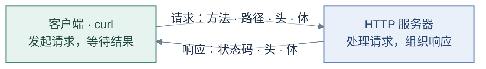
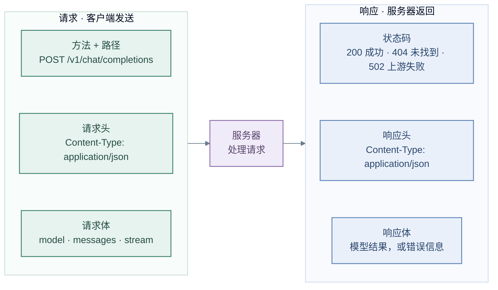
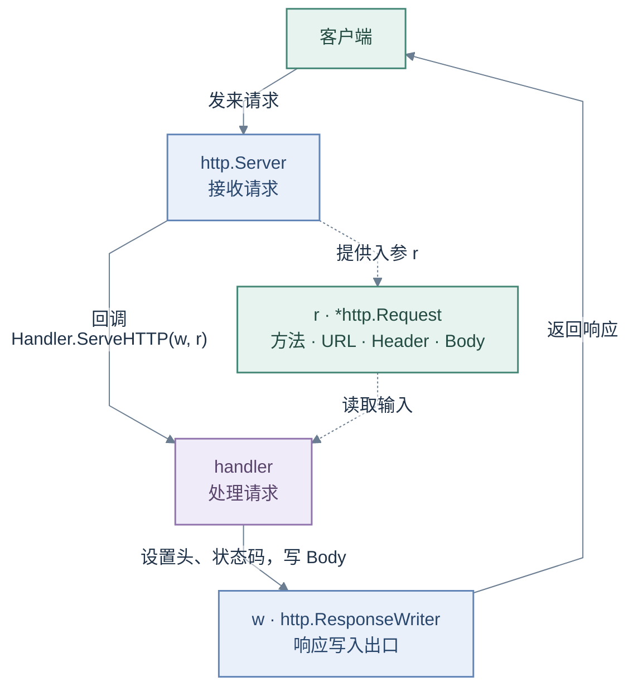
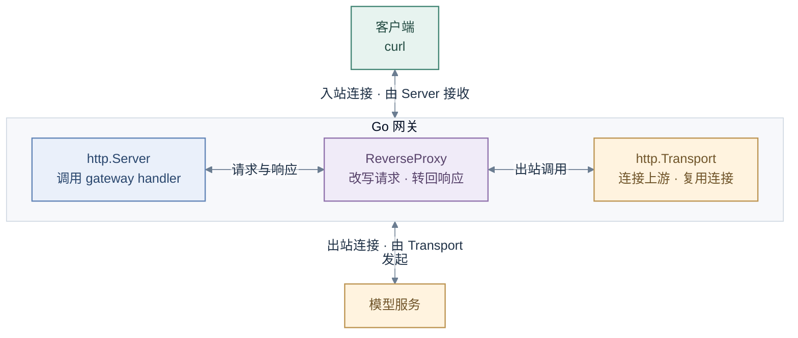
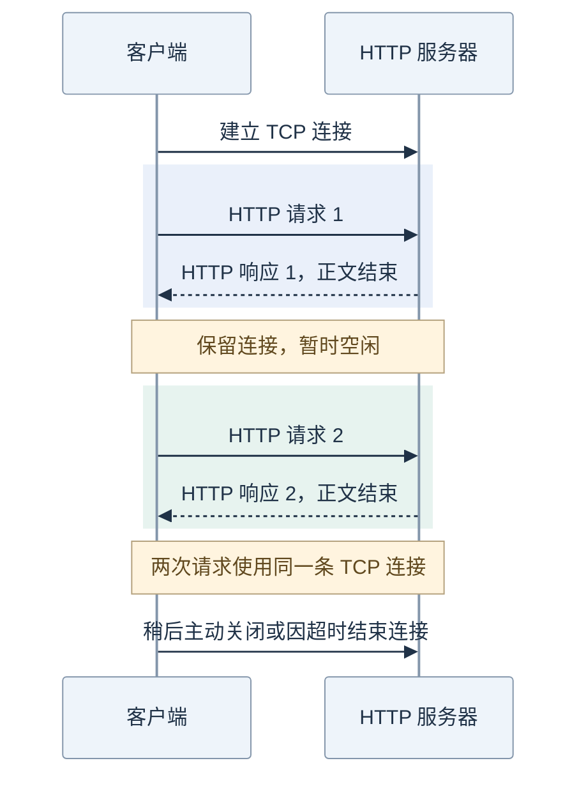
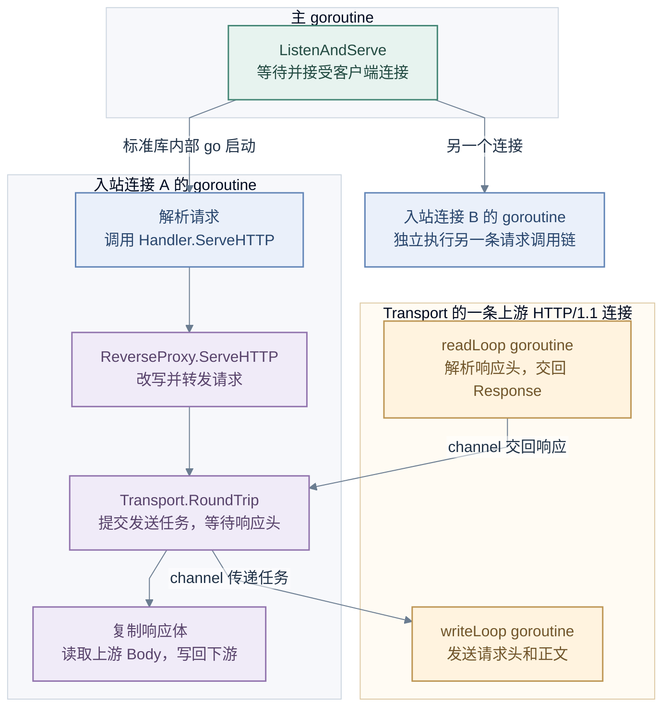
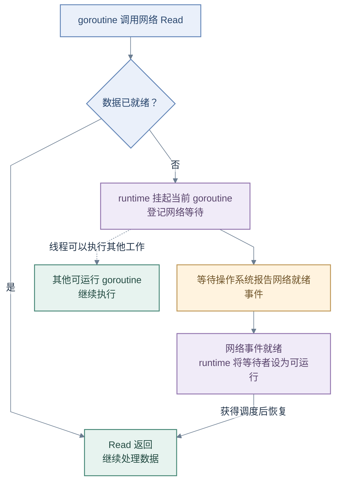
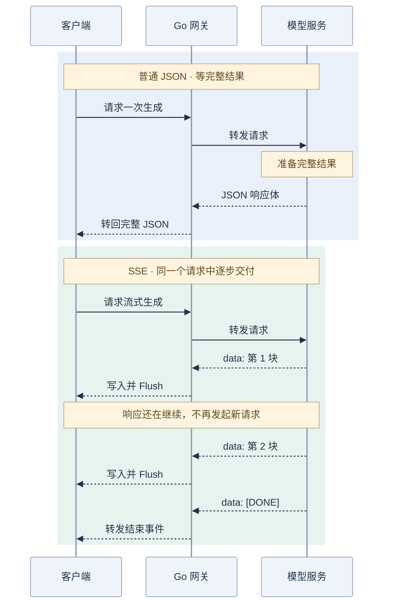
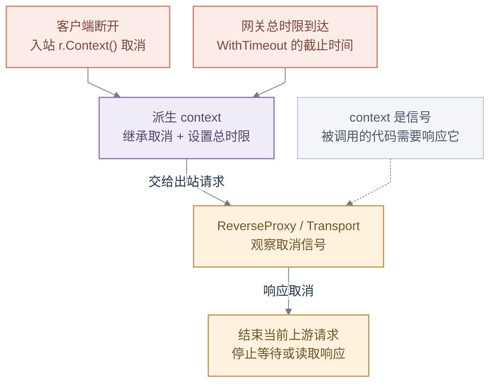
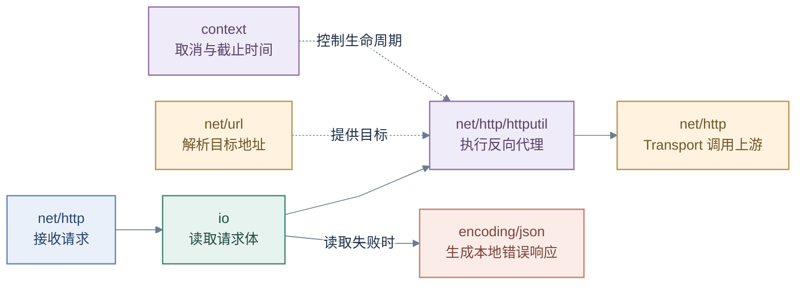

# 00：先认识 HTTP 和 Go 的 HTTP 标准库

这页是第 1 课的预备知识，不是 Go 语法词典，也不提前逐行讲代理代码。目标是先听懂第 1 课会反复出现的词：HTTP 请求与响应、handler、`Request`、`ResponseWriter`、`Server`、`ReverseProxy`、`Transport`，以及连接复用、goroutine 和网络等待。下一页会把这些概念放进一个真正运行的代理里。

## 一次 HTTP 请求是什么

HTTP 是客户端和服务器之间的一次请求与响应。客户端发请求，服务器回响应：


```mermaid
---
config:
  theme: "base"
  fontFamily: "Arial, PingFang SC, Microsoft YaHei, sans-serif"
  themeVariables:
    fontSize: "16px"
    primaryColor: "#eef4fa"
    primaryTextColor: "#203247"
    primaryBorderColor: "#8496ab"
    lineColor: "#6b7d91"
    secondaryColor: "#eaf6f1"
    tertiaryColor: "#fff4df"
    noteBkgColor: "#fff4df"
    noteTextColor: "#61491f"
    noteBorderColor: "#b4a17d"
    actorBkg: "#eef4fa"
    actorBorder: "#8496ab"
    actorTextColor: "#203247"
    edgeLabelBackground: "#FFFFFF"
  flowchart:
    htmlLabels: false
    curve: "linear"
    nodeSpacing: 30
    rankSpacing: 38
    useMaxWidth: true
  sequence:
    useMaxWidth: true
    wrap: true
    actorMargin: 40
    width: 150
    messageMargin: 30
    noteMargin: 12
  state:
    useMaxWidth: true
---
flowchart LR
    accTitle: HTTP 的一次请求与响应
    accDescr: 客户端向服务器发送方法、路径、请求头和请求体，服务器返回状态码、响应头和响应体。
    C["客户端 · curl<br/>发起请求，等待结果"] -->|"请求：方法 · 路径 · 头 · 体"| S["HTTP 服务器<br/>处理请求，组织响应"]
    S -->|"响应：状态码 · 头 · 体"| C
    classDef client fill:#E7F3EF,stroke:#448675,color:#234B42,stroke-width:1.5px;
    classDef server fill:#EAF0FA,stroke:#6285B7,color:#29466D,stroke-width:1.5px;
    class C client;
    class S server;
```

[查看 Mermaid 源图](diagrams/00-http-exchange.mmd)

在第 1 课中，客户端是 `curl`，Go 程序是 HTTP 服务器。Go 程序随后又作为客户端去请求模型服务，因此同一个程序会同时处在两条 HTTP 连接的两端：


```mermaid
---
config:
  theme: "base"
  fontFamily: "Arial, PingFang SC, Microsoft YaHei, sans-serif"
  themeVariables:
    fontSize: "16px"
    primaryColor: "#eef4fa"
    primaryTextColor: "#203247"
    primaryBorderColor: "#8496ab"
    lineColor: "#6b7d91"
    secondaryColor: "#eaf6f1"
    tertiaryColor: "#fff4df"
    noteBkgColor: "#fff4df"
    noteTextColor: "#61491f"
    noteBorderColor: "#b4a17d"
    actorBkg: "#eef4fa"
    actorBorder: "#8496ab"
    actorTextColor: "#203247"
    edgeLabelBackground: "#FFFFFF"
  flowchart:
    htmlLabels: false
    curve: "linear"
    nodeSpacing: 30
    rankSpacing: 38
    useMaxWidth: true
  sequence:
    useMaxWidth: true
    wrap: true
    actorMargin: 40
    width: 150
    messageMargin: 30
    noteMargin: 12
  state:
    useMaxWidth: true
---
flowchart LR
    accTitle: 网关同时是下游的服务器和上游的客户端
    accDescr: curl请求网关的HTTP服务，网关另发一个HTTP请求给模型服务。这是两次HTTP交互。
    C["curl<br/>下游客户端"]
    subgraph G["Go 网关 · 同一个程序"]
        direction LR
        IN["服务器角色<br/>接收 curl 的请求"] -->|"处理并转发"| OUT["客户端角色<br/>请求模型服务"]
    end
    U["模型服务<br/>上游服务器"]
    C <-->|"下游 HTTP 交互"| IN
    OUT <-->|"上游 HTTP 交互"| U
    classDef client fill:#E7F3EF,stroke:#448675,color:#234B42,stroke-width:1.5px;
    classDef server fill:#EAF0FA,stroke:#6285B7,color:#29466D,stroke-width:1.5px;
    classDef upstream fill:#FFF3DF,stroke:#BD9553,color:#70552A,stroke-width:1.5px;
    class C,OUT client;
    class IN server;
    class U upstream;
    style G fill:#F7F8FB,stroke:#CDD6E0,color:#33445B;
```

[查看 Mermaid 源图](diagrams/00-http-roles.mmd)

“上游”和“下游”是相对网关说的：模型服务是上游，等待答案的调用者是下游。

## 请求和响应里装什么


```mermaid
---
config:
  theme: "base"
  fontFamily: "Arial, PingFang SC, Microsoft YaHei, sans-serif"
  themeVariables:
    fontSize: "16px"
    primaryColor: "#eef4fa"
    primaryTextColor: "#203247"
    primaryBorderColor: "#8496ab"
    lineColor: "#6b7d91"
    secondaryColor: "#eaf6f1"
    tertiaryColor: "#fff4df"
    noteBkgColor: "#fff4df"
    noteTextColor: "#61491f"
    noteBorderColor: "#b4a17d"
    actorBkg: "#eef4fa"
    actorBorder: "#8496ab"
    actorTextColor: "#203247"
    edgeLabelBackground: "#FFFFFF"
  flowchart:
    htmlLabels: false
    curve: "linear"
    nodeSpacing: 30
    rankSpacing: 38
    useMaxWidth: true
  sequence:
    useMaxWidth: true
    wrap: true
    actorMargin: 40
    width: 150
    messageMargin: 30
    noteMargin: 12
  state:
    useMaxWidth: true
---
flowchart LR
    accTitle: HTTP 请求与响应的组成
    accDescr: 请求包含方法路径、请求头和请求体，响应包含状态码、响应头和响应体。图中的卡片表示组成部分，不表示多次网络调用。
    subgraph Q["请求 · 客户端发送"]
        direction TB
        Q1["方法 + 路径<br/>POST /v1/chat/completions"]
        Q2["请求头<br/>Content-Type: application/json"]
        Q3["请求体<br/>model · messages · stream"]
        Q1 ~~~ Q2 ~~~ Q3
    end
    H["服务器<br/>处理请求"]
    subgraph P["响应 · 服务器返回"]
        direction TB
        P1["状态码<br/>200 成功 · 404 未找到 · 502 上游失败"]
        P2["响应头<br/>Content-Type: application/json"]
        P3["响应体<br/>模型结果，或错误信息"]
        P1 ~~~ P2 ~~~ P3
    end
    Q --> H --> P
    classDef request fill:#E7F3EF,stroke:#448675,color:#234B42,stroke-width:1.5px;
    classDef response fill:#EAF0FA,stroke:#6285B7,color:#29466D,stroke-width:1.5px;
    classDef handler fill:#F0EBF8,stroke:#9173AD,color:#58436B,stroke-width:1.5px;
    class Q1,Q2,Q3 request;
    class P1,P2,P3 response;
    class H handler;
    style Q fill:#F8FCFA,stroke:#BDD6CB,color:#234B42;
    style P fill:#F8FAFE,stroke:#C5D4E9,color:#29466D;
```

[查看 Mermaid 源图](diagrams/00-http-message.mmd)

第 1 课使用的请求大致长这样：

```http
POST /v1/chat/completions HTTP/1.1
Host: localhost:8081
Content-Type: application/json

{"model":"demo-small","messages":[{"role":"user","content":"介绍一下 Go"}],"stream":false}
```

| 部分 | 例子 | 用途 |
| --- | --- | --- |
| 方法（method） | `POST` | 表示这次请求要做什么；本课只允许 POST |
| 路径（path） | `/v1/chat/completions` | 表示要调用服务器上的哪个接口 |
| 请求头（headers） | `Content-Type: application/json` | 描述请求体格式等附加信息 |
| 请求体（body） | JSON 对象 | 携带模型名、消息和其他参数 |

服务器返回的响应也有几部分：状态码说明结果（例如 `200`、`404`、`502`），响应头描述响应体（例如 `Content-Type`），响应体则装 JSON 或流式数据。HTTP 状态码是协议给客户端看的结果；Go 函数里的 `error` 是程序内部用来表示失败的值。程序需要决定如何把内部错误转换成 HTTP 响应。


```mermaid
---
config:
  theme: "base"
  fontFamily: "Arial, PingFang SC, Microsoft YaHei, sans-serif"
  themeVariables:
    fontSize: "16px"
    primaryColor: "#eef4fa"
    primaryTextColor: "#203247"
    primaryBorderColor: "#8496ab"
    lineColor: "#6b7d91"
    secondaryColor: "#eaf6f1"
    tertiaryColor: "#fff4df"
    noteBkgColor: "#fff4df"
    noteTextColor: "#61491f"
    noteBorderColor: "#b4a17d"
    actorBkg: "#eef4fa"
    actorBorder: "#8496ab"
    actorTextColor: "#203247"
    edgeLabelBackground: "#FFFFFF"
  flowchart:
    htmlLabels: false
    curve: "linear"
    nodeSpacing: 30
    rankSpacing: 38
    useMaxWidth: true
  sequence:
    useMaxWidth: true
    wrap: true
    actorMargin: 40
    width: 150
    messageMargin: 30
    noteMargin: 12
  state:
    useMaxWidth: true
---
flowchart LR
    accTitle: Go 错误值如何变成 HTTP 响应
    accDescr: 以请求体超限为例，读取操作返回Go错误值，handler检查错误类型，再写HTTP 413和JSON错误响应。
    B["请求体超过上限"] --> E["读取器返回 Go error<br/>http.MaxBytesError"]
    E --> H["handler 检查错误类型<br/>决定如何回答客户端"]
    H --> R["HTTP 响应<br/>413 + JSON 错误信息"]
    classDef error fill:#FBECE8,stroke:#C77F70,color:#7B473C,stroke-width:1.5px;
    classDef handler fill:#F0EBF8,stroke:#9173AD,color:#58436B,stroke-width:1.5px;
    classDef response fill:#EAF0FA,stroke:#6285B7,color:#29466D,stroke-width:1.5px;
    class B,E error;
    class H handler;
    class R response;
```

[查看 Mermaid 源图](diagrams/00-http-error.mmd)

**沿图读：**读取失败产生 `error`，handler 判断错误类型并选择状态码；这个例子返回 413。HTTP 响应需要由程序明确写出。

## `net/http`：接收请求并写回响应


```mermaid
---
config:
  theme: "base"
  fontFamily: "Arial, PingFang SC, Microsoft YaHei, sans-serif"
  themeVariables:
    fontSize: "16px"
    primaryColor: "#eef4fa"
    primaryTextColor: "#203247"
    primaryBorderColor: "#8496ab"
    lineColor: "#6b7d91"
    secondaryColor: "#eaf6f1"
    tertiaryColor: "#fff4df"
    noteBkgColor: "#fff4df"
    noteTextColor: "#61491f"
    noteBorderColor: "#b4a17d"
    actorBkg: "#eef4fa"
    actorBorder: "#8496ab"
    actorTextColor: "#203247"
    edgeLabelBackground: "#FFFFFF"
  flowchart:
    htmlLabels: false
    curve: "linear"
    nodeSpacing: 30
    rankSpacing: 38
    useMaxWidth: true
  sequence:
    useMaxWidth: true
    wrap: true
    actorMargin: 40
    width: 150
    messageMargin: 30
    noteMargin: 12
  state:
    useMaxWidth: true
---
flowchart TB
    accTitle: Server 调用 handler，Request 是输入，ResponseWriter 是输出
    accDescr: net/http服务器收到请求后构造Request与ResponseWriter，回调Handler.ServeHTTP。handler读Request并通过ResponseWriter写响应。
    C["客户端"] -->|"发来请求"| S["http.Server<br/>接收请求"]
    S -->|"回调 Handler.ServeHTTP(w, r)"| H["handler<br/>处理请求"]
    R["r · *http.Request<br/>方法 · URL · Header · Body"] -.->|"读取输入"| H
    H -->|"设置头、状态码，写 Body"| W["w · http.ResponseWriter<br/>响应写入出口"]
    W -->|"返回响应"| C
    S -.->|"提供入参 r"| R
    classDef client fill:#E7F3EF,stroke:#448675,color:#234B42,stroke-width:1.5px;
    classDef server fill:#EAF0FA,stroke:#6285B7,color:#29466D,stroke-width:1.5px;
    classDef handler fill:#F0EBF8,stroke:#9173AD,color:#58436B,stroke-width:1.5px;
    class C,R client;
    class S,W server;
    class H handler;
```

[查看 Mermaid 源图](diagrams/00-http-handler.mmd)

Go 标准库的 `net/http` 包提供 HTTP 服务器和请求/响应类型。第 1 课会用到：

| Go 名字 | 在 HTTP 里负责什么 |
| --- | --- |
| `http.Server` | 在一个地址上监听，接收进入的请求 |
| `http.Handler` | 约定“如何处理一个请求”的接口 |
| `http.Request` | 保存收到的请求，包括方法、路径、请求头、请求体和取消信号 |
| `http.ResponseWriter` | handler 用来设置响应头、状态码并写响应体的出口 |
| `http.Transport` | 执行到上游的出站 HTTP 请求，并管理和复用连接 |

`http.Handler` 的约定可以缩写为：

```go
type Handler interface {
    ServeHTTP(ResponseWriter, *Request)
}
```

服务器收到请求后，会调用设置在 `Server.Handler` 上的 handler。也就是说，`ServeHTTP` 通常不是 `main` 手动调用的；它是 `net/http` 按接口约定回调的入口。`Request` 是“收到什么”，`ResponseWriter` 是“要回什么”。

一个最小 handler 看起来像这样：

```go
import (
    "io"
    "net/http"
)

func hello(w http.ResponseWriter, r *http.Request) {
    w.Header().Set("Content-Type", "text/plain")
    w.WriteHeader(http.StatusOK)
    _, _ = io.WriteString(w, "hello")
}
```

这里 `w` 和 `r` 只是参数名：`w` 用来写响应，`r` 用来读请求。`http.HandlerFunc` 可以把这种函数接到 HTTP 路由上。第 1 课则定义了一个有状态的 `gateway` 类型，并让它的方法满足同一个 `Handler` 接口。


```mermaid
---
config:
  theme: "base"
  fontFamily: "Arial, PingFang SC, Microsoft YaHei, sans-serif"
  themeVariables:
    fontSize: "16px"
    primaryColor: "#eef4fa"
    primaryTextColor: "#203247"
    primaryBorderColor: "#8496ab"
    lineColor: "#6b7d91"
    secondaryColor: "#eaf6f1"
    tertiaryColor: "#fff4df"
    noteBkgColor: "#fff4df"
    noteTextColor: "#61491f"
    noteBorderColor: "#b4a17d"
    actorBkg: "#eef4fa"
    actorBorder: "#8496ab"
    actorTextColor: "#203247"
    edgeLabelBackground: "#FFFFFF"
  flowchart:
    htmlLabels: false
    curve: "linear"
    nodeSpacing: 30
    rankSpacing: 38
    useMaxWidth: true
  sequence:
    useMaxWidth: true
    wrap: true
    actorMargin: 40
    width: 150
    messageMargin: 30
    noteMargin: 12
  state:
    useMaxWidth: true
---
flowchart LR
    accTitle: 示例 handler 写响应的顺序
    accDescr: hello示例先设置Content-Type，再写状态码200，最后写hello响应体。Header调用本身只修改待发送的头。
    A["1 · 准备响应头<br/>w.Header().Set(...)"] --> B["2 · 写状态码<br/>w.WriteHeader(200)"]
    B --> C["3 · 写响应体<br/>io.WriteString(w, hello)"]
    C --> D["客户端看到<br/>200 + text/plain + hello"]
    classDef server fill:#EAF0FA,stroke:#6285B7,color:#29466D,stroke-width:1.5px;
    classDef handler fill:#F0EBF8,stroke:#9173AD,color:#58436B,stroke-width:1.5px;
    classDef client fill:#E7F3EF,stroke:#448675,color:#234B42,stroke-width:1.5px;
    class A,B server;
    class C handler;
    class D client;
```

[查看 Mermaid 源图](diagrams/00-http-response.mmd)

**对照代码读：**三次调用分别负责响应头、状态码和响应体。先设置好响应头，再发送状态码和内容；响应已经发送后，不能再修改发出的状态码。

## `httputil.ReverseProxy`：把请求从一端转到另一端

服务器收到请求后，handler 可以自己处理，也可以委托给另一个组件。第 1 课用 `net/http/httputil` 包里的 `ReverseProxy`，在下游客户端和上游模型服务之间转发请求和响应：


```mermaid
---
config:
  theme: "base"
  fontFamily: "Arial, PingFang SC, Microsoft YaHei, sans-serif"
  themeVariables:
    fontSize: "16px"
    primaryColor: "#eef4fa"
    primaryTextColor: "#203247"
    primaryBorderColor: "#8496ab"
    lineColor: "#6b7d91"
    secondaryColor: "#eaf6f1"
    tertiaryColor: "#fff4df"
    noteBkgColor: "#fff4df"
    noteTextColor: "#61491f"
    noteBorderColor: "#b4a17d"
    actorBkg: "#eef4fa"
    actorBorder: "#8496ab"
    actorTextColor: "#203247"
    edgeLabelBackground: "#FFFFFF"
  flowchart:
    htmlLabels: false
    curve: "linear"
    nodeSpacing: 30
    rankSpacing: 38
    useMaxWidth: true
  sequence:
    useMaxWidth: true
    wrap: true
    actorMargin: 40
    width: 150
    messageMargin: 30
    noteMargin: 12
  state:
    useMaxWidth: true
---
flowchart TB
    accTitle: Server、ReverseProxy 与 Transport 的分工
    accDescr: 入站请求经Server调用gateway handler，handler交给ReverseProxy，ReverseProxy通过Transport调用上游。响应沿相反方向返回。
    C["客户端<br/>curl"]
    subgraph G["Go 网关"]
        direction LR
        S["http.Server<br/>调用 gateway handler"] <-->|"请求与响应"| P["ReverseProxy<br/>改写请求 · 转回响应"]
        P <-->|"出站调用"| T["http.Transport<br/>连接上游 · 复用连接"]
    end
    U["模型服务"]
    C <-->|"入站连接 · 由 Server 接收"| G
    G <-->|"出站连接 · 由 Transport 发起"| U
    classDef client fill:#E7F3EF,stroke:#448675,color:#234B42,stroke-width:1.5px;
    classDef server fill:#EAF0FA,stroke:#6285B7,color:#29466D,stroke-width:1.5px;
    classDef proxy fill:#F0EBF8,stroke:#9173AD,color:#58436B,stroke-width:1.5px;
    classDef upstream fill:#FFF3DF,stroke:#BD9553,color:#70552A,stroke-width:1.5px;
    class C client;
    class S server;
    class P proxy;
    class T,U upstream;
    style G fill:#F7F8FB,stroke:#CDD6E0,color:#33445B;
```

[查看 Mermaid 源图](diagrams/00-proxy-components.mmd)

这几个名字容易混淆，可以这样区分：

- `http.Server` 接收别人发给网关的请求。
- `httputil.ReverseProxy` 决定如何改写并转发请求，以及如何转回响应。
- `http.Transport` 负责实际向上游建立 HTTP 请求和复用连接。

因此，`Server` 面向下游，`Transport` 面向上游；`ReverseProxy` 把两边接起来。第 1 课还会用 `net/url` 解析上游基础地址，再把路径固定到 Chat Completions 接口。

## HTTP 请求结束时，连接一定断开吗？

一次 HTTP 请求与响应，通常通过一条 TCP 连接传输。HTTP/1.1 默认支持持久连接（keep-alive）：一份响应结束后，连接可以保留，用来发送下一次请求。下面把请求的生命周期和连接的生命周期分开画：


```mermaid
---
config:
  theme: "base"
  fontFamily: "Arial, PingFang SC, Microsoft YaHei, sans-serif"
  themeVariables:
    fontSize: "16px"
    primaryColor: "#eef4fa"
    primaryTextColor: "#203247"
    primaryBorderColor: "#8496ab"
    lineColor: "#6b7d91"
    secondaryColor: "#eaf6f1"
    tertiaryColor: "#fff4df"
    noteBkgColor: "#fff4df"
    noteTextColor: "#61491f"
    noteBorderColor: "#b4a17d"
    actorBkg: "#eef4fa"
    actorBorder: "#8496ab"
    actorTextColor: "#203247"
    edgeLabelBackground: "#FFFFFF"
  flowchart:
    htmlLabels: false
    curve: "linear"
    nodeSpacing: 30
    rankSpacing: 38
    useMaxWidth: true
  sequence:
    useMaxWidth: true
    wrap: true
    actorMargin: 40
    width: 150
    messageMargin: 30
    noteMargin: 12
  state:
    useMaxWidth: true
---
sequenceDiagram
    accTitle: 一条 TCP 连接可以承载多次 HTTP 请求
    accDescr: HTTP/1.1持久连接中，一次响应正文结束后可以保留连接，随后在同一连接发送下一次请求。响应结束和连接关闭是不同事件。
    participant C as 客户端
    participant S as HTTP 服务器
    C->>S: 建立 TCP 连接
    rect rgb(234, 240, 250)
        C->>S: HTTP 请求 1
        S-->>C: HTTP 响应 1，正文结束
    end
    Note over C,S: 保留连接，暂时空闲
    rect rgb(231, 243, 239)
        C->>S: HTTP 请求 2
        S-->>C: HTTP 响应 2，正文结束
    end
    Note over C,S: 两次请求使用同一条 TCP 连接
    C->>S: 稍后主动关闭或因超时结束连接
```

[查看 Mermaid 源图](diagrams/00-http-keepalive.mmd)

响应的 `Content-Length` 或分块传输的结束标记，可以告诉接收方“这次正文已经结束”，无需关闭连接来表示结束。因此，读响应 `Body` 得到 EOF，也不一定表示 TCP 连接已经关闭。

| 对象 | 生命周期 |
| --- | --- |
| 一次 HTTP 请求与响应 | 从发送请求到接收完这次响应 |
| 一条 TCP 连接 | 可以承载多次请求；直到某一端关闭、空闲超时或发生错误 |

独立执行一次 `curl` 命令时，进程通常在响应结束后退出，随之关闭连接。浏览器、SDK 或长期运行的 Go 程序则可以保留连接。`http.Transport` 管理上游连接池：响应体读完并关闭、连接符合复用条件时，可供后续请求继续使用。每次请求都新建一个 Transport，会让连接池难以发挥作用。

keep-alive 描述的是连接复用；SSE 描述的是一次响应持续输出。普通的短 JSON 请求也可以使用持久连接。HTTP/2 还允许一条连接同时承载多个请求流，下面的 goroutine 示意先以本地实验常见的 HTTP/1.1 为例。

## 代码没有写 go，为什么仍然能并发处理请求？

**goroutine 是 Go runtime 管理的执行单元。** `go f()` 会启动一个 goroutine 执行 `f`，但启动动作也可以写在标准库里面。调用 `http.Server.ListenAndServe()` 后，标准库负责接受连接，并在内部为连接启动处理 goroutine，所以业务代码不必自己写接收连接的循环。


```mermaid
---
config:
  theme: "base"
  fontFamily: "Arial, PingFang SC, Microsoft YaHei, sans-serif"
  themeVariables:
    fontSize: "16px"
    primaryColor: "#eef4fa"
    primaryTextColor: "#203247"
    primaryBorderColor: "#8496ab"
    lineColor: "#6b7d91"
    secondaryColor: "#eaf6f1"
    tertiaryColor: "#fff4df"
    noteBkgColor: "#fff4df"
    noteTextColor: "#61491f"
    noteBorderColor: "#b4a17d"
    actorBkg: "#eef4fa"
    actorBorder: "#8496ab"
    actorTextColor: "#203247"
    edgeLabelBackground: "#FFFFFF"
  flowchart:
    htmlLabels: false
    curve: "linear"
    nodeSpacing: 30
    rankSpacing: 38
    useMaxWidth: true
  sequence:
    useMaxWidth: true
    wrap: true
    actorMargin: 40
    width: 150
    messageMargin: 30
    noteMargin: 12
  state:
    useMaxWidth: true
---
flowchart TB
    accTitle: HTTP/1.1 下标准库创建 goroutine 的主要位置
    accDescr: 主goroutine接受连接，Server为入站连接启动goroutine。handler与ReverseProxy的主要调用在同一个goroutine中进行，Transport的上游连接读写循环通过channel协作，响应体由handler调用链继续读取。
    subgraph MAIN["主 goroutine"]
        A["ListenAndServe<br/>等待并接受客户端连接"]
    end
    subgraph IN["入站连接 A 的 goroutine"]
        H["解析请求<br/>调用 Handler.ServeHTTP"]
        P["ReverseProxy.ServeHTTP<br/>改写并转发请求"]
        T["Transport.RoundTrip<br/>提交发送任务，等待响应头"]
        C["复制响应体<br/>读取上游 Body，写回下游"]
        H --> P --> T --> C
    end
    B["入站连接 B 的 goroutine<br/>独立执行另一条请求调用链"]
    subgraph OUT["Transport 的一条上游 HTTP/1.1 连接"]
        W["writeLoop goroutine<br/>发送请求头和正文"]
        R["readLoop goroutine<br/>解析响应头，交回 Response"]
    end
    A -->|"标准库内部 go 启动"| H
    A -->|"另一个连接"| B
    T -->|"channel 传递任务"| W
    R -->|"channel 交回响应"| T
    classDef client fill:#E7F3EF,stroke:#448675,color:#234B42,stroke-width:1.5px;
    classDef server fill:#EAF0FA,stroke:#6285B7,color:#29466D,stroke-width:1.5px;
    classDef proxy fill:#F0EBF8,stroke:#9173AD,color:#58436B,stroke-width:1.5px;
    classDef upstream fill:#FFF3DF,stroke:#BD9553,color:#70552A,stroke-width:1.5px;
    class A client;
    class H,B server;
    class P,T,C proxy;
    class W,R upstream;
    style MAIN fill:#F7F8FB,stroke:#CDD6E0,color:#33445B;
    style IN fill:#F7F8FB,stroke:#CDD6E0,color:#33445B;
    style OUT fill:#FFFBF3,stroke:#DDC9A5,color:#70552A;
```

[查看 Mermaid 源图](diagrams/00-http-goroutines.mmd)

图中的框表示主要执行位置，箭头标明普通调用或内部协作；对象与 goroutine 并非一一对应。标准库在需要的位置创建 goroutine，**runtime 决定哪些可运行的 goroutine 获得线程执行**。`Server`、`ReverseProxy`、`Transport` 是普通对象，它们的方法可以在不同请求的 goroutine 中被调用。

在 HTTP/1.1 下，Server 通常为每条入站连接创建处理 goroutine。同一条持久连接上的请求依次处理，不同连接可以并发处理。`Handler.ServeHTTP` 与它调用的 `ReverseProxy.ServeHTTP`，主要就在当前连接的 goroutine 中执行；普通方法调用不会自动切换 goroutine。HTTP/2 的 handler 按请求流并发运行，不能直接套用“一条连接依次处理”的模型。

Transport 获取或建立上游连接，必要时有拨号 goroutine；一条上游 HTTP/1.1 连接还有 `writeLoop`、`readLoop` 等内部 goroutine，通过 channel 交接发送任务和响应。`readLoop` 取得响应头后，会交回带有可读取 `Body` 的响应对象。随后，handler 调用链中的代理复制逻辑继续读取正文并写给下游，不会等待 `readLoop` 把整个 SSE 答案收齐。

| 名称 | 与 goroutine 的关系 |
| --- | --- |
| `http.Server` | 内部启动连接处理 goroutine，并在其中调用 handler |
| `httputil.ReverseProxy` | 主要请求处理与响应复制在调用它的 goroutine 中执行；内部还可能有刷新回调等辅助工作 |
| `http.Transport` | 管理连接与内部读写协作；连接复用时，相应的连接 goroutine 也继续服务后续请求 |
| Go runtime | 把可运行的 goroutine 调度到操作系统线程，处理网络等待和唤醒 |

图没有展开后台断连检测、拨号、定时回调等辅助工作；这些数量还会随协议和连接复用情况变化，不能按“一个请求固定几个 goroutine”计算。后续课程会再讲 channel 和容量限制，本课先看懂执行位置即可。

## 等待网络时，会一直占用一个线程吗？

goroutine 执行 Go 代码时需要操作系统线程；网络暂时没有数据可读时，runtime 可以挂起当前 goroutine，让线程执行其他可运行的 goroutine。网络就绪后，等待者重新变成可运行状态，获得调度后继续执行。这是 Go 网络 I/O 看起来使用同步 `Read`、`Write`，同时还能处理许多连接的基础。


```mermaid
---
config:
  theme: "base"
  fontFamily: "Arial, PingFang SC, Microsoft YaHei, sans-serif"
  themeVariables:
    fontSize: "16px"
    primaryColor: "#eef4fa"
    primaryTextColor: "#203247"
    primaryBorderColor: "#8496ab"
    lineColor: "#6b7d91"
    secondaryColor: "#eaf6f1"
    tertiaryColor: "#fff4df"
    noteBkgColor: "#fff4df"
    noteTextColor: "#61491f"
    noteBorderColor: "#b4a17d"
    actorBkg: "#eef4fa"
    actorBorder: "#8496ab"
    actorTextColor: "#203247"
    edgeLabelBackground: "#FFFFFF"
  flowchart:
    htmlLabels: false
    curve: "linear"
    nodeSpacing: 30
    rankSpacing: 38
    useMaxWidth: true
  sequence:
    useMaxWidth: true
    wrap: true
    actorMargin: 40
    width: 150
    messageMargin: 30
    noteMargin: 12
  state:
    useMaxWidth: true
---
flowchart TB
    accTitle: 网络 I/O 等待时 goroutine 怎样挂起和恢复
    accDescr: 网络读取暂时没有数据时runtime挂起当前goroutine，操作系统线程可以运行其他goroutine。网络事件就绪后，runtime把等待者重新设为可运行，再调度其继续读取。
    A["goroutine 调用网络 Read"] --> D{"数据已就绪？"}
    D -->|"是"| R["Read 返回<br/>继续处理数据"]
    D -->|"否"| P["runtime 挂起当前 goroutine<br/>登记网络等待"]
    P --> W["等待操作系统报告网络就绪事件"]
    P -.->|"线程可以执行其他工作"| O["其他可运行 goroutine<br/>继续执行"]
    W --> Q["网络事件就绪<br/>runtime 将等待者设为可运行"]
    Q -->|"获得调度后恢复"| R
    classDef server fill:#EAF0FA,stroke:#6285B7,color:#29466D,stroke-width:1.5px;
    classDef runtime fill:#F0EBF8,stroke:#9173AD,color:#58436B,stroke-width:1.5px;
    classDef waiting fill:#FFF3DF,stroke:#BD9553,color:#70552A,stroke-width:1.5px;
    classDef work fill:#E7F3EF,stroke:#448675,color:#234B42,stroke-width:1.5px;
    class A,D server;
    class P,Q runtime;
    class W waiting;
    class O,R work;
```

[查看 Mermaid 源图](diagrams/00-http-netpoll.mmd)

以代理读取流式响应为例：上游正在生成下一块内容时，当前 goroutine 可以暂停；其他连接的 handler 仍然能运行。下游读取很慢、网络写入需要等待时，也会出现类似的等待过程。goroutine 与操作系统线程没有永久的一对一绑定；很多 goroutine 并不意味着同样数量的线程，也不意味着它们都在同时使用 CPU。

长响应可以让一个 handler goroutine 存在几分钟，但它等待网络的这些时间里，通常无需一直独占一个线程。等待中的 goroutine 仍然持有请求、缓冲区和连接等资源，因此后续课程还需要限制并发数量。runtime 的网络等待与调度会自动参与这些标准库调用，不需要业务代码显式导入 `runtime`。

## 响应体可以一次到齐，也可以持续到达


```mermaid
---
config:
  theme: "base"
  fontFamily: "Arial, PingFang SC, Microsoft YaHei, sans-serif"
  themeVariables:
    fontSize: "16px"
    primaryColor: "#eef4fa"
    primaryTextColor: "#203247"
    primaryBorderColor: "#8496ab"
    lineColor: "#6b7d91"
    secondaryColor: "#eaf6f1"
    tertiaryColor: "#fff4df"
    noteBkgColor: "#fff4df"
    noteTextColor: "#61491f"
    noteBorderColor: "#b4a17d"
    actorBkg: "#eef4fa"
    actorBorder: "#8496ab"
    actorTextColor: "#203247"
    edgeLabelBackground: "#FFFFFF"
  flowchart:
    htmlLabels: false
    curve: "linear"
    nodeSpacing: 30
    rankSpacing: 38
    useMaxWidth: true
  sequence:
    useMaxWidth: true
    wrap: true
    actorMargin: 40
    width: 150
    messageMargin: 30
    noteMargin: 12
  state:
    useMaxWidth: true
---
sequenceDiagram
    accTitle: 普通 JSON 和 SSE 的响应体交付
    accDescr: 普通响应等待完整结果，SSE在同一个请求的响应体内多次发事件并刷新。块数仅用于示意，不代表实际token数。
    participant C as 客户端
    participant G as Go 网关
    participant U as 模型服务
    rect rgb(234, 240, 250)
        Note over C,U: 普通 JSON · 等完整结果
        C->>G: 请求一次生成
        G->>U: 转发请求
        Note over U: 准备完整结果
        U-->>G: JSON 响应体
        G-->>C: 转回完整 JSON
    end
    rect rgb(231, 243, 239)
        Note over C,U: SSE · 同一个请求中逐步交付
        C->>G: 请求流式生成
        G->>U: 转发请求
        U-->>G: data: 第 1 块
        G-->>C: 写入并 Flush
        Note over C,U: 响应还在继续，不再发起新请求
        U-->>G: data: 第 2 块
        G-->>C: 写入并 Flush
        U-->>G: data: [DONE]
        G-->>C: 转发结束事件
    end
```

[查看 Mermaid 源图](diagrams/00-http-stream.mmd)

HTTP 响应都有响应体，但响应体不一定要一次性准备完整。普通 JSON 通常在生成完成后整体返回；流式响应可以先发送一部分，再继续发送后续部分。第 1 课的流式响应使用 SSE（Server-Sent Events）：响应头标为 `text/event-stream`，内容由一条条 `data: ...` 事件组成。

SSE 仍然是**同一个 HTTP 请求和响应**，不是每个内容块都重新请求一次。代理要边读上游响应体边写给下游；刷新（flush）让已经写出的内容及时离开服务器缓冲区。第 1 课会用 Mock 让你看到首块在完整响应结束前到达。

## `context`：让取消和截止时间跟着请求走


```mermaid
---
config:
  theme: "base"
  fontFamily: "Arial, PingFang SC, Microsoft YaHei, sans-serif"
  themeVariables:
    fontSize: "16px"
    primaryColor: "#eef4fa"
    primaryTextColor: "#203247"
    primaryBorderColor: "#8496ab"
    lineColor: "#6b7d91"
    secondaryColor: "#eaf6f1"
    tertiaryColor: "#fff4df"
    noteBkgColor: "#fff4df"
    noteTextColor: "#61491f"
    noteBorderColor: "#b4a17d"
    actorBkg: "#eef4fa"
    actorBorder: "#8496ab"
    actorTextColor: "#203247"
    edgeLabelBackground: "#FFFFFF"
  flowchart:
    htmlLabels: false
    curve: "linear"
    nodeSpacing: 30
    rankSpacing: 38
    useMaxWidth: true
  sequence:
    useMaxWidth: true
    wrap: true
    actorMargin: 40
    width: 150
    messageMargin: 30
    noteMargin: 12
  state:
    useMaxWidth: true
---
flowchart TB
    accTitle: 客户端取消与网关截止时间汇入出站请求的 context
    accDescr: 入站请求取消或网关总时限到达都会取消派生context，Transport响应这个信号，结束当前上游请求。取消不会强行终止不响应context的代码。
    C["客户端断开<br/>入站 r.Context() 取消"] --> X["派生 context<br/>继承取消 + 设置总时限"]
    D["网关总时限到达<br/>WithTimeout 的截止时间"] --> X
    X -->|"交给出站请求"| R["ReverseProxy / Transport<br/>观察取消信号"]
    R -->|"响应取消"| E["结束当前上游请求<br/>停止等待或读取响应"]
    N["context 是信号<br/>被调用的代码需要响应它"] -.-> R
    classDef cancel fill:#FBECE8,stroke:#C77F70,color:#7B473C,stroke-width:1.5px;
    classDef proxy fill:#F0EBF8,stroke:#9173AD,color:#58436B,stroke-width:1.5px;
    classDef upstream fill:#FFF3DF,stroke:#BD9553,color:#70552A,stroke-width:1.5px;
    classDef note fill:#F3F5F8,stroke:#ADBACA,color:#48586F,stroke-width:1px;
    class C,D cancel;
    class X proxy;
    class R,E upstream;
    class N note;
```

[查看 Mermaid 源图](diagrams/00-http-cancel.mmd)

如果客户端在流还没结束时断开，网关应该停止等待上游。`context.Context` 是 Go 用来传递取消信号和截止时间的值。第 1 课从入站请求取出 context，为它设置总时限，再把它交给出站代理请求。

调用 `cancel()` 会发出取消信号；它不会强行终止任意 Go 代码。HTTP 请求及其底层操作必须接收并响应这个 context，取消才能传到网络请求。后续并发课还会用 context 管理更多任务的生命周期。

## 第 1 课会遇到的标准库包


```mermaid
---
config:
  theme: "base"
  fontFamily: "Arial, PingFang SC, Microsoft YaHei, sans-serif"
  themeVariables:
    fontSize: "16px"
    primaryColor: "#eef4fa"
    primaryTextColor: "#203247"
    primaryBorderColor: "#8496ab"
    lineColor: "#6b7d91"
    secondaryColor: "#eaf6f1"
    tertiaryColor: "#fff4df"
    noteBkgColor: "#fff4df"
    noteTextColor: "#61491f"
    noteBorderColor: "#b4a17d"
    actorBkg: "#eef4fa"
    actorBorder: "#8496ab"
    actorTextColor: "#203247"
    edgeLabelBackground: "#FFFFFF"
  flowchart:
    htmlLabels: false
    curve: "linear"
    nodeSpacing: 30
    rankSpacing: 38
    useMaxWidth: true
  sequence:
    useMaxWidth: true
    wrap: true
    actorMargin: 40
    width: 150
    messageMargin: 30
    noteMargin: 12
  state:
    useMaxWidth: true
---
flowchart LR
    accTitle: 标准库包在一次代理工作中的位置
    accDescr: net/http接收请求，io读取请求体，httputil负责代理，net/url提供目标地址，context传递取消，encoding/json生成本地错误响应。
    S["net/http<br/>接收请求"] --> I["io<br/>读取请求体"]
    I --> P["net/http/httputil<br/>执行反向代理"]
    P --> T["net/http<br/>Transport 调用上游"]
    U["net/url<br/>解析目标地址"] -.->|"提供目标"| P
    C["context<br/>取消与截止时间"] -.->|"控制生命周期"| P
    I -->|"读取失败时"| E["encoding/json<br/>生成本地错误响应"]
    classDef server fill:#EAF0FA,stroke:#6285B7,color:#29466D,stroke-width:1.5px;
    classDef input fill:#E7F3EF,stroke:#448675,color:#234B42,stroke-width:1.5px;
    classDef proxy fill:#F0EBF8,stroke:#9173AD,color:#58436B,stroke-width:1.5px;
    classDef upstream fill:#FFF3DF,stroke:#BD9553,color:#70552A,stroke-width:1.5px;
    classDef error fill:#FBECE8,stroke:#C77F70,color:#7B473C,stroke-width:1.5px;
    class S server;
    class I input;
    class P,C proxy;
    class T,U upstream;
    class E error;
```

[查看 Mermaid 源图](diagrams/00-http-packages.mmd)

不用一次记住所有包名。阅读代码时按它们承担的工作来认：

| 导入路径 | 本课中的工作 |
| --- | --- |
| `net/http` | 入站服务器、请求/响应类型、出站 Transport、HTTP 状态码 |
| `net/http/httputil` | 反向代理 `ReverseProxy` |
| `net/url` | 解析并检查上游地址 |
| `io` | 读取请求体 |
| `context` | 传递请求取消和总时限 |
| `encoding/json` | 生成 JSON 错误响应 |

Go 文件里的 `import` 声明说明代码使用哪些包。例如导入路径 `net/http/httputil` 的包名是 `httputil`，代码里就写 `httputil.ReverseProxy`。引用名称取自包的声明名；这些标准库包的包名与路径最后一段相同，也可以在导入时显式起别名。

## 带着这些概念进入第 1 课

读 [第 1 课：从 main 读懂一个 Go 代理](01-proxy.md)，再打开[独立课程代码](../lessons/01-proxy/main.go)。先试着指出：

1. 哪一段启动接收下游请求的 `http.Server`？
2. 哪个对象实现了 `http.Handler`？
3. 哪个对象负责真正向模型服务发出请求？
4. 普通 JSON 和 SSE 的响应体处理有什么差别？
5. handler 在哪里被调用，为什么没有显式写 `go` 也能处理多个连接？

如果这里的 `Handler`、`Request`、`ResponseWriter`、`Server`、`Transport` 还容易混，回到上面的角色图。goroutine 先掌握“标准库内部创建、runtime 调度、网络等待时可以挂起”这三点；第 1 课把对象关系和实际调用对上源码，后续并发课再展开 channel、锁和容量控制。
