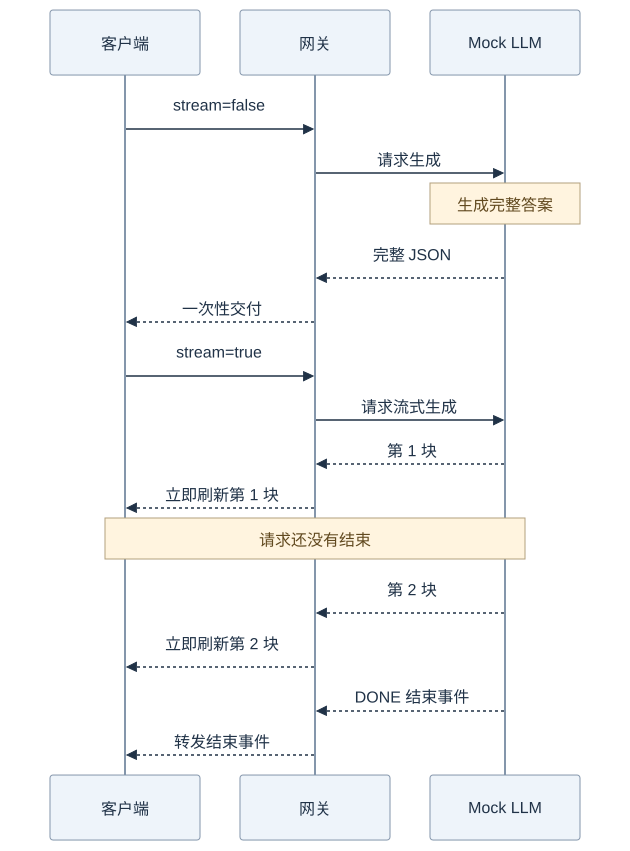

# 第 1 步：让一个问题经过 Go 代理

先只解决一件事：**客户端把问题发给 Go 程序，Go 程序找模型服务要答案，再把答案转回来。**这一课不选模型、不做 fallback，也不要求你先掌握整本 Go 语法。

本地实验中的“模型服务”是 Mock：它只返回固定模拟文本，方便观察网络行为，不会真的理解问题。

## 1. 先看图：三个角色，各做一件事


[查看 Mermaid 源图](diagrams/01-proxy.mmd)

从左向右读请求，再从右向左读答案：

1. **curl** 是客户端，相当于一个最简单的聊天窗口。
2. **Go 代理** 是中间站，知道模型服务在哪里，也持有访问上游的凭据。
3. **Mock LLM** 是上游，即网关要调用的服务。

“上游”和“下游”都是相对网关说的：模型服务是上游，等答案的客户端是下游。图上的 8081 和 9090 是两个服务的监听端口；客户端不需要自己的固定监听端口。

## 2. 跑起来：不用模型账号

安装 Go 1.26 或更高版本，确认 `go version` 可用。在项目根目录先验证第一课：

```sh
go test ./lessons/01-proxy
```

然后打开三个终端，都进入项目根目录。

**终端一：启动 Mock。**它默认每隔约 300ms 产生一块模拟数据。

```sh
go run ./cmd/mock-provider -addr localhost:9090
```

**终端二：启动代理，告诉它上游地址。**

```sh
UPSTREAM_URL=http://localhost:9090/v1 UPSTREAM_API_KEY=demo-only go run ./lessons/01-proxy
```

`UPSTREAM_URL` 是模型服务的 API 根地址；不要在这里重复加 `/chat/completions`。`demo-only` 是本地实验占位值，Mock 不校验它。代理默认监听 `localhost:8081`。

**终端三：提出一个问题。**

```sh
curl -i http://localhost:8081/v1/chat/completions \
  -H 'Content-Type: application/json' \
  -d '{"model":"demo-small","messages":[{"role":"user","content":"介绍一下 Go"}],"stream":false}'
```

你应收到 HTTP 200 和一个完整 JSON，里面的模型文本是固定的 `x` 字符。它证明“请求转发成功”，不证明模型真的会回答问题。此处 `model` 由上游解释，代理不会选择模型；第 2 步才引入 cheap / balanced / powerful。

## 3. 为什么流式看起来更快？

把刚才请求的 `stream` 改成 `true`，并给 curl 加 `-N`：

```sh
curl -N -i http://localhost:8081/v1/chat/completions \
  -H 'Content-Type: application/json' \
  -d '{"model":"demo-small","messages":[{"role":"user","content":"介绍一下 Go"}],"stream":true}'
```



[查看 Mermaid 源图](diagrams/01-stream.mmd)

图从上往下表示时间。先看一次性部分：客户端要等完整答案。再看流式部分：客户端先看到第 1 块，此时上游仍在生成后续内容。

- **一次性**：收到一个完整的 JSON 响应，常用于程序拿到结果后再处理。
- **流式**：在同一个 HTTP 请求里多次收到 `data: ...` 事件，适合边生成边展示。
- **SSE**：这里使用的分块事件格式。不是每个 token 都重新发一个 HTTP 请求，也不保证每个 SSE 块只含一个 token。
- **Flush**：把已写好的数据及时刷新给客户端。`-N` 则关闭 curl 自己的输出缓冲，两端都要配合才能看见逐块到达。

流式主要改善“多久看到第一部分”，不保证整个答案生成得更快。Mock 的一次性等待与流式分块时长可以分别观察，但不能当成真实模型性能结论。

## 4. 带着图去读最少的代码

打开 [第一课入口](../lessons/01-proxy/main.go)，按这四个问题找代码：

| 图里的问题 | 对应代码 | 先理解这一点 |
| --- | --- | --- |
| 谁开始监听？ | `main` / `http.Server` | 程序启动后等待请求，收到请求才执行 handler |
| 哪些请求能通过？ | `gateway.ServeHTTP` | 检查路径、方法、请求体大小，然后转发 |
| 请求转给谁？ | `newGateway` / `Director` | 改写目标地址和上游认证；共用 Transport |
| 怎么边读边发？ | `FlushInterval = -1` | 及时转发数据，不先收齐整段 SSE |

`ServeHTTP(w, r)` 中，`r` 是收到的请求，`w` 是写回客户端的出口。`Transport` 管理与上游的 HTTP 连接，多个请求可以共享它。遇到这些词还不熟时，再查 [第 0 步](00-go-basics.md)。

请求的 context 会沿调用链传下去。流还在输出时按 Ctrl-C 终止 curl，网关就能取消对应的上游 HTTP 请求；这不等于撤销供应商已经完成的计算。

## 5. 做三个小实验，确认自己理解了

| 改动 | 应看到什么 | 说明什么 |
| --- | --- | --- |
| 把路径改成 `/v1/embeddings` | 404 | 本课只代理一个固定 API |
| 对正确路径发 GET | 405 | 接口只接受 POST |
| 流没结束时停止 curl | 客户端退出，上游调用被取消 | 请求生命周期可以传递取消信号 |

不用只凭肉眼判断取消：`go test -v ./lessons/01-proxy` 中已有真实临时 HTTP 测试，检查首块在上游结束前到达，以及客户端断开传到上游。实验完成后，在两个服务终端分别按 Ctrl-C 停止程序。

## 6. 再接真实兼容服务

先完成本地实验，再把上游地址与密钥改成所用服务的配置：

```sh
export UPSTREAM_URL='https://api.example.com/v1'
export UPSTREAM_API_KEY='在本机设置你的上游密钥'
export GATEWAY_ADDR='localhost:8081'
go run ./lessons/01-proxy
```

这是占位示例。真实的模型 ID 也要替换为上游支持的值。调用方传来的 Authorization 不会原样转发，代理会使用自己的上游凭据；密钥不会写入日志。

## 本课先停在这里

第一课可以转发 JSON 与 SSE，但还没有模型路由、fallback、并发容量、使用者认证、请求速率限制、持久化任务或完善的优雅停机。

它已限制入站请求体为 1MiB、读取时间为 15 秒，上游响应头等待为 30 秒，代理调用总时限为 2 分钟；总时限会截断更长的生成。第一课也未单独控制流读取空闲或慢客户端写入，因此不应直接作为公网生产网关。

继续阅读：[第 2 步：选择模型与 fallback](02-routing.md)。
