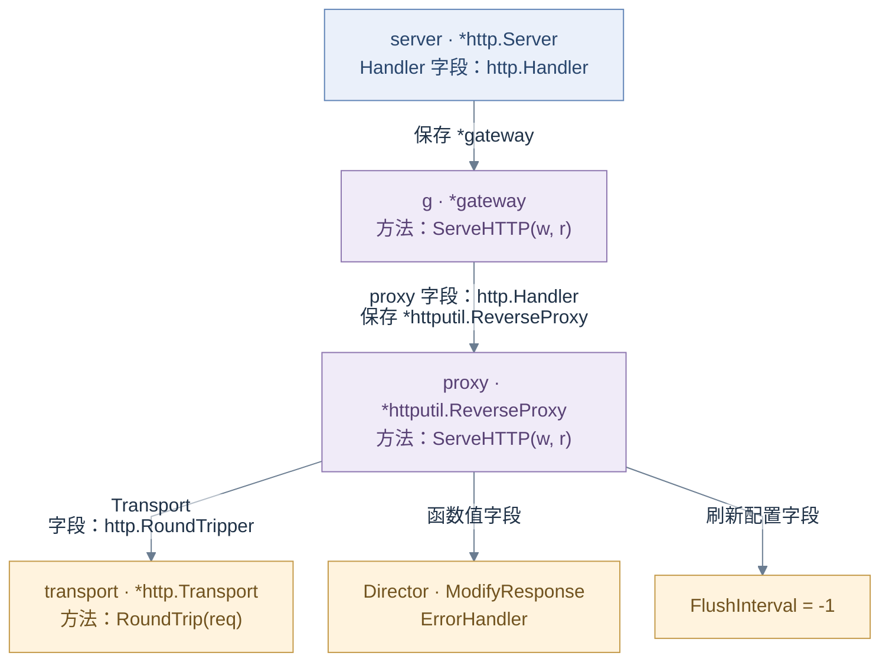
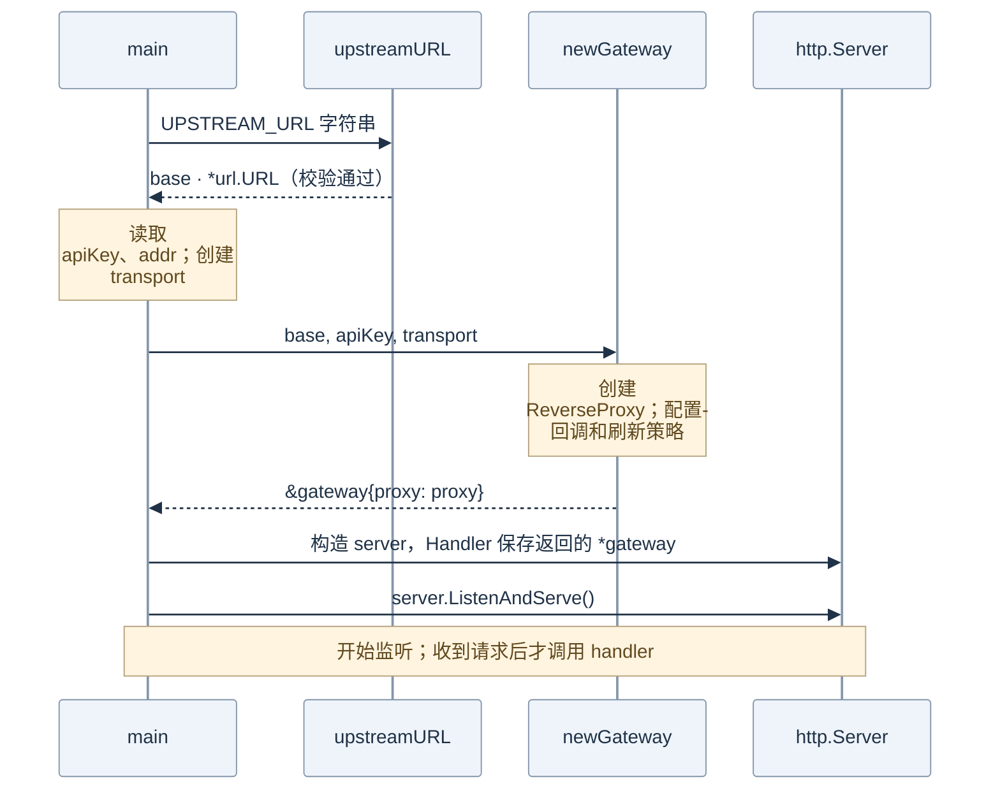
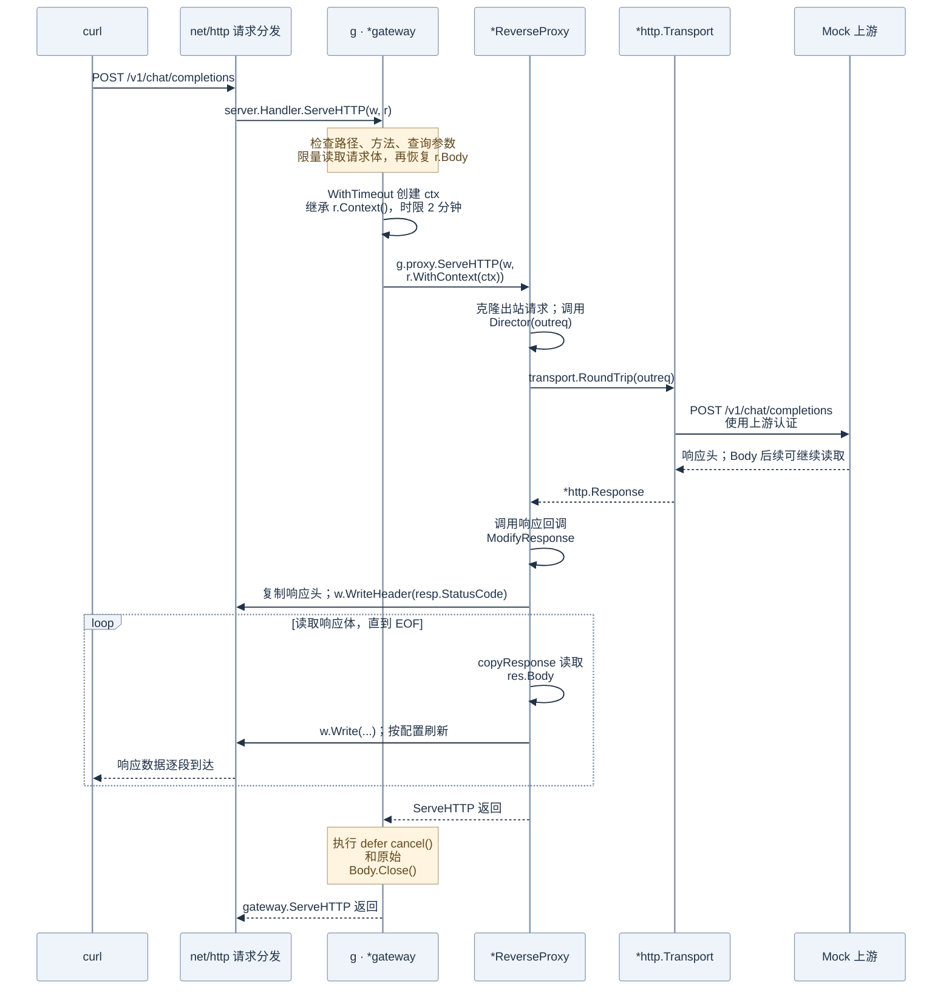
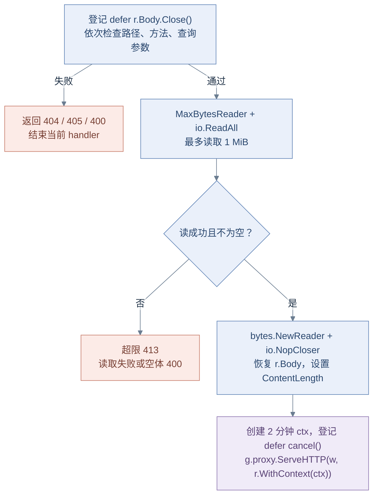
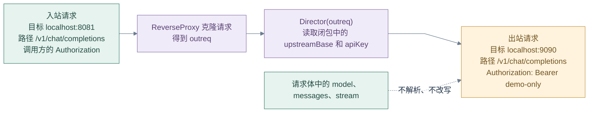
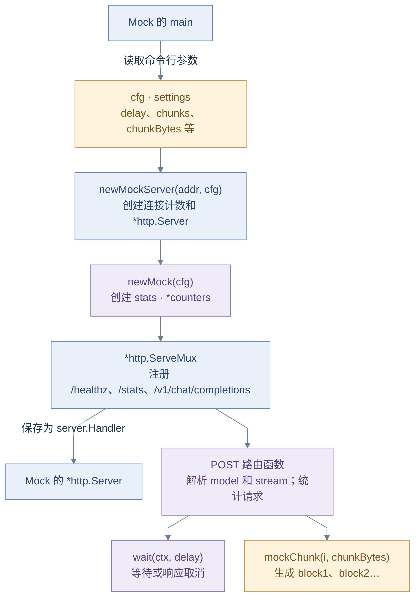
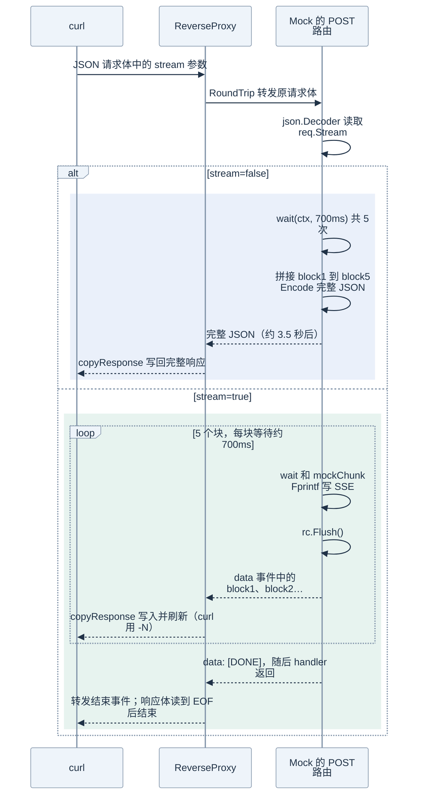
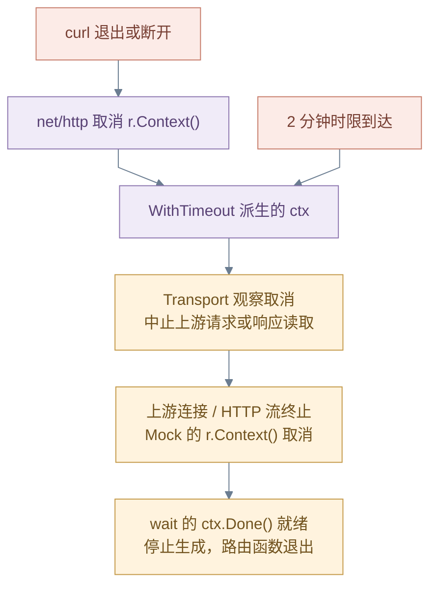

# 第 1 课：从 main 读懂一个 Go 代理

这一课直接阅读 [网关源码](../lessons/01-proxy/main.go)：弄清楚程序启动时创建了什么对象、收到请求时谁调用谁，以及普通 JSON 和流式响应怎样经过同一份代码。[第 0 课](00-go-basics.md)介绍 HTTP 和 Go 标准库的概念，这里把它们对应到具体的结构体、字段、方法和调用位置。

本课目录是 [lessons/01-proxy](../lessons/01-proxy/README.md)，有独立的 Go 模块。网关入口是 `main.go`；[cmd/mock-provider/main.go](../lessons/01-proxy/cmd/mock-provider/main.go) 是另一个程序，用来模拟上游。读代码时先看下面的对象图，再从网关的 `main` 往下追踪调用。

## 1. gateway 只有一个字段，为什么它能处理请求？

网关自己定义的结构体很短：

```go
type gateway struct {
    proxy http.Handler
}
```

`proxy` 是字段，保存一个可以处理 HTTP 请求的对象。稍后 `newGateway` 会把 `*httputil.ReverseProxy` 放进这个字段。与此同时，`gateway` 自己还有一个方法：

```go
func (g *gateway) ServeHTTP(w http.ResponseWriter, r *http.Request) {
    // 检查请求，再调用 g.proxy.ServeHTTP(...)
}
```

`(g *gateway)` 是接收者：说明这个方法属于 `*gateway`。方法写在结构体定义外面，所以你在 `type gateway struct` 里面看不到它。Go 的 `http.Handler` 接口只要求实现 `ServeHTTP(http.ResponseWriter, *http.Request)`；这个方法满足要求，因此 `*gateway` 可以作为 handler，无需额外声明“实现接口”。


```mermaid
---
config:
  theme: "base"
  fontFamily: "Arial, PingFang SC, Microsoft YaHei, sans-serif"
  themeVariables:
    fontSize: "16px"
    primaryColor: "#eef4fa"
    primaryTextColor: "#203247"
    primaryBorderColor: "#8496ab"
    lineColor: "#6b7d91"
    secondaryColor: "#eaf6f1"
    tertiaryColor: "#fff4df"
    noteBkgColor: "#fff4df"
    noteTextColor: "#61491f"
    noteBorderColor: "#b4a17d"
    actorBkg: "#eef4fa"
    actorBorder: "#8496ab"
    actorTextColor: "#203247"
    edgeLabelBackground: "#FFFFFF"
  flowchart:
    htmlLabels: false
    curve: "linear"
    nodeSpacing: 30
    rankSpacing: 38
    useMaxWidth: true
  sequence:
    useMaxWidth: true
    wrap: true
    actorMargin: 40
    width: 150
    messageMargin: 30
    noteMargin: 12
  state:
    useMaxWidth: true
---
flowchart TB
    accTitle: 第一课的对象与方法关系
    accDescr: Server的Handler保存gateway指针，gateway的proxy字段保存ReverseProxy指针，ReverseProxy共用Transport并持有请求与响应回调。
    S["server · *http.Server<br/>Handler 字段：http.Handler"] -->|"保存 *gateway"| G["g · *gateway<br/>方法：ServeHTTP(w, r)"]
    G -->|"proxy 字段：http.Handler<br/>保存 *httputil.ReverseProxy"| P["proxy · *httputil.ReverseProxy<br/>方法：ServeHTTP(w, r)"]
    P -->|"Transport 字段：http.RoundTripper"| T["transport · *http.Transport<br/>方法：RoundTrip(req)"]
    P -->|"函数值字段"| F["Director · ModifyResponse<br/>ErrorHandler"]
    P -->|"刷新配置字段"| I["FlushInterval = -1"]
    classDef server fill:#EAF0FA,stroke:#6285B7,color:#29466D;
    classDef gateway fill:#F0EBF8,stroke:#8E77B0,color:#584174;
    classDef transport fill:#FFF3DE,stroke:#C49A4A,color:#71531F;
    class S server;
    class G,P gateway;
    class T,F,I transport;
```

[查看 Mermaid 源图](diagrams/01-objects.mmd)

沿图中的实线读字段关系：`server.Handler` 保存外层的 `*gateway`，它的 `proxy` 字段保存内层的 `*ReverseProxy`。二者各有一个 `ServeHTTP` 方法。外层负责本课的入站检查，内层负责真正的 HTTP 转发。

| 代码里的对象 | 类型与位置 | 负责什么 |
| --- | --- | --- |
| `server` | `main` 中创建的 `*http.Server` | 监听端口，接收请求，并调用 `Handler` |
| `g` | `*gateway` 方法接收者 | 访问当前网关对象，例如 `g.proxy` |
| `proxy` | `newGateway` 中创建的 `*httputil.ReverseProxy` | 改写出站请求、调用上游、转回响应 |
| `transport` | `main` 中创建的 `*http.Transport` | 实现 `RoundTrip`，建立和复用到上游的连接 |

这里还要区分三种代码：`main`、`newGateway`、`upstreamURL`、`writeError` 是普通函数；`gateway.ServeHTTP` 是带接收者的方法；`Director`、`ModifyResponse`、`ErrorHandler` 是 ReverseProxy 的**函数值字段**，我们把匿名函数赋给字段，标准库在相应阶段调用它们。

## 2. main：启动时把这些对象接起来

打开网关 `main.go` 的 `main`。它先读取环境变量，再创建 Transport 和 Server。下面这段把启动时最重要的关系连起来：

```go
server := &http.Server{
    Addr:              addr,
    Handler:           newGateway(base, apiKey, transport),
    ReadHeaderTimeout: 5 * time.Second,
    ReadTimeout:       readTimeout,
}
```

Go 会先执行 `newGateway(base, apiKey, transport)`，得到返回值，再把它存入 `Handler`。`newGateway` 最后返回的是 `&gateway{proxy: proxy}`，所以 `server.Handler` 实际保存了一个 `*gateway`。


```mermaid
---
config:
  theme: "base"
  fontFamily: "Arial, PingFang SC, Microsoft YaHei, sans-serif"
  themeVariables:
    fontSize: "16px"
    primaryColor: "#eef4fa"
    primaryTextColor: "#203247"
    primaryBorderColor: "#8496ab"
    lineColor: "#6b7d91"
    secondaryColor: "#eaf6f1"
    tertiaryColor: "#fff4df"
    noteBkgColor: "#fff4df"
    noteTextColor: "#61491f"
    noteBorderColor: "#b4a17d"
    actorBkg: "#eef4fa"
    actorBorder: "#8496ab"
    actorTextColor: "#203247"
    edgeLabelBackground: "#FFFFFF"
  flowchart:
    htmlLabels: false
    curve: "linear"
    nodeSpacing: 30
    rankSpacing: 38
    useMaxWidth: true
  sequence:
    useMaxWidth: true
    wrap: true
    actorMargin: 40
    width: 150
    messageMargin: 30
    noteMargin: 12
  state:
    useMaxWidth: true
---
sequenceDiagram
    accTitle: main 启动时创建和配置哪些对象
    accDescr: main先校验地址并创建Transport，newGateway配置ReverseProxy后返回gateway指针，再把它交给Server的Handler字段，最后开始监听。
    participant M as main
    participant U as upstreamURL
    participant N as newGateway
    participant S as http.Server
    M->>U: UPSTREAM_URL 字符串
    U-->>M: base · *url.URL（校验通过）
    Note over M: 读取 apiKey、addr；创建 transport
    M->>N: base, apiKey, transport
    Note over N: 创建 ReverseProxy；配置回调和刷新策略
    N-->>M: &gateway{proxy: proxy}
    M->>S: 构造 server，Handler 保存返回的 *gateway
    M->>S: server.ListenAndServe()
    Note over M,S: 开始监听；收到请求后才调用 handler
```

[查看 Mermaid 源图](diagrams/01-startup.mmd)

图上这一阶段只创建和配置对象。`newGateway` 是普通的构造函数名字；它不会因为叫这个名字就自动处理请求。它设置 `Director` 等字段时，匿名函数的函数体也还没有执行。直到 `server.ListenAndServe()` 开始监听并收到请求，才进入下一节的调用链。

启动时的变量与配置分别来自这些位置：

| 变量或函数 | 代码做了什么 | 对后续请求的影响 |
| --- | --- | --- |
| `base := upstreamURL(...)` | 解析 `UPSTREAM_URL`，检查 http/https、主机、无用户信息/查询参数/片段、路径以 `/v1` 结尾 | `Director` 使用这个目标；不合法时程序启动失败 |
| `apiKey` | 读取 `UPSTREAM_API_KEY`，要求非空 | 改写出站 Authorization，不写入日志 |
| `addr` | 读取 `GATEWAY_ADDR`，缺省为 `localhost:8081` | 决定网关监听地址 |
| `transport` | 配置拨号、TLS、空闲连接和等待响应头的时限 | 所有上游请求共用这一个 Transport |
| `server.ListenAndServe()` | 开始接受 HTTP 请求 | 标准库负责解析请求并调用 handler |

`upstreamURL` 检查 `/v1` 是本课的地址约定；仅凭 URL 后缀无法证明服务兼容。真正接入的上游还要支持 `/chat/completions`、请求 JSON 和相应的响应格式。`base` 可以包含更长的前缀，例如 `/api/v1`，最终出站路径就会是 `/api/v1/chat/completions`。

## 3. 一次请求：两个 ServeHTTP 怎样被依次调用？

下面画的是一个通过检查的普通 HTTP POST 请求。图中既有本课的方法，也有 Go 标准库内部的关键调用；省略了标准库的连接调度和报文解析细节。


```mermaid
---
config:
  theme: "base"
  fontFamily: "Arial, PingFang SC, Microsoft YaHei, sans-serif"
  themeVariables:
    fontSize: "16px"
    primaryColor: "#eef4fa"
    primaryTextColor: "#203247"
    primaryBorderColor: "#8496ab"
    lineColor: "#6b7d91"
    secondaryColor: "#eaf6f1"
    tertiaryColor: "#fff4df"
    noteBkgColor: "#fff4df"
    noteTextColor: "#61491f"
    noteBorderColor: "#b4a17d"
    actorBkg: "#eef4fa"
    actorBorder: "#8496ab"
    actorTextColor: "#203247"
    edgeLabelBackground: "#FFFFFF"
  flowchart:
    htmlLabels: false
    curve: "linear"
    nodeSpacing: 30
    rankSpacing: 38
    useMaxWidth: true
  sequence:
    useMaxWidth: true
    wrap: true
    actorMargin: 40
    width: 150
    messageMargin: 30
    noteMargin: 12
  state:
    useMaxWidth: true
---
sequenceDiagram
    accTitle: 一个合法 POST 请求的实际调用链
    accDescr: net/http调用gateway的ServeHTTP，gateway读取并恢复请求体后调用ReverseProxy，后者依次调用Director、Transport.RoundTrip和ModifyResponse，再逐段写回响应。
    participant C as curl
    participant S as net/http 请求分发
    participant G as g · *gateway
    participant P as *ReverseProxy
    participant T as *http.Transport
    participant U as Mock 上游
    C->>S: POST /v1/chat/completions
    S->>G: server.Handler.ServeHTTP(w, r)
    Note over G: 检查路径、方法、查询参数<br/>限量读取请求体，再恢复 r.Body
    G->>G: WithTimeout 创建 ctx<br/>继承 r.Context()，时限 2 分钟
    G->>P: g.proxy.ServeHTTP(w, r.WithContext(ctx))
    P->>P: 克隆出站请求；调用 Director(outreq)
    P->>T: transport.RoundTrip(outreq)
    T->>U: POST /v1/chat/completions<br/>使用上游认证
    U-->>T: 响应头；Body 后续可继续读取
    T-->>P: *http.Response
    P->>P: 调用响应回调<br/>ModifyResponse
    P->>S: 复制响应头；w.WriteHeader(resp.StatusCode)
    loop 读取响应体，直到 EOF
        P->>P: copyResponse 读取 res.Body
        P->>S: w.Write(...)；按配置刷新
        S-->>C: 响应数据逐段到达
    end
    P-->>G: ServeHTTP 返回
    Note over G: 执行 defer cancel() 和原始 Body.Close()
    G-->>S: gateway.ServeHTTP 返回
```

[查看 Mermaid 源图](diagrams/01-request.mmd)

第一步中的 `server.Handler.ServeHTTP(w, r)` 由 **`net/http` 调用**。以本地 HTTP/1.1 路径为例，标准库内部的 `serverHandler.ServeHTTP` 取出 `Server.Handler`，再调用其 `ServeHTTP`。因此你在本课 `main` 中找不到这句显式调用。`Handler` 中的实际对象是 `*gateway`，这一次进入的是 `gateway.ServeHTTP`。

在标准库 `net/http/server.go` 中，这部分的关键语句是：

```go
handler := sh.srv.Handler
// 省略默认 handler 等分支
handler.ServeHTTP(rw, req)
```

第二次调用则明写在本课源码里：

```go
g.proxy.ServeHTTP(w, r.WithContext(ctx))
```

`g.proxy` 虽然声明为 `http.Handler`，实际保存的对象是 `*httputil.ReverseProxy`，所以这一次进入标准库的 `ReverseProxy.ServeHTTP`。它先调用 `Director`，再调用 `transport.RoundTrip(outreq)`；收到响应头后调用 `ModifyResponse`，随后复制响应头和响应体到 `w`。

`RoundTrip` 返回的 `*http.Response` 包含一个仍可继续读取的 `Body`，不会为了返回这个对象先把流式答案收齐。图中的循环表示标准库反复读响应体、写给客户端；每次读写的字节数不一定对应一个 SSE 事件，也不一定对应一个 token。

## 4. gateway.ServeHTTP：先检查，再恢复请求体，最后转发

这个方法里的顺序直接决定哪些请求能到上游。失败分支会写回错误并 `return`；只有通过全部检查，才会走到 `g.proxy.ServeHTTP`。


```mermaid
---
config:
  theme: "base"
  fontFamily: "Arial, PingFang SC, Microsoft YaHei, sans-serif"
  themeVariables:
    fontSize: "16px"
    primaryColor: "#eef4fa"
    primaryTextColor: "#203247"
    primaryBorderColor: "#8496ab"
    lineColor: "#6b7d91"
    secondaryColor: "#eaf6f1"
    tertiaryColor: "#fff4df"
    noteBkgColor: "#fff4df"
    noteTextColor: "#61491f"
    noteBorderColor: "#b4a17d"
    actorBkg: "#eef4fa"
    actorBorder: "#8496ab"
    actorTextColor: "#203247"
    edgeLabelBackground: "#FFFFFF"
  flowchart:
    htmlLabels: false
    curve: "linear"
    nodeSpacing: 30
    rankSpacing: 38
    useMaxWidth: true
  sequence:
    useMaxWidth: true
    wrap: true
    actorMargin: 40
    width: 150
    messageMargin: 30
    noteMargin: 12
  state:
    useMaxWidth: true
---
flowchart TD
    accTitle: gateway.ServeHTTP 的检查和转发顺序
    accDescr: 先检查路径方法与查询参数，再读取受限请求体，恢复可读取的Body并创建超时context，最后调用内层代理；检查失败就直接结束。
    A["登记 defer r.Body.Close()<br/>依次检查路径、方法、查询参数"] -->|失败| GATE["返回 404 / 405 / 400<br/>结束当前 handler"]
    A -->|通过| R["MaxBytesReader + io.ReadAll<br/>最多读取 1 MiB"]
    R --> V{"读成功且不为空？"}
    V -->|否| E["超限 413<br/>读取失败或空体 400"]
    V -->|是| K["bytes.NewReader + io.NopCloser<br/>恢复 r.Body，设置 ContentLength"]
    K --> P["创建 2 分钟 ctx，登记 defer cancel()<br/>g.proxy.ServeHTTP(w, r.WithContext(ctx))"]
    classDef process fill:#EAF0FA,stroke:#6285B7,color:#29466D;
    classDef proxy fill:#F0EBF8,stroke:#8E77B0,color:#584174;
    classDef error fill:#FCEBE7,stroke:#C77D6B,color:#773F33;
    class A,R,V,K process;
    class P proxy;
    class GATE,E error;
```

[查看 Mermaid 源图](diagrams/01-validation.mmd)

路径与方法检查使用 `chatPath = "/v1/chat/completions"` 和 `http.MethodPost`。代码还拒绝查询参数，例如 `?debug=true`。这些检查限制了公开接口；`writeError` 统一设置 JSON Content-Type、写入状态码，再用 `json.Encoder` 输出 `{"error":"..."}`。路径错误用的是标准库 `http.NotFound`，所以它返回的 404 正文是普通文本。

### 为什么读过请求体之后还要重新赋值？

检查大小的这一段会把原来的请求体读完：

```go
r.Body = http.MaxBytesReader(w, r.Body, maxBodyBytes)
body, err := io.ReadAll(r.Body)
// 处理读取失败和空请求体后：
r.Body = io.NopCloser(bytes.NewReader(body))
r.ContentLength = int64(len(body))
```

`maxBodyBytes` 是 1 MiB。`MaxBytesReader` 限制读取量；`io.ReadAll` 得到 `[]byte` 类型的 `body`。原来的 `r.Body` 此时已经读到末尾，如果直接交给代理，上游就读不到这些内容了。因此代码用 `bytes.NewReader(body)` 创建一个从头开始的内存读取器，再用 `io.NopCloser` 补上 `Close` 方法，重新放回 `r.Body`。

这里的缓冲针对**入站请求体**。网关限制并读取请求体后，才开始上游调用；返回的响应体则由 ReverseProxy 边读边写。网关没有检查请求体是不是合法 JSON，也没有读取 `model` 或 `stream`；这些内容留给上游解释。Mock 上游会执行 JSON 解析。

方法第一句的 `defer r.Body.Close()` 登记了关闭动作。服务端收到的请求由 `net/http` 建好，`Body` 非 nil；即使没有正文，也有可关闭的空 Body。`defer` 登记时会确定当前接收者，因此这里最终关闭的是**进入方法时的原始 Body**。后来把 `r.Body` 换成内存读取器，不会改变已登记的关闭对象。提前返回的错误分支也会执行它。

### 总时限从哪里开始？

```go
ctx, cancel := context.WithTimeout(r.Context(), requestTimeout)
defer cancel()
g.proxy.ServeHTTP(w, r.WithContext(ctx))
```

`requestTimeout` 是 2 分钟。这个时限在读完并恢复请求体后开始，覆盖上游调用和响应转发；入站读取另外受 `Server.ReadTimeout` 限制。`r.WithContext(ctx)` 返回一份使用新 context 的请求副本，代理继续把取消信号带到 Transport。请求正常结束时，`defer cancel()` 也会释放计时资源。

## 5. newGateway：给 ReverseProxy 配置具体行为

回到 `newGateway`，把它看作“组装内层代理”的函数：先执行 `httputil.NewSingleHostReverseProxy(upstreamBase)` 创建对象，然后配置 Transport、回调和刷新策略，最后把它放进 `gateway.proxy`。

其中 `Director` 是实际改变目标请求的地方。它接收的是 ReverseProxy 克隆出的出站请求；这里的 `req` 和外层 `ServeHTTP` 的 `r` 是不同函数中的参数名。


```mermaid
---
config:
  theme: "base"
  fontFamily: "Arial, PingFang SC, Microsoft YaHei, sans-serif"
  themeVariables:
    fontSize: "16px"
    primaryColor: "#eef4fa"
    primaryTextColor: "#203247"
    primaryBorderColor: "#8496ab"
    lineColor: "#6b7d91"
    secondaryColor: "#eaf6f1"
    tertiaryColor: "#fff4df"
    noteBkgColor: "#fff4df"
    noteTextColor: "#61491f"
    noteBorderColor: "#b4a17d"
    actorBkg: "#eef4fa"
    actorBorder: "#8496ab"
    actorTextColor: "#203247"
    edgeLabelBackground: "#FFFFFF"
  flowchart:
    htmlLabels: false
    curve: "linear"
    nodeSpacing: 30
    rankSpacing: 38
    useMaxWidth: true
  sequence:
    useMaxWidth: true
    wrap: true
    actorMargin: 40
    width: 150
    messageMargin: 30
    noteMargin: 12
  state:
    useMaxWidth: true
---
flowchart LR
    accTitle: Director 怎样改写出站请求
    accDescr: ReverseProxy克隆入站请求后调用Director，只改写目标地址路径Host与Authorization，JSON请求体保留原样。
    IN["入站请求<br/>目标 localhost:8081<br/>路径 /v1/chat/completions<br/>调用方的 Authorization"] --> CL["ReverseProxy 克隆请求<br/>得到 outreq"]
    CL --> D["Director(outreq)<br/>读取闭包中的 upstreamBase 和 apiKey"]
    D --> OUT["出站请求<br/>目标 localhost:9090<br/>路径 /v1/chat/completions<br/>Authorization: Bearer demo-only"]
    B["请求体中的 model、messages、stream"] -.->|"不解析、不改写"| OUT
    classDef incoming fill:#E7F3EF,stroke:#448675,color:#234B42;
    classDef proxy fill:#F0EBF8,stroke:#8E77B0,color:#584174;
    classDef upstream fill:#FFF3DE,stroke:#C49A4A,color:#71531F;
    class IN,B incoming;
    class CL,D proxy;
    class OUT upstream;
```

[查看 Mermaid 源图](diagrams/01-rewrite.mmd)

```go
proxy.Director = func(req *http.Request) {
    req.URL.Scheme = upstreamBase.Scheme
    req.URL.Host = upstreamBase.Host
    req.URL.Path = strings.TrimRight(upstreamBase.Path, "/") + "/chat/completions"
    req.URL.RawPath = ""
    req.Host = upstreamBase.Host
    req.Header.Del("Authorization")
    if apiKey != "" {
        req.Header.Set("Authorization", "Bearer "+apiKey)
    }
}
```

`req.URL.Host` 决定目标地址，`req.Host` 决定发给上游的 HTTP Host 值，两者都改为上游主机。路径直接使用配置前缀加 `/chat/completions`，不是把入站的 `/v1/chat/completions` 再拼一次。代码先删除调用方的 Authorization，再设置网关自己的上游密钥。

匿名函数可以读取 `newGateway` 的 `upstreamBase`、`apiKey`，这是闭包：这些配置在创建代理时就确定，后来每次调用 `Director` 时仍然可用。

| ReverseProxy 字段 | 谁在什么时候使用它 | 本课配置的效果 |
| --- | --- | --- |
| `Transport` | `ReverseProxy.ServeHTTP` 调用其 `RoundTrip` | 使用 `main` 创建的共享 Transport 发出请求 |
| `Director` | 发往上游前调用 | 改目标地址、固定路径和认证 |
| `ModifyResponse` | 收到上游响应、写回客户端前调用 | 对 300–399 返回错误，拒绝上游重定向响应 |
| `FlushInterval` | 复制响应体时读取 | `-1` 表示每次复制写入后及时刷新 |
| `ErrorHandler` | 上游调用失败或 `ModifyResponse` 返回错误时调用 | 取消则停止处理，超时写 504，其余错误写 502 |

本课直接使用 `Transport.RoundTrip`，没有通过 `http.Client.Do` 自动跟随重定向。`ModifyResponse` 的作用是把收到的 3xx 拒绝为代理错误。上游返回普通的 4xx/5xx 响应不等于网络调用失败，通常会保留上游状态码转发；`ErrorHandler` 不是看到所有非 200 就执行。

## 6. Mock：谁解释 stream，谁生成 block1？

Mock 的入口也叫 `main`，但它在另一个目录，是通过 `go run ./cmd/mock-provider` 启动的另一个进程。网关不会直接调用 Mock 的 Go 函数；两个程序之间通过 HTTP 通信。


```mermaid
---
config:
  theme: "base"
  fontFamily: "Arial, PingFang SC, Microsoft YaHei, sans-serif"
  themeVariables:
    fontSize: "16px"
    primaryColor: "#eef4fa"
    primaryTextColor: "#203247"
    primaryBorderColor: "#8496ab"
    lineColor: "#6b7d91"
    secondaryColor: "#eaf6f1"
    tertiaryColor: "#fff4df"
    noteBkgColor: "#fff4df"
    noteTextColor: "#61491f"
    noteBorderColor: "#b4a17d"
    actorBkg: "#eef4fa"
    actorBorder: "#8496ab"
    actorTextColor: "#203247"
    edgeLabelBackground: "#FFFFFF"
  flowchart:
    htmlLabels: false
    curve: "linear"
    nodeSpacing: 30
    rankSpacing: 38
    useMaxWidth: true
  sequence:
    useMaxWidth: true
    wrap: true
    actorMargin: 40
    width: 150
    messageMargin: 30
    noteMargin: 12
  state:
    useMaxWidth: true
---
flowchart TB
    accTitle: Mock 的结构体、构造函数和路由关系
    accDescr: Mock的main读取settings后调用newMockServer，后者用newMock创建ServeMux并保存为Server.Handler。路由函数捕获配置和统计计数，生成时调用wait与mockChunk。
    M["Mock 的 main"] -->|"读取命令行参数"| CFG["cfg · settings<br/>delay、chunks、chunkBytes 等"]
    CFG --> N["newMockServer(addr, cfg)<br/>创建连接计数和 *http.Server"]
    N --> F["newMock(cfg)<br/>创建 stats · *counters"]
    F --> X["*http.ServeMux<br/>注册 /healthz、/stats、/v1/chat/completions"]
    X -->|"保存为 server.Handler"| S["Mock 的 *http.Server"]
    X --> H["POST 路由函数<br/>解析 model 和 stream；统计请求"]
    H --> W["wait(ctx, delay)<br/>等待或响应取消"]
    H --> B["mockChunk(i, chunkBytes)<br/>生成 block1、block2…"]
    classDef server fill:#EAF0FA,stroke:#6285B7,color:#29466D;
    classDef config fill:#FFF3DE,stroke:#C49A4A,color:#71531F;
    classDef handler fill:#F0EBF8,stroke:#8E77B0,color:#584174;
    class M,N,X,S server;
    class CFG,B config;
    class F,H,W handler;
```

[查看 Mermaid 源图](diagrams/01-mock.mmd)

| Mock 中的定义 | 与其他代码的关系 |
| --- | --- |
| `settings` | 保存命令行参数；作为 `cfg` 传给 `newMockServer`、`newMock`，路由函数读取它 |
| `counters` | 保存原子计数；`newMock` 创建 `stats`，请求路由更新它，`/stats` 读取它 |
| `newMockServer` | 创建 `*http.Server`；把 `newMock(cfg)` 的返回值存到 `Handler`，并用 `ConnState` 统计连接 |
| `newMock` | 创建 `*http.ServeMux`，用 `HandleFunc` 注册路由，返回为 `http.Handler` |
| POST 路由中的匿名 `req` 结构体 | 每次请求新建，只解析 `Model`、`Stream` 两个 JSON 字段 |
| `wait` / `mockChunk` | 普通函数：分别控制生成间隔和块文本；由 POST 路由函数调用 |

`ServeMux` 实现了 `ServeHTTP`。Mock 的 Server 收到请求后调用它，再由它选择匹配的路由函数。注册路由时，函数还没有处理请求；这和 `newGateway` 配置回调后等待请求的区别相似。

下面的图只展开上游生成与内层代理的响应复制，完整的入口调用见第 3 节。真正的 `if !req.Stream` 出现在 Mock 里。普通模式等待全部生成间隔，把 `mockChunk` 产生的块拼起来，用 `json.Encoder` 一次输出。流式模式每隔一个间隔用 `fmt.Fprintf` 写一段 `data: ...\n\n`，再调用 `http.ResponseController.Flush()`。


```mermaid
---
config:
  theme: "base"
  fontFamily: "Arial, PingFang SC, Microsoft YaHei, sans-serif"
  themeVariables:
    fontSize: "16px"
    primaryColor: "#eef4fa"
    primaryTextColor: "#203247"
    primaryBorderColor: "#8496ab"
    lineColor: "#6b7d91"
    secondaryColor: "#eaf6f1"
    tertiaryColor: "#fff4df"
    noteBkgColor: "#fff4df"
    noteTextColor: "#61491f"
    noteBorderColor: "#b4a17d"
    actorBkg: "#eef4fa"
    actorBorder: "#8496ab"
    actorTextColor: "#203247"
    edgeLabelBackground: "#FFFFFF"
  flowchart:
    htmlLabels: false
    curve: "linear"
    nodeSpacing: 30
    rankSpacing: 38
    useMaxWidth: true
  sequence:
    useMaxWidth: true
    wrap: true
    actorMargin: 40
    width: 150
    messageMargin: 30
    noteMargin: 12
  state:
    useMaxWidth: true
---
sequenceDiagram
    accTitle: Mock 的两种输出怎样经过同一份代理代码
    accDescr: Mock解析stream字段决定等待后完整编码JSON或逐步发送SSE；网关两种模式都通过ReverseProxy复制响应体，不解析事件。示例使用5步和700毫秒间隔。
    participant C as curl
    participant P as ReverseProxy
    participant H as Mock 的 POST 路由
    C->>P: JSON 请求体中的 stream 参数
    P->>H: RoundTrip 转发原请求体
    H->>H: json.Decoder 读取 req.Stream
    alt stream=false
        rect rgb(234, 240, 250)
        H->>H: wait(ctx, 700ms) 共 5 次
        H->>H: 拼接 block1 到 block5<br/>Encode 完整 JSON
        H-->>P: 完整 JSON（约 3.5 秒后）
        P-->>C: copyResponse 写回完整响应
        end
    else stream=true
        rect rgb(231, 243, 239)
        loop 5 个块，每块等待约 700ms
            H->>H: wait 和 mockChunk<br/>Fprintf 写 SSE
            H->>H: rc.Flush()
            H-->>P: data 事件中的 block1、block2…
            P-->>C: copyResponse 写入并刷新（curl 用 -N）
        end
        H-->>P: data: [DONE]，随后 handler 返回
        P-->>C: 转发结束事件；响应体读到 EOF 后结束
        end
    end
```

[查看 Mermaid 源图](diagrams/01-stream.mmd)

网关的 `gateway.ServeHTTP` **没有按 `stream` 分支**。两种响应都进入 `ReverseProxy.ServeHTTP`，由 `copyResponse` 复制响应体。`FlushInterval = -1` 让网关及时刷新；客户端的 `curl -N` 则关闭输出缓冲。标准库也会对 `text/event-stream` 自动使用及时刷新策略。

`mockChunk` 默认给每块 64 字节内容加 `block1`、`block2` 等编号，剩余位置补 `.`，便于观察。最后的 `[DONE]` 由 Mock 写出，网关把它当普通字节转发，不解析这个结束标记。代理真正读到响应体 EOF 时，才结束复制。

## 7. 请求结束与出错：context 和两个错误出口

外层创建的 context 有两个取消来源：下游断开，以及 2 分钟时限到达。它们都会传到正在执行的上游 HTTP 请求。


```mermaid
---
config:
  theme: "base"
  fontFamily: "Arial, PingFang SC, Microsoft YaHei, sans-serif"
  themeVariables:
    fontSize: "16px"
    primaryColor: "#eef4fa"
    primaryTextColor: "#203247"
    primaryBorderColor: "#8496ab"
    lineColor: "#6b7d91"
    secondaryColor: "#eaf6f1"
    tertiaryColor: "#fff4df"
    noteBkgColor: "#fff4df"
    noteTextColor: "#61491f"
    noteBorderColor: "#b4a17d"
    actorBkg: "#eef4fa"
    actorBorder: "#8496ab"
    actorTextColor: "#203247"
    edgeLabelBackground: "#FFFFFF"
  flowchart:
    htmlLabels: false
    curve: "linear"
    nodeSpacing: 30
    rankSpacing: 38
    useMaxWidth: true
  sequence:
    useMaxWidth: true
    wrap: true
    actorMargin: 40
    width: 150
    messageMargin: 30
    noteMargin: 12
  state:
    useMaxWidth: true
---
flowchart TB
    accTitle: 下游取消怎样传到上游
    accDescr: 客户端断开后net/http取消入站context，WithTimeout派生的context随之取消，Transport中止上游HTTP请求，Mock的请求context随连接终止而取消，wait退出。
    C["curl 退出或断开"] --> R["net/http 取消 r.Context()"]
    R --> X["WithTimeout 派生的 ctx"]
    TIME["2 分钟时限到达"] --> X
    X --> T["Transport 观察取消<br/>中止上游请求或响应读取"]
    T --> U["上游连接 / HTTP 流终止<br/>Mock 的 r.Context() 取消"]
    U --> W["wait 的 ctx.Done() 就绪<br/>停止生成，路由函数退出"]
    classDef cancel fill:#FCEBE7,stroke:#C77D6B,color:#773F33;
    classDef context fill:#F0EBF8,stroke:#8E77B0,color:#584174;
    classDef upstream fill:#FFF3DE,stroke:#C49A4A,color:#71531F;
    class C,TIME cancel;
    class R,X context;
    class T,U,W upstream;
```

[查看 Mermaid 源图](diagrams/01-cancel.mmd)

取消信号不是把同一个 Go context 对象跨进程传给 Mock。网关这边 Transport 终止上游连接或 HTTP 流，Mock 那边的 `net/http` 观察到请求终止，取消它自己的 `r.Context()`。`wait` 用 `select` 等待计时器或 `ctx.Done()`；后者就绪时停止等待，路由函数退出。

结合前面的检查图和调用序列图，可以把错误对应到具体出口：

| 发生的位置 | 例子 | 响应由谁写 |
| --- | --- | --- |
| `gateway.ServeHTTP` 的检查阶段 | 方法不对、请求体超限 | 本课 `writeError`；路径错误由 `http.NotFound` 写 |
| ReverseProxy 尚未写回正常响应时 | 连接上游失败、等待超时、上游 3xx 被拒绝 | 本课配置的 `ErrorHandler`，通常为 502 或 504 |
| 上游返回正常 HTTP 错误响应 | Mock 返回 503 | ReverseProxy 转发该状态和正文 |
| 响应已经开始后读取失败 | SSE 输出到一半断流 | 标准库中止响应，不能再补一个新的 502 JSON |

`ErrorHandler` 检查取消时会直接返回，因为客户端可能已经断开。超时能否写回 504，还取决于正常响应是否已经开始。固定时限会让更长的流在中途终止；它不是“空闲太久才断开”的时限。

## 8. 对照源码运行：观察首块、总耗时和取消

需要 Go 1.26 或更高版本。在仓库根目录进入本课模块：

```sh
cd lessons/01-proxy
go test ./...
```

`go test ./...` 检查本课模块中的自动化测试，不会启动固定监听 8081/9090 的教学服务。HTTP 测试使用临时监听地址；可以在手动实验前运行，也可以独立运行。本课只依赖标准库，不涉及根模块的 SQLite 依赖。

手动实验需要三个终端，都进入本课目录。终端一启动 Mock，显式把生成间隔调到 700ms，默认 5 块：

```sh
go run ./cmd/mock-provider -addr localhost:9090 -delay 700ms
```

终端二启动网关，`demo-only` 是本地实验占位密钥，Mock 不校验它：

```sh
UPSTREAM_URL=http://localhost:9090/v1 UPSTREAM_API_KEY=demo-only go run .
```

如果 9090 被占用，例如已有本地代理程序，Mock 改用 `-addr localhost:9091`，网关的 `UPSTREAM_URL` 也改成 `http://localhost:9091/v1`。curl 仍请求网关的 8081。

终端三先发普通请求，再发流式请求：

```sh
curl -i -sS -w '\n首字节：%{time_starttransfer}s，总耗时：%{time_total}s\n' \
  http://localhost:8081/v1/chat/completions \
  -H 'Content-Type: application/json' \
  -d '{"model":"demo-small","messages":[{"role":"user","content":"介绍一下 Go"}],"stream":false}'
```

```sh
curl -N -i -sS -w '\n首字节：%{time_starttransfer}s，总耗时：%{time_total}s\n' \
  http://localhost:8081/v1/chat/completions \
  -H 'Content-Type: application/json' \
  -d '{"model":"demo-small","messages":[{"role":"user","content":"介绍一下 Go"}],"stream":true}'
```

按这些参数运行时，应观察到下面的结果，实际值会有网络和调度开销：

| 模式 | 首字节时间 `time_starttransfer` | 总耗时 `time_total` | 输出样子 |
| --- | --- | --- | --- |
| `stream:false` | 约 3.5 秒 | 约 3.5 秒 | 一个 JSON，content 拼接 block1 到 block5 |
| `stream:true` | 约 0.7 秒 | 约 3.5 秒 | SSE 逐块出现 block1 到 block5，最后 [DONE] |

`time_starttransfer` 统计的是收到响应的首字节，包含响应头；在这个 Mock 的正常流式实验里，响应头随首块一起发出，所以它可以近似帮助观察首块时机。`-w` 的计时结果在请求结束后打印。这个实验演示的是提前显示部分内容，总生成时长由 Mock 固定；它不能当作真实模型的性能结论。

再做三个对应源码分支的实验：

| 操作 | 预期 | 回到哪里看代码 |
| --- | --- | --- |
| 把路径改为 `/v1/embeddings` | 404 | `gateway.ServeHTTP` 的路径检查 |
| 对正确路径发 GET | 405，Allow: POST | 同一方法的方法检查；curl 不带 `-d` 默认 GET |
| 流没结束时按 Ctrl-C 停止 curl | 上游生成停止 | `WithTimeout` 的父 context、Transport、Mock 的 `wait` |

[main_test.go](../lessons/01-proxy/main_test.go) 已覆盖首块先于上游结束到达、配置认证、客户端断开、拒绝重定向、入口限制和请求体大小。可用 `go test -v .` 对照测试名称阅读这些行为。完成实验后，在两个服务终端按 Ctrl-C 停止程序。

## 9. 本课代码的边界

接真实服务时，把 `UPSTREAM_URL`、`UPSTREAM_API_KEY` 换成自己的配置，并把请求中的 `model` 换成上游支持的模型 ID。本课把 `model` 原样交给上游解释；模型选择与 fallback 从 [第 2 课](02-routing.md) 开始。

这一版本有请求体大小和部分时间限制：读取请求头 5 秒、入站读取 15 秒、等待上游响应头 30 秒、代理调用和响应转发 2 分钟。`main` 没有设置固定的 `WriteTimeout`；固定写入时限可能截断正常的长响应流。本课也还没有独立的响应读取空闲时限、慢客户端写入控制、使用者认证、并发容量或优雅停机，因此仍是用于理解代理调用关系的教学版本。
