# 02：把“想要什么模型”和“由谁执行”分开

模型档次 cheap / balanced / powerful 表达能力或成本需求，Provider 负责供应商协议。将两者分开后，客户端可以保持逻辑档次不变，由配置选择实际执行的供应商和模型。

## 先看图：cheap 是需求档次，不是某一家模型的名字

同一个问题“介绍一下 Go”，可以交给不同供应商。客户端只说自己需要哪个档次，由网关配置决定实际模型。



[查看 Mermaid 源图](diagrams/02-routing.mmd)

**读图例子（示意数值）：**A 占用 10/20 个名额，B 占用 3/20 个名额，网关会倾向 B。两者都属于第一组，不是每次同时调用两个模型。只有允许 fallback 且该组没有剩余可用候选时，才考虑下一组。

客户端发出 `model=cheap`；上游收到的是 `model=demo-small`。`Provider` 负责“怎样向这家服务发请求”，`Target` 则把“这家服务”和“这个真实模型”绑定在一起。

## 沿请求走一遍

客户端发送 `model=cheap`。`ParseRequest` 读取这个逻辑档次；`Gateway.Do` 查 cheap 的候选组；`acquire` 选一个尚有容量的目标；`OpenAIProvider.Open` 将请求里的 model 换成该目标的实际模型 ID，随后发送。

请求其余字段用 `json.RawMessage` 保留，避免因为只定义了 content 字符串就丢失多模态、工具参数或供应商扩展。每次尝试都会复制字段 map，不能修改共享请求：否则失败重试和并发调用可能串模型。

示例配置的含义：

```json
"cheap": [
  [{"provider":"primary-a","model":"demo-small"},
   {"provider":"primary-b","model":"demo-small"}],
  [{"provider":"backup","model":"demo-backup-small"}]
]
```

第一组是两个可互换副本，按当前占用比例分配。都不可用或可重试失败后再走第二组；满载的端点直接跳过，不等待名额。并列负载用轮转打散。可以用相同 provider 的不同 model 配置模型 fallback，也可以跨供应商。

## 再看图：为什么不能写到一半换模型？

假设 A 已经发出了“第一步先…”，B 会从自己的答案开头重新生成。把两段接起来，用户拿到的就不是一个连贯的回答。



[查看 Mermaid 源图](diagrams/02-fallback.mmd)

因此这个实现采用保守边界：**首块交给 HTTP 层之前才有机会换候选。**首块可能只是心跳，不必然是真正的文字 token。已经交出首块后出现问题，客户端会看到截断；它需要决定是否重新发起完整请求。

一次性 JSON 不会边读边交付：它先在网关内做有界缓冲，所以未交付前的读失败仍可以尝试其他候选。

## fallback 的边界

| 发生了什么 | 当前行为 | 原因 |
| --- | --- | --- |
| 连接失败、等待响应头超时 | 下一个候选 | 尚未向客户端交付内容 |
| 408、429、5xx | 下一个候选 | 当前端点可能暂时不可用 |
| 400、401、403 等其他 4xx | 返回错误，不 fallback | 避免掩盖参数或权限问题 |
| JSON 读到一半断开、超限、非法 JSON | 下一个候选 | 一次性响应仍在内部有界缓冲，尚未发送 |
| SSE 空流或首块前断开 | 下一个候选 | 没有输出可见内容 |
| SSE 已读到首块，随后断开 | 中止本次响应 | 两个模型的生成无法拼接成同一个答案 |
| 客户端取消或整个调用预算耗尽 | 停止所有尝试 | fallback 不能复活已取消的工作 |

这里的流式切换边界是“首块 body 交给 HTTP 层”，保守地包含心跳或注释，并非精确识别首 token。更精细的 token 级协议适配会增加复杂度，留作后续课题。

每个候选每次调用最多尝试一次，每档配置最多 16 个候选。没有隐藏 SDK 重试，没有无限重试循环。单候选的超时必须小于整个请求预算，才给后备留出时间；只有一个候选时，单次 attempt 时限也限制最长流时长。

即使尚未向客户端返回内容，上游也可能已经消耗 token。fallback 解决可用性，不能保证不重复计费。不同模型必须都支持用户的 tools、图片或推理参数；否则候选会返回 400，网关不会擅自删掉参数。

## 三层职责如何衔接

- `types.go`：定义逻辑档次、候选目标与 Provider 接口。
- `provider.go`：封装兼容协议和客户端复用。
- `router.go`：按配置选择目标，在安全交付边界内执行 fallback。

并发执行网络 I/O 与持久化后台任务是不同的能力。HTTP 返回 202 后仍能可靠查询、在重启后恢复的任务，需要单独的状态与存储机制，见第四课。

## 实验

运行 `go test -v ./internal/gateway -run 'TestFallback|TestAttempt|TestLoadBalance|TestProvider'`。然后修改备用组的模型 ID，观察 `X-Gateway-Model`。把两个主端点都以 `-status 503` 启动，验证备用端点被选中；改成 400，验证没有自动换模型。

语义自动分档是可选扩展。已经明确的 cheap/balanced/powerful、健康状态和容量由代码决定；若加入根据自然语言选择档次的分类器，需要单独评估误判，并在分类失败或置信不足时使用明确的默认档次。

下一步：[第 3 步：并发与生命周期](03-concurrency.md)。
