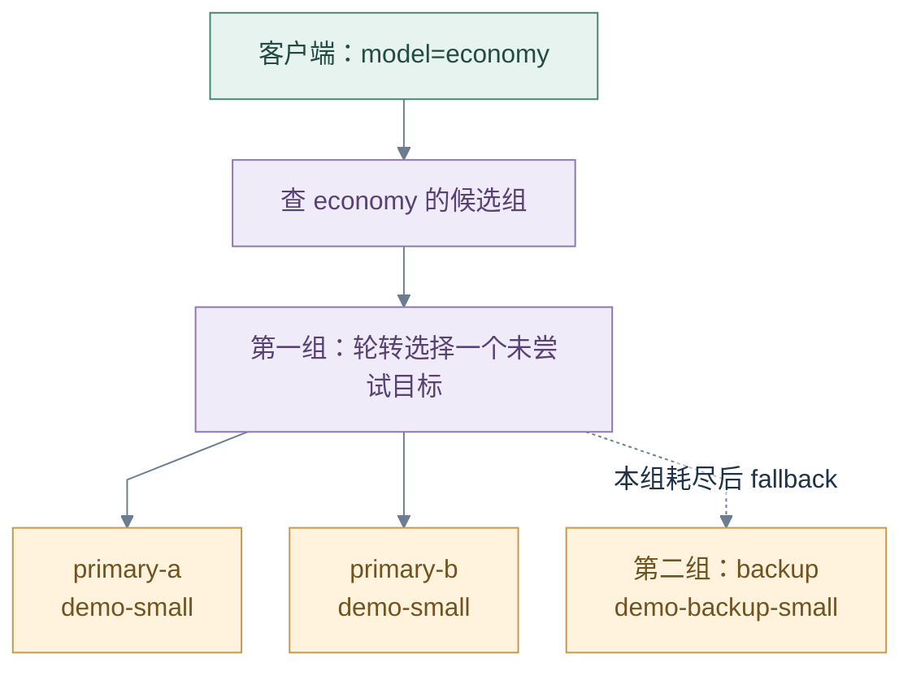
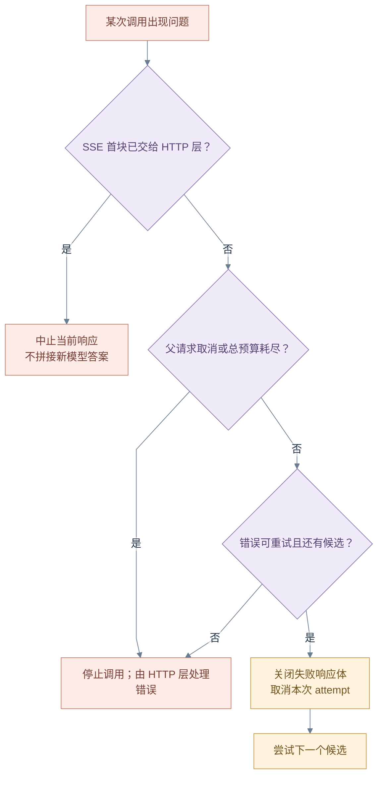
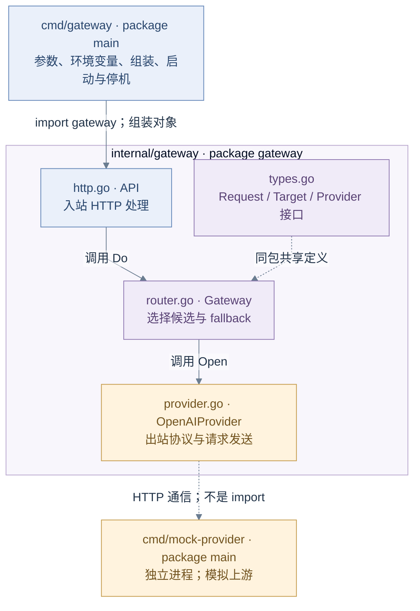
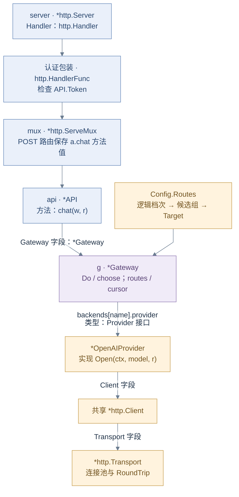
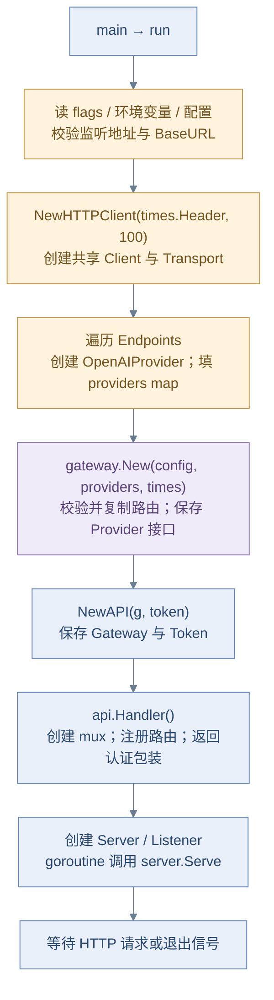
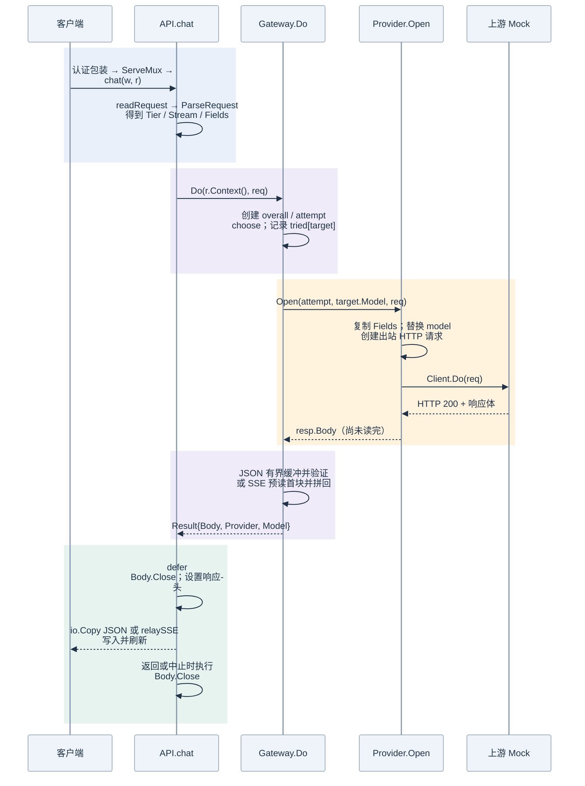
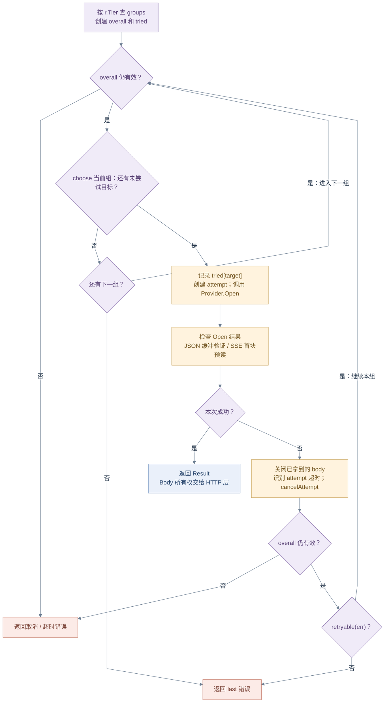
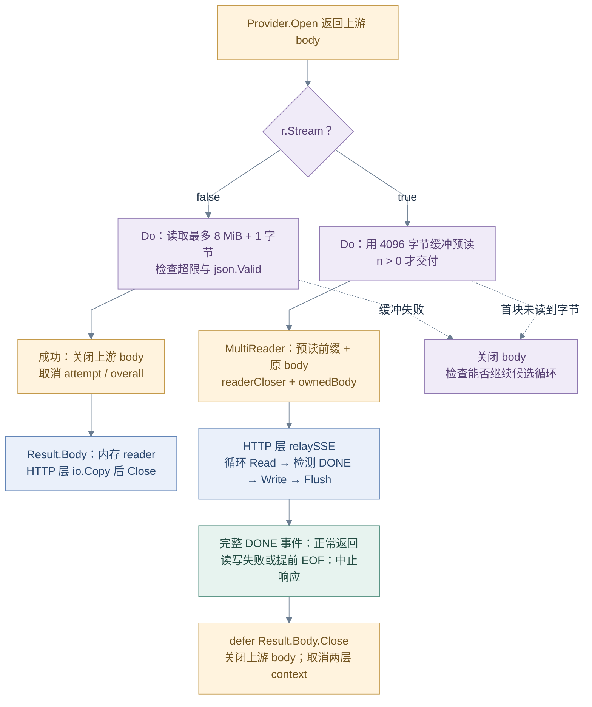

# 第 2 课：从固定代理走到模型路由与 fallback

**本课独立代码：[lessons/02-routing](../lessons/02-routing/README.md)。**先在仓库根目录执行 `cd lessons/02-routing`，再运行本文命令。此目录有自己的 Go 模块和 Mock，所有测试针对本课源码。

## 1. 与第一课相比：为什么不再只用 ReverseProxy？

[第一课](01-proxy.md)的调用关系是 `Server → gateway.ServeHTTP → ReverseProxy → Transport`。客户端发送真实模型 ID，例如 `demo-small`；网关只把请求转发到一个固定上游。第二课让客户端发送逻辑档次 `economy`，网关自己决定哪家供应商、哪个真实模型来执行，并在允许的边界内尝试备用候选。

这要求网关在写回响应之前参与选择、请求改写与结果检查。本课不再创建 `httputil.ReverseProxy`，而是用自己的 `API`、`Gateway` 和 `Provider` 串起请求处理，底层仍由标准库 `http.Client` / `Transport` 发送 HTTP 和复用连接。

| 对照项 | 第一课：固定代理 | 第二课：模型路由 |
| --- | --- | --- |
| 网关源码结构 | 一个 `main.go`，外层 handler 包住 ReverseProxy | `cmd/gateway/main.go` 组装；`internal/gateway` 分出 HTTP、路由、协议代码 |
| 上游与模型配置 | 环境变量指定一个上游；`model` 原样传递 | JSON 定义 endpoints 和 routes；逻辑档次映射到 `Target` 的真实模型 |
| 请求体 | 限量读入后恢复，不解析业务 JSON | `ParseRequest` 检查 model / stream / messages，其余字段保留为 `json.RawMessage` |
| 上游调用失败 | 固定上游失败就结束 | 组内轮转；可重试失败继续其他候选，主组用尽再进入备用组 |
| 普通响应 | ReverseProxy 边读边复制 | `Do` 先限量读完、检查 JSON，再交给 HTTP 层 |
| 流式响应 | ReverseProxy 复制并刷新；不识别 `[DONE]` | `Do` 预读首块，`relaySSE` 逐块刷新并识别完整 `[DONE]` 事件 |
| 时间预算 | 固定 2 分钟调用时限、30 秒响应头时限 | 默认总预算 10 分钟、单候选 4 分钟、响应头 30 秒，可用 flags 调整 |
| 认证与停机 | 配置上游密钥；没有调用方认证与优雅停机 | 可设 `GATEWAY_TOKEN`；每个 endpoint 从指定环境变量取上游密钥；停机先等待 5 秒 |
| 默认监听 | `localhost:8081` | `localhost:8080`，Mock 示例增加到三个端点 |

两课都限制请求体为 1 MiB，都继承客户端的取消信号，也都复用上游连接。第二课新增的是**模型选择和交付前的有限重试**；它还没有第三课的供应商并发容量、按占用比例选择和读写空闲时限。

接下来先理解模型档次和 fallback 的规则，再像第一课一样，从对象、启动过程和请求调用关系拆解本课代码。

模型档次 economy（经济型）/ balanced（均衡型）/ powerful（高能力型）表达成本与能力需求，Provider 负责供应商协议。名称只表示网关的逻辑档次，实际模型由配置映射。将两者分开后，客户端可以保持逻辑档次不变，由配置选择实际执行的供应商和模型。

## 2. 先看图：economy 是需求档次，不是某一家模型的名字

同一个问题“介绍一下 Go”，可以交给不同供应商。客户端只说自己需要哪个档次，由网关配置决定实际模型。


```mermaid
---
config:
  theme: "base"
  fontFamily: "Arial, PingFang SC, Microsoft YaHei, sans-serif"
  themeVariables:
    fontSize: "16px"
    primaryColor: "#eef4fa"
    primaryTextColor: "#203247"
    primaryBorderColor: "#8496ab"
    lineColor: "#6b7d91"
    secondaryColor: "#eaf6f1"
    tertiaryColor: "#fff4df"
    noteBkgColor: "#fff4df"
    noteTextColor: "#61491f"
    noteBorderColor: "#b4a17d"
    actorBkg: "#eef4fa"
    actorBorder: "#8496ab"
    actorTextColor: "#203247"
    edgeLabelBackground: "#FFFFFF"
  flowchart:
    htmlLabels: false
    curve: "linear"
    nodeSpacing: 30
    rankSpacing: 38
    useMaxWidth: true
  sequence:
    useMaxWidth: true
    wrap: true
    actorMargin: 40
    width: 150
    messageMargin: 30
    noteMargin: 12
  state:
    useMaxWidth: true
---
flowchart TB
    accTitle: 第二课的逻辑档次、组内轮转与备用组
    accDescr: 客户端指定economy，配置映射为主组A与B及备用组。每次先调用一个候选，可重试失败继续组内尝试，主组用尽后才进入备用组。
    C["客户端：model=economy"] --> G["查 economy 的候选组"]
    G --> R["第一组：轮转选择一个未尝试目标"]
    R --> A["primary-a<br/>demo-small"]
    R --> B["primary-b<br/>demo-small"]
    R -.->|"本组耗尽后 fallback"| F["第二组：backup<br/>demo-backup-small"]
    classDef client fill:#E7F3EF,stroke:#448675,color:#234B42;
    classDef http fill:#EAF0FA,stroke:#6285B7,color:#29466D;
    classDef routing fill:#F0EBF8,stroke:#8E77B0,color:#584174;
    classDef upstream fill:#FFF3DE,stroke:#C49A4A,color:#71531F;
    classDef error fill:#FCEBE7,stroke:#C77D6B,color:#773F33;
    class C client;
    class G,R routing;
    class A,B,F upstream;
```

[查看 Mermaid 源图](diagrams/02-routing-lesson.mmd)

**读图例子：**第一次请求先选 A，下一次先选 B；一次请求只先调用一个候选。A、B 都属于第一组，允许重试的失败会继续尝试组内其他候选，主组候选用尽后才考虑备用组。本课先使用轮转；按占用比例选择和满载跳过在第 3 课加入。

客户端发出 `model=economy`；上游收到的是 `model=demo-small`。`Provider` 负责“怎样向这家服务发请求”，`Target` 则把“这家服务”和“这个真实模型”绑定在一起。

## 3. 沿请求走一遍

客户端发送 `model=economy`。`ParseRequest` 读取这个逻辑档次；`Gateway.Do` 查 economy 的候选组；`choose` 轮转选择一个尚未尝试的目标；`OpenAIProvider.Open` 将请求里的 model 换成该目标的实际模型 ID，随后发送。

请求其余字段用 `json.RawMessage` 保留，避免因为只定义了 content 字符串就丢失多模态、工具参数或供应商扩展。每次尝试都会复制字段 map，再替换 model，不改原始 `Request.Fields`，避免污染后续 fallback 或复用同一请求的并发调用。

示例配置的含义：

```json
"economy": [
  [{"provider":"primary-a","model":"demo-small"},
   {"provider":"primary-b","model":"demo-small"}],
  [{"provider":"backup","model":"demo-backup-small"}]
]
```

第一组是两个可互换副本，本课按轮转选择。组内候选出现允许重试的失败并用尽后再走第二组。此阶段不统计在途数量，也没有供应商容量检查。可以用相同 provider 的不同 model 配置模型 fallback，也可以跨供应商。

## 4. 再看图：为什么不能写到一半换模型？

假设 A 已经发出了“第一步先…”，B 会从自己的答案开头重新生成。把两段接起来，用户拿到的就不是一个连贯的回答。


```mermaid
---
config:
  theme: "base"
  fontFamily: "Arial, PingFang SC, Microsoft YaHei, sans-serif"
  themeVariables:
    fontSize: "16px"
    primaryColor: "#eef4fa"
    primaryTextColor: "#203247"
    primaryBorderColor: "#8496ab"
    lineColor: "#6b7d91"
    secondaryColor: "#eaf6f1"
    tertiaryColor: "#fff4df"
    noteBkgColor: "#fff4df"
    noteTextColor: "#61491f"
    noteBorderColor: "#b4a17d"
    actorBkg: "#eef4fa"
    actorBorder: "#8496ab"
    actorTextColor: "#203247"
    edgeLabelBackground: "#FFFFFF"
  flowchart:
    htmlLabels: false
    curve: "linear"
    nodeSpacing: 30
    rankSpacing: 38
    useMaxWidth: true
  sequence:
    useMaxWidth: true
    wrap: true
    actorMargin: 40
    width: 150
    messageMargin: 30
    noteMargin: 12
  state:
    useMaxWidth: true
---
flowchart TB
    accTitle: 第二课什么时候可以切换候选
    accDescr: SSE首块交给HTTP层后不能再切换。交付前也必须未取消、总预算未耗尽、错误可重试并且仍有候选。失败响应关闭后取消该attempt，再尝试下一目标。
    A["某次调用出现问题"] --> B{"SSE 首块已交给 HTTP 层？"}
    B -->|"是"| C["中止当前响应<br/>不拼接新模型答案"]
    B -->|"否"| D{"父请求取消或总预算耗尽？"}
    D -->|"是"| E["停止调用；由 HTTP 层处理错误"]
    D -->|"否"| F{"错误可重试且还有候选？"}
    F -->|"否"| E
    F -->|"是"| G["关闭失败响应体<br/>取消本次 attempt"]
    G --> H["尝试下一个候选"]
    classDef client fill:#E7F3EF,stroke:#448675,color:#234B42;
    classDef http fill:#EAF0FA,stroke:#6285B7,color:#29466D;
    classDef routing fill:#F0EBF8,stroke:#8E77B0,color:#584174;
    classDef upstream fill:#FFF3DE,stroke:#C49A4A,color:#71531F;
    classDef error fill:#FCEBE7,stroke:#C77D6B,color:#773F33;
    class A,C,E error;
    class B,D,F routing;
    class G,H upstream;
```

[查看 Mermaid 源图](diagrams/02-fallback.mmd)

因此这个实现采用保守边界：**首块交给 HTTP 层之前才有机会换候选。**首块可能只是心跳，不必然是真正的文字 token。已经交出首块后出现问题，客户端会看到截断；它需要决定是否重新发起完整请求。

一次性 JSON 不会边读边交付：它先在网关内做有界缓冲，所以未交付前的读失败仍可以尝试其他候选。

## 5. fallback 的边界

| 发生了什么 | 当前行为 | 原因 |
| --- | --- | --- |
| 连接失败、等待响应头超时 | 下一个候选 | 尚未向客户端交付内容 |
| 408、429、5xx | 下一个候选 | 当前端点可能暂时不可用 |
| 400、401、403 等其他 4xx | 返回错误，不 fallback | 避免掩盖参数或权限问题 |
| JSON 读到一半断开、超限、非法 JSON | 下一个候选 | 一次性响应仍在内部有界缓冲，尚未发送 |
| SSE 空流或首块前断开 | 下一个候选 | 没有输出可见内容 |
| SSE 已读到首块，随后断开 | 中止本次响应 | 两个模型的生成无法拼接成同一个答案 |
| 客户端取消或整个调用预算耗尽 | 停止所有尝试 | fallback 不能复活已取消的工作 |

这里的流式切换边界是“首块 body 交给 HTTP 层”，保守地包含心跳或注释，并非精确识别首 token。更精细的 token 级协议适配会增加复杂度，留作后续课题。

每个候选每次调用最多尝试一次，每档配置最多 16 个候选。没有隐藏 SDK 重试，没有无限重试循环。单候选的超时必须小于整个请求预算，才给后备留出时间；只有一个候选时，单次 attempt 时限也限制最长流时长。

即使尚未向客户端返回内容，上游也可能已经消耗 token。fallback 解决可用性，不能保证不重复计费。不同模型必须都支持用户的 tools、图片或推理参数；否则候选会返回 400，网关不会擅自删掉参数。

## 6. 为什么拆成两个包？先分清模块、目录、包和文件

第一课把入口和代理逻辑都写在根目录的 `package main` 里，适合用一份文件追踪完整调用。第二课增加了配置、模型路由和 fallback，便把**网关程序**分成两个包：入口包负责启动环境，`gateway` 包负责网关功能。读代码时，先看文件开头的 `package`，再看它所在的目录。

```text
lessons/02-routing/                  ← 本课独立模块的根目录
├── go.mod                          ← module example.com/llm-gateway
├── cmd/
│   ├── gateway/
│   │   └── main.go                 ← package main：网关可执行程序
│   └── mock-provider/
│       └── main.go                 ← package main：另一个可执行程序
└── internal/
    └── gateway/
        ├── types.go                ← package gateway
        ├── http.go                 ← package gateway
        ├── router.go               ← package gateway
        ├── provider.go             ← package gateway
        └── gateway_test.go         ← package gateway：同包测试
```

### 一份模块里可以有多个包，几个文件也可以属于同一个包

| 名称 | 在本课中是什么 | 用来解决什么问题 |
| --- | --- | --- |
| 模块（module） | `go.mod` 声明的 `example.com/llm-gateway` | 给包路径提供前缀，声明 Go 版本和模块依赖；一个模块可包含多个包 |
| 包（package） | `cmd/gateway` 的 `main`、`internal/gateway` 的 `gateway` | 组织一起编译的源码，确定导入与跨包访问的边界 |
| 目录 | `cmd/gateway`、`internal/gateway` 等 | Go 工具链通常按目录组织包，子目录不会自动并入父目录的包 |
| 文件 | `types.go`、`router.go` 等 | 在包内按主题拆开代码，让读者容易找到定义 |

`http.go`、`router.go`、`provider.go` 和 `types.go` 都声明 `package gateway`，所以它们是**同一个包里的四个文件**。`router.go` 可以直接使用 `types.go` 的 `Request`，`http.go` 也可以使用路由文件中未导出的辅助定义；不需要也不能通过 `import "types.go"` 来连接它们。包级定义跨文件可见，但 import 是各文件自己的：哪个文件用到 `http.Client`，哪个文件就要导入 `net/http`。

两个目录即使都写 `package main`，也不会合成一个包。`cmd/gateway` 与 `cmd/mock-provider` 有各自的包路径、入口和编译结果：前者启动网关，后者启动 Mock，通过 HTTP 通信。整个本课模块包含这三个包；“拆成两个包”说的是网关本身的组织方式。Go 官方的[模块布局说明](https://go.dev/doc/modules/layout)展示了一个模块组织多个包和命令的方式。


```mermaid
---
config:
  theme: "base"
  fontFamily: "Arial, PingFang SC, Microsoft YaHei, sans-serif"
  themeVariables:
    fontSize: "16px"
    primaryColor: "#eef4fa"
    primaryTextColor: "#203247"
    primaryBorderColor: "#8496ab"
    lineColor: "#6b7d91"
    secondaryColor: "#eaf6f1"
    tertiaryColor: "#fff4df"
    noteBkgColor: "#fff4df"
    noteTextColor: "#61491f"
    noteBorderColor: "#b4a17d"
    actorBkg: "#eef4fa"
    actorBorder: "#8496ab"
    actorTextColor: "#203247"
    edgeLabelBackground: "#FFFFFF"
  flowchart:
    htmlLabels: false
    curve: "linear"
    nodeSpacing: 30
    rankSpacing: 38
    useMaxWidth: true
  sequence:
    useMaxWidth: true
    wrap: true
    actorMargin: 40
    width: 150
    messageMargin: 30
    noteMargin: 12
  state:
    useMaxWidth: true
---
flowchart TB
    accTitle: 第二课的两个网关包与独立Mock程序
    accDescr: cmd/gateway的main包导入internal/gateway包。gateway包内HTTP、路由和Provider按文件组织，仍然共享同一包边界。gateway通过HTTP访问独立Mock进程，不导入Mock的main包。
    MAIN["cmd/gateway · package main<br/>参数、环境变量、组装、启动与停机"]
    subgraph GW["internal/gateway · package gateway"]
        API["http.go · API<br/>入站 HTTP 处理"]
        ROUTE["router.go · Gateway<br/>选择候选与 fallback"]
        PROVIDER["provider.go · OpenAIProvider<br/>出站协议与请求发送"]
        TYPES["types.go<br/>Request / Target / Provider 接口"]
        API -->|"调用 Do"| ROUTE
        ROUTE -->|"调用 Open"| PROVIDER
        TYPES -.->|"同包共享定义"| ROUTE
    end
    MAIN -->|"import gateway；组装对象"| API
    MOCK["cmd/mock-provider · package main<br/>独立进程；模拟上游"]
    PROVIDER -.->|"HTTP 通信；不是 import"| MOCK
    classDef command fill:#EAF0FA,stroke:#6285B7,color:#29466D;
    classDef routing fill:#F0EBF8,stroke:#8E77B0,color:#584174;
    classDef upstream fill:#FFF3DE,stroke:#C49A4A,color:#71531F;
    class MAIN,API command;
    class ROUTE,TYPES routing;
    class PROVIDER,MOCK upstream;
    style GW fill:#F8F6FC,stroke:#B9A7CE,color:#584174
```

[查看 Mermaid 源图](diagrams/02-packages.mmd)

图中的实线表示组装或包内调用，通往 Mock 的虚线表示跨进程 HTTP 通信。三个处理层仍然处在 `gateway` 包内，不能把“分层”“分文件”和“分包”当成同一件事。

### 为什么入口留在 main，功能放到 gateway？

**第一，变化的原因不同。** 命令行参数、环境变量、监听地址和退出信号属于程序怎么运行；请求解析、轮转、协议发送和流式转发属于网关怎么处理调用。`main.run` 读取 `GATEWAY_TOKEN` 与供应商密钥，然后把 token、Provider 实例和预算传给 `gateway`。功能代码因此不用自己读取命令行或决定进程何时退出。

**第二，测试可以绕过真实启动环境。** [gateway_test.go](../lessons/02-routing/internal/gateway/gateway_test.go) 直接调用 `New`，用实现 `Provider` 接口的测试对象模拟成功、失败与超时，再通过 `NewAPI(...).Handler()` 测 HTTP 行为。测试不必启动 `cmd/gateway`，也不必使用固定的 8080 端口。分包便于暴露稳定入口；真正让测试可替换供应商的，是参数传入和 Provider 接口。

**第三，包边界能收住实现细节。** 入口需要 `Config`、`New`、`NewAPI` 等名字，但不需要直接操作轮转锁、游标或首块缓冲。本课的 `cursor`、`backends`、`choose`、`ownedBody` 都留在包内部。以后调整这些实现，入口仍可以通过原有方法组装和调用。实际导出的字段不止这几个，所以这份教学代码也不是完全封装的成品 API。

当前没有继续拆成 `http`、`router`、`provider` 三个包：它们共同围绕 `Request`、`Target` 与响应体生命周期工作，先在一个小包里按文件组织更容易追踪。拆出新包要有独立职责、清楚的使用接口或复用需求；文件变长可以先拆文件，不必立刻增加包。

`gateway` 包本身仍然使用 `net/http`，并包含 `API` 和 `OpenAIProvider`。这次拆分建立的是**程序入口与网关功能的边界**，并没有把所有 HTTP 代码隔离到另一个包。

### import 为什么这么写，依赖方向怎样保持清楚？

本课 [go.mod](../lessons/02-routing/go.mod) 声明：

```go
module example.com/llm-gateway
```

入口的导入路径由模块路径加模块内目录得到：

```go
import "example.com/llm-gateway/internal/gateway"
```

这里导入的是一个包，而不是某个 `.go` 文件。这个前缀在本课是模块标识；Go 会找到本模块的 `internal/gateway`，不会因为路径看起来像域名就下载本课代码。默认使用导入包声明的名称，因此调用写成 `gateway.New(...)`、`gateway.NewAPI(...)`。

依赖方向是 `cmd/gateway → internal/gateway → 标准库`。功能包不反过来读取入口的变量，也不导入入口包；入口通过参数把配置交进去。Go 禁止包直接或间接导入自己，因此跨包设计必须避免循环依赖。如果将来拆更多包，双方都需要的定义应放在职责合适的位置，或通过接口和参数传递。包的导入、文件级 import 与循环限制见 [Go 规范](https://go.dev/ref/spec#Import_declarations)。

### cmd 是惯例，internal 是工具链执行的限制

`cmd` 常用来集中存放可执行程序的入口，`cmd/gateway` 的目录名也方便表明程序用途。它不是 Go 关键字，也不是运行程序的必需目录；第一课直接在模块根目录放 `package main`，一样可以运行。`main.go` 这个文件名也是惯例，真正的入口要求是 `package main` 中有 `func main()`。

`internal` 则有导入限制：其中的包只能由 **internal 的父目录所覆盖的目录树内的代码**导入。在本课，父目录就是 `lessons/02-routing`，所以本课的 `cmd/gateway` 可以导入 `internal/gateway`；放在这棵目录树外的项目不能把它当成开放库随意依赖。它表达“项目内部实现”的意图，也给重构留出空间。具体限制见 [go 命令的 Internal Directories 文档](https://pkg.go.dev/cmd/go#hdr-Internal_Directories)。

`internal` 限制的是**谁能导入这个包**；大小写控制的是**导入后能访问哪些名字**。所以包放在 `internal` 里，`New`、`Config` 等跨包使用的名字仍然要导出。

### 对照本课，记住这些 Go 常用约定

下面把语言规则与惯例标开，避免误以为所有写法都是语法要求。

| 规则或约定 | 本课例子 | 为什么这样写 |
| --- | --- | --- |
| 大写开头表示导出，小写开头不导出；这是语言规则 | `New`、`Config`、`API`、`Do`；`choose`、`chat`、`cursor` | 跨包入口显式可见，包内辅助实现不暴露；类型、函数、字段、方法都要分别看名称 |
| 普通包名通常短、小写，常与目录末段一致 | `package gateway` | 让 `gateway.New` 等使用方式简洁；可执行入口使用特殊的 `package main` |
| 构造函数常用 `New` 或 `NewX` | `New`、`NewAPI`、`NewHTTPClient` | 这是普通函数的命名惯例，没有构造器关键字或自动调用；需要主动调用并检查返回错误 |
| 标识符常用 MixedCaps，常见缩写保持一致 | `OpenAIProvider`、`BaseURL`、`APIKeyEnv` | 让 Go 名称容易辨认；JSON 的 `api_key_env` 通过 struct tag 单独指定，不决定 Go 导出性 |
| 错误通常作为最后一个返回值，先处理失败再继续 | `g, err := gateway.New(...)`；`if err != nil { return err }` | 成功路径顺着往下读；包内把错误返回，入口或 HTTP 层决定日志、退出和响应 |
| 依赖通过参数或字段传入 | `New(config, providers, times)`、`NewAPI(g, token)` | 启动时明确组装，也方便测试用不同实现替换 Provider |
| 测试文件用 `_test.go`；可选择同包或外部测试包 | 本课 `gateway_test.go` 声明 `package gateway` | 同包测试能检查未导出细节；写 `package gateway_test` 时从跨包使用者视角测试导出接口 |
| 代码交给 gofmt，包级检查用 Go 工具 | `go fmt ./...`、`go test ./...` | 统一格式并按包处理；`go run ./cmd/gateway` 会编译该入口包，而不是把目录名当包名 |

大写导出的条件见 [Go 规范](https://go.dev/ref/spec#Exported_identifiers)，包名、构造函数命名和格式约定见 [Effective Go](https://go.dev/doc/effective_go#package-names)。回到本课源码，`gateway.New` 是包里的函数，`g.Do` 是对象的方法，`g.choose` 则只在 `gateway` 包内使用；这样就能把包边界与前面讲的方法调用连起来。

## 7. 先认对象：API、Gateway、Provider 各保存什么？

打开本课的 [types.go](../lessons/02-routing/internal/gateway/types.go)、[router.go](../lessons/02-routing/internal/gateway/router.go) 和 [http.go](../lessons/02-routing/internal/gateway/http.go)。不要把三个名字都理解成 HTTP handler：它们承担不同职责。

| 定义 | 关键字段或方法 | 与其他代码的关系 |
| --- | --- | --- |
| `API` | `Gateway *Gateway`、`Token string`；`Handler`、`chat` | 处理入站 HTTP；调用 `Gateway.Do`；向客户端写响应 |
| `Gateway` | `backends`、`routes`、`cursor`、`mu`、`times`；`choose`、`Do` | 保存路由、轮转位置和预算；调用 Provider；返回可交付的结果 |
| `Provider` 接口 | `Open(context.Context, string, Request) (io.ReadCloser, error)` | 约定协议适配器怎样打开一次上游调用；第二个参数是真实模型 ID |
| `OpenAIProvider` | `URL`、`Key`、`Client *http.Client`；`Open` | 实现上述接口，负责 Chat Completions 兼容协议、认证和发送 |
| `Target` | `Provider string`、`Model string` | 把 endpoint 名称与真实模型绑定；本身不包含 HTTP 客户端 |
| `Result` | `Body io.ReadCloser`、`Provider`、`Model` | 从路由层交给 HTTP 层；HTTP 层读取并负责 Close |


```mermaid
---
config:
  theme: "base"
  fontFamily: "Arial, PingFang SC, Microsoft YaHei, sans-serif"
  themeVariables:
    fontSize: "16px"
    primaryColor: "#eef4fa"
    primaryTextColor: "#203247"
    primaryBorderColor: "#8496ab"
    lineColor: "#6b7d91"
    secondaryColor: "#eaf6f1"
    tertiaryColor: "#fff4df"
    noteBkgColor: "#fff4df"
    noteTextColor: "#61491f"
    noteBorderColor: "#b4a17d"
    actorBkg: "#eef4fa"
    actorBorder: "#8496ab"
    actorTextColor: "#203247"
    edgeLabelBackground: "#FFFFFF"
  flowchart:
    htmlLabels: false
    curve: "linear"
    nodeSpacing: 30
    rankSpacing: 38
    useMaxWidth: true
  sequence:
    useMaxWidth: true
    wrap: true
    actorMargin: 40
    width: 150
    messageMargin: 30
    noteMargin: 12
  state:
    useMaxWidth: true
---
flowchart TB
    accTitle: 第二课的对象、字段和接口关系
    accDescr: Server.Handler保存认证包装函数，包装函数调用ServeMux，路由函数a.chat通过API.Gateway调用Gateway.Do。Gateway通过Provider接口调用OpenAIProvider，多个实例共享Client与Transport。
    S["server · *http.Server<br/>Handler：http.Handler"] --> H["认证包装 · http.HandlerFunc<br/>检查 API.Token"]
    H --> M["mux · *http.ServeMux<br/>POST 路由保存 a.chat 方法值"]
    M --> A["api · *API<br/>方法：chat(w, r)"]
    A -->|"Gateway 字段：*Gateway"| G["g · *Gateway<br/>Do / choose；routes / cursor"]
    G -->|"backends[name].provider<br/>类型：Provider 接口"| P["*OpenAIProvider<br/>实现 Open(ctx, model, r)"]
    P -->|"Client 字段"| C["共享 *http.Client"]
    C -->|"Transport 字段"| T["*http.Transport<br/>连接池与 RoundTrip"]
    CFG["Config.Routes<br/>逻辑档次 → 候选组 → Target"] --> G
    classDef client fill:#E7F3EF,stroke:#448675,color:#234B42;
    classDef http fill:#EAF0FA,stroke:#6285B7,color:#29466D;
    classDef routing fill:#F0EBF8,stroke:#8E77B0,color:#584174;
    classDef upstream fill:#FFF3DE,stroke:#C49A4A,color:#71531F;
    classDef error fill:#FCEBE7,stroke:#C77D6B,color:#773F33;
    class S,H,M,A http;
    class G routing;
    class P,C,T,CFG upstream;
```

[查看 Mermaid 源图](diagrams/02-objects.mmd)

蓝色表示 HTTP 入口，紫色表示路由，暖金表示配置和上游调用。图中箭头标出的字段与接口，是从一个对象找到下一个对象的路径。

和第一课的 `gateway.proxy http.Handler` 相似，`backend.provider Provider` 保存接口值，实际装进去的是 `*OpenAIProvider`。`func (p *OpenAIProvider) Open(...)` 的签名满足接口，因此可以赋给 `Provider`，无需显式声明“实现接口”。`Do` 调用 `b.provider.Open(...)` 时，Go 会执行里面具体对象的 `Open` 方法。

`Gateway` 没有 `ServeHTTP`，也不是 `http.Handler`。`API.Handler()` 返回的是 handler：认证包装函数转成 `http.HandlerFunc`，由这个适配类型提供 `ServeHTTP`；内部的 `ServeMux` 再把请求交给 `a.chat`。

## 8. 从 main 开始：启动时怎样组装这些对象？

入口在 [cmd/gateway/main.go](../lessons/02-routing/cmd/gateway/main.go)。`main` 调用 `run()`，如果它返回错误就记录日志并退出。组装对象、启动服务和等待退出信号都发生在 `run` 里。


```mermaid
---
config:
  theme: "base"
  fontFamily: "Arial, PingFang SC, Microsoft YaHei, sans-serif"
  themeVariables:
    fontSize: "16px"
    primaryColor: "#eef4fa"
    primaryTextColor: "#203247"
    primaryBorderColor: "#8496ab"
    lineColor: "#6b7d91"
    secondaryColor: "#eaf6f1"
    tertiaryColor: "#fff4df"
    noteBkgColor: "#fff4df"
    noteTextColor: "#61491f"
    noteBorderColor: "#b4a17d"
    actorBkg: "#eef4fa"
    actorBorder: "#8496ab"
    actorTextColor: "#203247"
    edgeLabelBackground: "#FFFFFF"
  flowchart:
    htmlLabels: false
    curve: "linear"
    nodeSpacing: 30
    rankSpacing: 38
    useMaxWidth: true
  sequence:
    useMaxWidth: true
    wrap: true
    actorMargin: 40
    width: 150
    messageMargin: 30
    noteMargin: 12
  state:
    useMaxWidth: true
---
flowchart TB
    accTitle: 第二课main和run的启动顺序
    accDescr: run先读取参数和配置，再创建共享HTTP客户端、各供应商实例、Gateway和API。API.Handler创建路由并返回认证包装函数，Server.Serve开始等待请求。
    M["main → run"] --> CFG["读 flags / 环境变量 / 配置<br/>校验监听地址与 BaseURL"]
    CFG --> C["NewHTTPClient(times.Header, 100)<br/>创建共享 Client 与 Transport"]
    C --> P["遍历 Endpoints<br/>创建 OpenAIProvider；填 providers map"]
    P --> G["gateway.New(config, providers, times)<br/>校验并复制路由；保存 Provider 接口"]
    G --> A["NewAPI(g, token)<br/>保存 Gateway 与 Token"]
    A --> H["api.Handler()<br/>创建 mux；注册路由；返回认证包装"]
    H --> S["创建 Server / Listener<br/>goroutine 调用 server.Serve"]
    S --> W["等待 HTTP 请求或退出信号"]
    classDef client fill:#E7F3EF,stroke:#448675,color:#234B42;
    classDef http fill:#EAF0FA,stroke:#6285B7,color:#29466D;
    classDef routing fill:#F0EBF8,stroke:#8E77B0,color:#584174;
    classDef upstream fill:#FFF3DE,stroke:#C49A4A,color:#71531F;
    classDef error fill:#FCEBE7,stroke:#C77D6B,color:#773F33;
    class M,A,H,S,W http;
    class CFG,C,P upstream;
    class G routing;
```

[查看 Mermaid 源图](diagrams/02-startup.mmd)

图从上往下读。这些对象在启动阶段创建，并由后续请求复用；此时注册 `a.chat` 还没有真正处理聊天请求。

1. `DefaultTimeouts()` 给出默认预算，再用 `flag.DurationVar` 绑定命令行参数。`flag.Parse()` 后，`times` 就保存最终值。`GATEWAY_TOKEN` 用于入站认证；未设 token 时只允许监听回环地址。
2. 用 `json.Decoder` 读取 [config.example.json](../lessons/02-routing/config.example.json)，`DisallowUnknownFields()` 拒绝未知结构体字段。`Endpoints` 定义名字、地址和密钥环境变量；`Routes` 定义三档模型的候选组。
3. `NewHTTPClient(times.Header, 100)` 创建一个共享 Client。遍历 endpoints 时，每个 `OpenAIProvider` 有自己的 `URL`、`Key`，但 `Client` 都指向这个对象。配置指定了 `api_key_env` 却读不到有效密钥时，启动失败；本地 Mock 示例留空。
4. `gateway.New(config, providers, times)` 校验 endpoint 名称、三个档次的路由、非空组、真实模型和重复目标。每档最多 16 个目标；重复按整个 `Target{Provider, Model}` 判断。同一家服务的不同模型可以是不同目标。`New` 复制每个组的切片，保存路由供请求使用。
5. `NewAPI(g, token)` 保存两个字段。`api.Handler()` 创建 mux，注册健康检查和聊天路由，返回认证包装。这个返回值被放进 `server.Handler`，随后 `net.Listen` 创建监听器，goroutine 调用 `server.Serve(listener)`。

关键组装代码可以连起来读：

```go
client := gateway.NewHTTPClient(times.Header, 100)
providers[endpoint.Name] = &gateway.OpenAIProvider{
    URL: endpoint.BaseURL, Key: key, Client: client,
}
g, err := gateway.New(config, providers, times)
// 检查 err 后继续
api := gateway.NewAPI(g, token)
server := &http.Server{Addr: *address, Handler: api.Handler() /* 其余字段略 */}
```

这是启动过程的节选，`providers[...]` 那一行在 endpoint 循环内。Go 的 `&Type{...}` 创建结构体并取指针；构造函数返回的对象通过字段引用串起来。`New` 不会提前联系上游，启动成功也不代表模型服务一定可用。

## 9. 请求到达：谁调用 chat，ParseRequest 又留下什么？

[http.go](../lessons/02-routing/internal/gateway/http.go) 中的 `Handler` 有两个时间点：启动时创建路由，请求时执行注册函数。

```go
mux.HandleFunc("POST /v1/chat/completions", a.chat)
```

这里的 `a.chat` 是**绑定了接收者 a 的方法值**。注册时保存它；匹配请求到来时 mux 才用 `w, r` 调用它。外层认证包装先检查 `a.Token`，不通过就写 401 并返回，通过才调用 `mux.ServeHTTP(w, r)`。`GET /healthz` 也经过同一认证包装。


```mermaid
---
config:
  theme: "base"
  fontFamily: "Arial, PingFang SC, Microsoft YaHei, sans-serif"
  themeVariables:
    fontSize: "16px"
    primaryColor: "#eef4fa"
    primaryTextColor: "#203247"
    primaryBorderColor: "#8496ab"
    lineColor: "#6b7d91"
    secondaryColor: "#eaf6f1"
    tertiaryColor: "#fff4df"
    noteBkgColor: "#fff4df"
    noteTextColor: "#61491f"
    noteBorderColor: "#b4a17d"
    actorBkg: "#eef4fa"
    actorBorder: "#8496ab"
    actorTextColor: "#203247"
    edgeLabelBackground: "#FFFFFF"
  flowchart:
    htmlLabels: false
    curve: "linear"
    nodeSpacing: 30
    rankSpacing: 38
    useMaxWidth: true
  sequence:
    useMaxWidth: true
    wrap: true
    actorMargin: 40
    width: 150
    messageMargin: 30
    noteMargin: 12
  state:
    useMaxWidth: true
---
sequenceDiagram
    accTitle: 第二课一次成功请求的调用顺序
    accDescr: 标准库调用认证包装和ServeMux后进入API.chat。chat解析请求并调用Do，Do选择目标并调用Provider.Open，预读或缓冲成功后才返回Result，最后HTTP层转发并关闭响应体。
    participant C as 客户端
    participant H as API.chat
    participant G as Gateway.Do
    participant P as Provider.Open
    participant U as 上游 Mock
    rect rgb(234, 240, 250)
    C->>H: 认证包装 → ServeMux → chat(w, r)
    H->>H: readRequest → ParseRequest<br/>得到 Tier / Stream / Fields
    end
    rect rgb(240, 235, 248)
    H->>G: Do(r.Context(), req)
    G->>G: 创建 overall / attempt<br/>choose；记录 tried[target]
    end
    rect rgb(255, 243, 222)
    G->>P: Open(attempt, target.Model, req)
    P->>P: 复制 Fields；替换 model<br/>创建出站 HTTP 请求
    P->>U: Client.Do(req)
    U-->>P: HTTP 200 + 响应体
    P-->>G: resp.Body（尚未读完）
    end
    rect rgb(240, 235, 248)
    G->>G: JSON 有界缓冲并验证<br/>或 SSE 预读首块并拼回
    G-->>H: Result{Body, Provider, Model}
    end
    rect rgb(231, 243, 239)
    H->>H: defer Body.Close；设置响应头
    H-->>C: io.Copy JSON 或 relaySSE 写入并刷新
    H->>H: 返回或中止时执行 Body.Close
    end
```

[查看 Mermaid 源图](diagrams/02-request.mmd)

从上往下是调用时间。`Provider.Open` 返回 body 时，上游内容还没有读完；`Do` 还要检查它能否交付，之后 `chat` 才写回客户端。

`chat` 的开头是三个连续动作：

```go
_, req, err := readRequest(w, r)
// 读取或解析失败：requestError，然后 return
result, err := a.Gateway.Do(r.Context(), req)
// 路由或执行失败：executionError，然后 return
defer result.Body.Close()
```

`readRequest` 用 `MaxBytesReader` 把入站正文限制为 1 MiB，`io.ReadAll` 读取后调用 `ParseRequest`；它的 defer 负责关闭入站 `r.Body`。第一课要恢复 `r.Body` 给 ReverseProxy 再读一次，这里不需要：后面传的是解析后的 `Request`，Provider 会重新编码出站正文。

`Request` 只有三个字段，但没有丢掉其他 JSON 内容：

```go
type Request struct {
    Tier   string
    Stream bool
    Fields map[string]json.RawMessage
}
```

`Fields` 是完整顶层 JSON 对象的字段 map；`Tier` 和 `Stream` 是从里面提取出来的路由信息。`json.RawMessage` 保存每个字段的原始 JSON 值，Provider 编码 map 时会把这些值作为 JSON 写入，而不是把它们当成普通字符串加一层引号。

| ParseRequest 读取的内容 | 本课行为 |
| --- | --- |
| 顶层 | 必须能解码成非 nil 的 map 对象；`null`、数组等不接受，空对象也会因缺少 messages 被拒绝 |
| `model` | 缺省为 `balanced`；显式提供时必须是三种合法档次之一，`null` 或真实模型 ID 不接受 |
| `stream` | 缺省为 false；提供时必须能解码为布尔值，`null` 不接受 |
| `messages` | 必须是非空数组；本课不逐条校验消息内部结构，上游继续解释内容 |
| 其余字段 | 保存在 `Fields`，包括 tools、多模态内容和扩展参数 |

`req.Tier` 决定查哪条路由，`req.Stream` 决定预读与转发方式；`req.Fields` 则用于重建供应商请求。它们是同一请求的不同用途。

## 10. Provider.Open：真实模型怎样进入出站请求？

打开 [provider.go](../lessons/02-routing/internal/gateway/provider.go)。这部分对应第一课的 `Director` 和上游 Transport 调用，但本课会新建出站请求。

```go
fields := make(map[string]json.RawMessage, len(r.Fields)+1)
for k, v := range r.Fields {
    fields[k] = v
}
fields["model"], _ = json.Marshal(model)
body, err := json.Marshal(fields)
```

`model` 参数来自 `target.Model`，例如 `demo-small`。`r.Tier` 仍然是 `economy`；代码只把新 map 的 `model` 改成真实 ID。这里复制的是 map，`RawMessage` 的底层字节仍共享；本实现只替换字段值、不修改这些字节，因此不需要把每个值再复制一遍。

随后 `http.NewRequestWithContext` 把单候选的 attempt context 绑定到 POST 请求；URL 为 endpoint 地址去掉末尾 `/` 后再拼 `/chat/completions`。示例 endpoint 以 `/v1` 结尾，因此出站路径为 `/v1/chat/completions`。认证从 `p.Key` 设置，客户端用于访问网关的 token 不会传给上游。

`p.Client.Do(req)` 发出调用，复用启动时创建的 Transport。Client 没有设置一个短的全响应 `Timeout`；总时限由 context 控制，等待响应头还有 Transport 的独立 Header 时限。连接池的 100 个空闲连接配置不等于限制 100 个活跃调用，本课没有容量门。

Open 拿到响应头后还要判断：

| 响应情况 | Open 做什么 | 谁继续决定结果 |
| --- | --- | --- |
| HTTP 非 200 | `drainErrorBody` 有界排空并关闭 body；返回 `UpstreamError{Status}` | `Do` 用 `retryable` 判断是否换候选 |
| HTTP 200，Content-Type 与 stream 不匹配 | 关闭 body，返回协议错误 | `Do` 可以在交付前重试 |
| HTTP 200，类型匹配 | 返回 `resp.Body` | `Do` 继续预读 SSE 或缓冲 JSON |
| Client.Do 发生网络错误 | 返回错误 | `Do` 检查预算和重试边界 |

Client 的 `CheckRedirect` 返回 `http.ErrUseLastResponse`，所以不会自动跟随 3xx；3xx 会作为非 200 错误返回，并且 `retryable` 不允许切换。错误响应体只尝试读取最多 4 KiB、等待最多约 100ms：小响应读到 EOF 有利于连接复用，大响应或迟迟不结束的响应会被关闭。供应商的错误正文与可能含内部地址的网络错误不会原样暴露给客户端。

## 11. choose 与 Do：轮转、候选循环、预算怎样配合？

打开 [router.go](../lessons/02-routing/internal/gateway/router.go)。`choose` 只解决一个问题：**当前组里，下一次尝试哪个尚未试过的 Target？** 它不发送 HTTP。

```go
start := int(g.cursor % uint64(len(group)))
for i := 0; i < len(group); i++ {
    target := group[(start+i)%len(group)]
    if !tried[target] {
        g.cursor++
        return target, g.backends[target.Provider], true
    }
}
```

这段在 mutex 内执行。`cursor` 是 `Gateway` 共享的轮转游标，`tried` 是本次 `Do` 新建的 map。模运算让下标绕回组开头；选中后游标加一，锁在 `choose` 返回时释放，后面的网络 I/O 不持锁。

注意游标是整个 Gateway 共用的，**不是每档、每组各有一个**。只连续发 economy 请求、没有失败和其他调用插入时，第一组的 A、B 会交替先被选中；混入其他档次、并发或重试会改变轮转位置。本课既不查忙闲，也不预占名额。

`Do` 则把选择与调用连成循环：


```mermaid
---
config:
  theme: "base"
  fontFamily: "Arial, PingFang SC, Microsoft YaHei, sans-serif"
  themeVariables:
    fontSize: "16px"
    primaryColor: "#eef4fa"
    primaryTextColor: "#203247"
    primaryBorderColor: "#8496ab"
    lineColor: "#6b7d91"
    secondaryColor: "#eaf6f1"
    tertiaryColor: "#fff4df"
    noteBkgColor: "#fff4df"
    noteTextColor: "#61491f"
    noteBorderColor: "#b4a17d"
    actorBkg: "#eef4fa"
    actorBorder: "#8496ab"
    actorTextColor: "#203247"
    edgeLabelBackground: "#FFFFFF"
  flowchart:
    htmlLabels: false
    curve: "linear"
    nodeSpacing: 30
    rankSpacing: 38
    useMaxWidth: true
  sequence:
    useMaxWidth: true
    wrap: true
    actorMargin: 40
    width: 150
    messageMargin: 30
    noteMargin: 12
  state:
    useMaxWidth: true
---
flowchart TB
    accTitle: Gateway.Do如何遍历候选并执行有限fallback
    accDescr: Do在总context有效时按组选择未尝试的Target。一次尝试经过Open及JSON缓冲或SSE首块预读。成功返回Result，失败则关闭响应并取消attempt，检查总context及retryable后继续。
    S["按 r.Tier 查 groups<br/>创建 overall 和 tried"] --> C{"overall 仍有效？"}
    C -->|"否"| E["返回取消 / 超时错误"]
    C -->|"是"| Q{"choose 当前组：还有未尝试目标？"}
    Q -->|"否"| N{"还有下一组？"}
    N -->|"是：进入下一组"| C
    N -->|"否"| L["返回 last 错误"]
    Q -->|"是"| A["记录 tried[target]<br/>创建 attempt；调用 Provider.Open"]
    A --> V["检查 Open 结果<br/>JSON 缓冲验证 / SSE 首块预读"]
    V --> O{"本次成功？"}
    O -->|"是"| R["返回 Result<br/>Body 所有权交给 HTTP 层"]
    O -->|"否"| F["关闭已拿到的 body<br/>识别 attempt 超时；cancelAttempt"]
    F --> T{"overall 仍有效？"}
    T -->|"否"| E
    T -->|"是"| B{"retryable(err)？"}
    B -->|"否"| L
    B -->|"是：继续本组"| C
    classDef client fill:#E7F3EF,stroke:#448675,color:#234B42;
    classDef http fill:#EAF0FA,stroke:#6285B7,color:#29466D;
    classDef routing fill:#F0EBF8,stroke:#8E77B0,color:#584174;
    classDef upstream fill:#FFF3DE,stroke:#C49A4A,color:#71531F;
    classDef error fill:#FCEBE7,stroke:#C77D6B,color:#773F33;
    class S,C,Q,N,O,T,B routing;
    class A,V,F upstream;
    class E,L error;
    class R http;
```

[查看 Mermaid 源图](diagrams/02-attempt.mmd)

紫色是路由判断，暖金是一次上游尝试，蓝色是结果交付，珊瑚色是停止出口。沿“可重试”箭头回到当前组；组内用尽才进入下一组。

- 外层 `for _, group := range groups` 按配置顺序走组，内层循环反复 `choose`。选中后立即设置 `tried[target] = true`，所以这次调用不会再试同一目标。
- `overall := context.WithTimeout(ctx, times.Total)` 继承入站请求；每个候选又用 `context.WithTimeout(overall, times.Attempt)`。候选时限到达而 overall 仍有效，可以尝试其他候选；父请求取消或总预算耗尽则停止整个循环。
- 每次失败先关闭已拿到的响应体，再取消 attempt。代码在主动 `cancelAttempt()` 前检查超时状态，避免把主动清理误判成候选超时。
- `retryable` 对 `UpstreamError` 只允许 408、429、5xx；网络、读取、协议错误也可以重试。其他状态直接返回。所有候选用尽时返回最后一次错误，不再从第一组重新开始。

`New` 只要求三个时限为正，并没有强制 `Attempt < Total`。设置时应给备用候选留出预算：默认是 4 分钟单候选、10 分钟总调用，但可尝试 16 个目标不代表它们每个都能得到完整 4 分钟。响应头时限是每次等待头的限制；收到头后，响应体仍受 attempt 和 overall 控制。

## 12. Do 返回 Result 后：JSON 与 SSE 的生命周期为什么不同？

第一课两种模式都交给 ReverseProxy 复制，本课在 `Do` 内显式按 `r.Stream` 分支。分支决定何时能安全交付，以及谁负责结束上游调用。


```mermaid
---
config:
  theme: "base"
  fontFamily: "Arial, PingFang SC, Microsoft YaHei, sans-serif"
  themeVariables:
    fontSize: "16px"
    primaryColor: "#eef4fa"
    primaryTextColor: "#203247"
    primaryBorderColor: "#8496ab"
    lineColor: "#6b7d91"
    secondaryColor: "#eaf6f1"
    tertiaryColor: "#fff4df"
    noteBkgColor: "#fff4df"
    noteTextColor: "#61491f"
    noteBorderColor: "#b4a17d"
    actorBkg: "#eef4fa"
    actorBorder: "#8496ab"
    actorTextColor: "#203247"
    edgeLabelBackground: "#FFFFFF"
  flowchart:
    htmlLabels: false
    curve: "linear"
    nodeSpacing: 30
    rankSpacing: 38
    useMaxWidth: true
  sequence:
    useMaxWidth: true
    wrap: true
    actorMargin: 40
    width: 150
    messageMargin: 30
    noteMargin: 12
  state:
    useMaxWidth: true
---
flowchart TB
    accTitle: JSON与SSE响应的准备、交付和清理
    accDescr: JSON在Do内限量读完并验证，关闭上游body与context后返回内存reader。SSE预读首块后以MultiReader拼回原流，ownedBody随HTTP层Close关闭上游body并取消两层context；后续失败不再回到路由。
    O["Provider.Open 返回上游 body"] --> B{"r.Stream？"}
    B -->|"false"| J["Do：读取最多 8 MiB + 1 字节<br/>检查超限与 json.Valid"]
    J --> JC["成功：关闭上游 body<br/>取消 attempt / overall"]
    JC --> JM["Result.Body：内存 reader<br/>HTTP 层 io.Copy 后 Close"]
    B -->|"true"| S["Do：用 4096 字节缓冲预读<br/>n > 0 才交付"]
    S --> M["MultiReader：预读前缀 + 原 body<br/>readerCloser + ownedBody"]
    M --> H["HTTP 层 relaySSE<br/>循环 Read → 检测 DONE → Write → Flush"]
    H --> END["完整 DONE 事件：正常返回<br/>读写失败或提前 EOF：中止响应"]
    END --> CL["defer Result.Body.Close<br/>关闭上游 body；取消两层 context"]
    J -.->|"缓冲失败"| F["关闭 body<br/>检查能否继续候选循环"]
    S -.->|"首块未读到字节"| F
    classDef client fill:#E7F3EF,stroke:#448675,color:#234B42;
    classDef http fill:#EAF0FA,stroke:#6285B7,color:#29466D;
    classDef routing fill:#F0EBF8,stroke:#8E77B0,color:#584174;
    classDef upstream fill:#FFF3DE,stroke:#C49A4A,color:#71531F;
    classDef error fill:#FCEBE7,stroke:#C77D6B,color:#773F33;
    class O,JC,M,CL upstream;
    class B,J,S,F routing;
    class JM,H http;
    class END client;
```

[查看 Mermaid 源图](diagrams/02-response.mmd)

左侧 JSON 分支先拿到完整可验证的数据，右侧 SSE 分支只读首块就交付。虚线是交付前准备失败时留在路由循环里的路径；HTTP 层开始消费 Result 后不再调用 fallback。

### JSON：先限量读完，再写给客户端

`io.ReadAll(io.LimitReader(body, MaxResponseBytes+1))` 最多读取 8 MiB 加 1 字节。额外的那一字节用来识别“超过 8 MiB”，而不是把超长 JSON 静默截成合法大小。之后检查 `json.Valid(data)`；读取失败、超限、非法 JSON 都没有向客户端写任何内容，因此仍能按规则换候选。

成功时 `Do` 关闭上游 body，调用 `cancelAttempt()` 和 `cancelAll()`，再用 `io.NopCloser(bytes.NewReader(data))` 包装内存中的完整 JSON 返回。`chat` 用 `io.Copy` 写回。这里 `json.Valid` 只验证 JSON 语法，不校验 choices 等业务字段；也不会把响应中的真实模型 ID 改回逻辑档次。

### SSE：首块先读出来，怎样避免丢掉它？

`Do` 用 4096 字节缓冲做一次 `Read`；只要 `n > 0`，就把这些字节视为可交付首块。它可能是心跳、半个事件或多个事件，并不等于第一条完整 SSE 消息，更不等于首个文字 token。没有字节的空流、读错误或无进展才进入失败路径。

预读已经消费了上游字节，因此返回前要拼回去：

```go
prefix := io.MultiReader(bytes.NewReader(buf[:n]), body)
```

`MultiReader` 先读预读前缀，再继续读原 body。它本身不提供 Close，本课的 `readerCloser` 嵌入 `io.Reader` 和 `io.Closer`，把读前缀与关闭原 body 组合成 `io.ReadCloser`；外面再包一层 `ownedBody`。

### ownedBody：为什么不能在 Do 返回时直接 cancel？

SSE 的 `Do` 返回时，上游仍可能生成后面的块。如果立刻执行 `cancelAll()`，流会被自己截断。`handedOff` 用来告诉 `Do` 的 defer：响应体所有权已经交出去，清理延后到 HTTP 层关闭 body 时执行。

`ownedBody.Close()` 用 `sync.Once` 保证只清理一次：先关闭真实上游 body，再调用 cleanup 取消 attempt 和 overall。`chat` 中的 `defer result.Body.Close()` 在正常结束、写入失败、中途截断时都会执行，所以网络响应与计时器都有明确的释放位置。JSON 分支已经读完并关闭上游，返回的只是内存 reader，不需要延长上游 context 的生命。

### relaySSE：检测结束标记，同时及时刷新

[http.go](../lessons/02-routing/internal/gateway/http.go) 的 `relaySSE` 用 32 KiB 缓冲循环 `Read`，每块经过 `doneDetector.feed` 得到应该转发的字节数，再 `w.Write` 和 `ResponseController.Flush()`。`doneDetector` 只保存当前行的前 32 字节和少量状态，不会缓存整个回答。

结束标记必须是唯一的 `data: [DONE]` 行，并由空行结束事件。检测器跨 Read 块保留状态，接受 LF、CRLF 和单独 CR，也不会把模型文本里的 `[DONE]` 或多 data 行事件误判为结束。同一块中结束事件后面的额外字节不再转发。

- 读到完整 `[DONE]` 事件：`relaySSE` 正常返回，Close 会结束上游读取，不必继续等连接 EOF。
- 没有 `[DONE]` 就读到 EOF：返回 `io.ErrUnexpectedEOF`；即使传输正常关了连接，也不当作完整模型回答。
- 读取、写入或 Flush 失败：返回错误，`chat` 用 `panic(http.ErrAbortHandler)` 让标准库中止响应。这里不能追加一个新的 JSON 错误，也不能接备用模型。

网关不重写普通 SSE 事件中的模型内容；它在字节转发之外只检测本协议的结束事件。这是与第一课“把 `[DONE]` 作为普通字节转发”的具体变化。

## 13. 错误出口与停机：最后由谁结束请求？

`chat` 先完成 `Do`，成功后才设置 `X-Gateway-Provider`、`X-Gateway-Model`，告诉客户端实际选中了哪个目标。普通响应设置 `application/json`；SSE 设置 `text/event-stream`、`Cache-Control: no-cache` 和 `X-Accel-Buffering: no`，然后转发。

| 出错位置 | 例子 | 处理出口 |
| --- | --- | --- |
| 认证包装 | token 不匹配 | 写 401，不进入 mux |
| mux / readRequest / ParseRequest | 路径或方法错误、超限、非法参数 | mux 处理路径和方法；`requestError` 把超限写为 413，其余读取或解析错误写为 400 |
| Do，结果交付前 | 不可重试错误或候选耗尽 | `executionError` 写安全的错误 JSON：超时 504、取消 408；上游 4xx 和 503 保留状态，其余通常 502 |
| HTTP 层消费 Result | SSE 中断、下游写失败 | `http.ErrAbortHandler` 中止响应，defer 关闭 body，不重新路由 |

代码尝试为取消写 408，但客户端若已断开，不保证能收到这个响应。上游返回非 200 的正文也不会像第一课那样直接透传；本课保留公开状态信息，并返回通用错误消息。429 或 503 的错误响应还会带 `Retry-After: 1`。

再回到 `run` 的末尾：服务 goroutine 把结果写进容量为 1 的 `httpDone` channel，主 goroutine 用 `select` 等服务结束或 `os.Interrupt` / `SIGTERM`。退出时创建一个 **5 秒的 shutdown context**，调用 `server.Shutdown` 停止接受新连接并等待正在处理的 HTTP 请求结束。

`server.BaseContext` 返回启动时创建的 `requests` context，所以入站 context、Do 的 overall 和 attempt 都继承这条取消链。5 秒宽限期耗尽时，`cancelRequests()` 取消剩余请求，再用 `server.Close()` 关闭连接。结束时还会关闭共享客户端的空闲连接。

这里的 goroutine 用于运行 HTTP 服务并等待退出；后台 goroutine 本身不等于可靠任务系统。返回 202 后可查询、重启后可恢复的后台任务，要到[第四课](04-jobs.md)再引入状态与存储。

## 14. 对照源码运行：观察轮转与 fallback

需要 Go 1.26 或更高版本。先停止第一课服务，再从仓库根目录进入本课模块：

```sh
cd lessons/02-routing
go test ./...
```

在三个终端分别启动 Mock，各终端都进入本课目录。它们是独立 HTTP 进程，网关不会直接调用 Mock 的 Go 函数；本地实验也不需要真实 API 账号。

```sh
go run ./cmd/mock-provider -addr localhost:9090
go run ./cmd/mock-provider -addr localhost:9091
go run ./cmd/mock-provider -addr localhost:9092
```

第四个终端启动网关：

```sh
go run ./cmd/gateway -config config.example.json
```

第五个终端发普通请求，再把 `stream` 改为 true 发流式请求：

```sh
curl -i http://localhost:8080/v1/chat/completions \
  -H 'Content-Type: application/json' \
  -d '{"model":"economy","messages":[{"role":"user","content":"介绍一下 Go"}],"stream":false}'
curl -N -i http://localhost:8080/v1/chat/completions \
  -H 'Content-Type: application/json' \
  -d '{"model":"economy","messages":[{"role":"user","content":"介绍一下 Go"}],"stream":true}'
```

如果设置了 `GATEWAY_TOKEN`，两条 curl 都要加 `Authorization: Bearer ...`。观察响应头：`X-Gateway-Provider` 是实际 endpoint 名，`X-Gateway-Model` 是真实模型。默认只有这几次请求且没有失败时，主组 A、B 交替先被选中；流式还应逐块显示内容并收到 `[DONE]`。

再沿源码分支做三个对照实验；重启 Mock 前先停止原来的同端口进程，备用端点 9092 保持正常：

| 操作 | 预期 | 回到哪里看代码 |
| --- | --- | --- |
| 两个主端点分别重启为 `go run ./cmd/mock-provider -addr localhost:9090 -status 503` 和 `-addr localhost:9091 -status 503` | 主组用尽后成功走 backup；响应头显示 `demo-backup-small` | `Open` 的状态检查；`Do` 的组循环与 `retryable` |
| 再把两个主端点的 `-status 503` 改为 `-status 400` | 返回 400，不调用备用模型 | `retryable` 的不可重试分支；`executionError` 的状态映射 |
| 把请求中的 `model` 改为 `demo-small` | 返回 400；入站必须是逻辑档次 | `ParseRequest` 的 Tier 校验 |

更细的首块、取消和协议边界可直接对照现有 [gateway_test.go](../lessons/02-routing/internal/gateway/gateway_test.go)：

```sh
go test -v ./internal/gateway -run 'TestRoundRobin|TestFallback|TestAttempt|TestTotalBudget|TestProvider|TestEmptyStream|TestTruncated|TestCompleteStream|TestDoneDetector'
```

`TestEmptyStreamCanFallback` 检查首块前可以换候选，`TestTruncatedStreamNeverFallsBack` 检查交付后不能换，`TestCompleteStreamStopsAtDone` 检查收到结束事件就关闭上游。`TestAttemptTimeoutCanFallback` 与 `TestTotalBudgetStopsFallback` 分别对应单候选超时和整个预算耗尽。完成实验后停止各服务。

语义自动分档是可选扩展。已经明确的 economy/balanced/powerful 和候选顺序由代码决定；第 3 课增加容量判断；若加入根据自然语言选择档次的分类器，需要单独评估误判，并在分类失败或置信不足时使用明确的默认档次。

下一步：[第 3 步：并发与生命周期](03-concurrency.md)。
