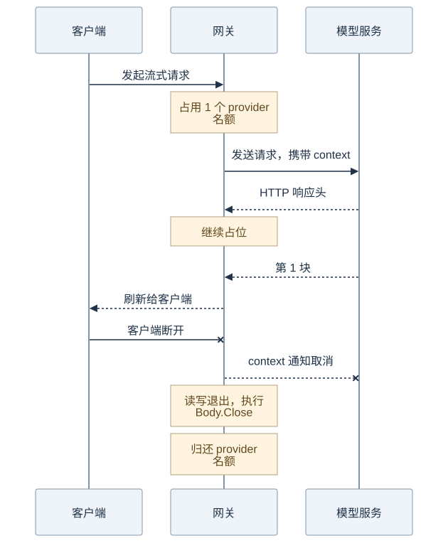

# 03：高并发的重点是资源预算

Go HTTP server 会为请求提供并发执行环境。再写 `go func()` 不等于更快；如果每个请求都会占住供应商一分钟，无限制接收只会使内存、连接和供应商配额耗尽。

假设稳定到达速率是每秒 20 次，平均调用时间 60 秒，那么平均在途请求约为 `20 × 60 = 1200`。这解释了 LLM 网关为什么与几十毫秒的普通接口不同。并发数不是 QPS，更不是打开的 TCP 连接数（HTTP/2 可以多路复用）。

## 先看图：并发名额像座位，坐着等待也占位置

下面只看并发层，假设只有一个可用端点、容量为 3。数字用于说明规则，不是默认配置。



[查看 Mermaid 源图](diagrams/03-slots.mmd)

A 正在输出，B 和 C 正在等下一块数据，三个都还没有结束，因此都占名额。D 会收到 503；它没有被偷偷放进内存队列。A 结束后，D 或其他客户端需要**重新发请求**，才可能抢到空位。

这也解释了为什么“模型正在等待、不怎么占 CPU”仍然可能让网关满载：连接、缓冲区和供应商并发额度依然被占用。

## 三层容量

1. HTTP 入口在读取 body 前限制同时处理的请求数，防止并发上传占用无限缓冲。容量为流式配额 + 一次性配额 + 32 个任务接口余量。
2. 前台 SSE 和一次性调用分别有容量，默认各 64；后台固定 4 个 worker。满载返回 503 和 Retry-After，而不是在内存排无界队列。
3. 每个供应商实例有共享容量，覆盖它的全部模型和所有前后台调用。槽位从发送请求前占用，到响应体读取完成或关闭才归还。

这些上限限制应用中的昂贵工作，并不限制操作系统接受的全部连接。公网抗大量慢连接仍要由反向代理/连接限制承担。入口分池也不代表供应商公平分配：后台和前台共用端点容量，长期满载可能让某类工作得不到服务；生产可进一步增加保留配额或公平队列。

`Gateway.acquire` 用一把短锁同时完成“选择最少占用端点”和“计数 +1”。若先解锁再加一，两个请求可能同时看见最后一个空位，造成超卖。锁不覆盖 HTTP I/O、body 读取或数据库操作。

## 一条长流的名额什么时候归还？



[查看 Mermaid 源图](diagrams/03-lifetime.mmd)

从上向下读：收到 HTTP 200 只代表响应开始，收到第 1 块也不代表答案结束。客户端断开后，取消信号传到上游 HTTP 调用；读写退出，收尾代码再归还名额。正常收到完整结束事件也会执行同样的收尾。

取消 HTTP 调用不等于撤销供应商已经做过的生成，也不保证供应商不会计费。

## 必须分开的时钟

| 时钟 | 默认值 | 解决什么 |
| --- | --- | --- |
| TCP 建连 / TLS 握手 | 各 5 秒 | 目标不可达或握手卡住 |
| 上游响应头 | 30 秒 | 已建立连接但没响应 |
| 上游单次阻塞读取 | 45 秒 | SSE 心跳/token 停止或一次性 body 卡住 |
| 单候选总时限 | 4 分钟 | 有心跳却永不结束的调用 |
| 全候选总时限 | 10 分钟 | fallback 不能无限延长请求 |
| 下游单次写入 | 15 秒 | 慢客户端导致网关写操作永久阻塞 |
| HTTP 请求 body 上传 | 10 秒 | 慢速上传占位 |
| 优雅停机宽限 | 5 秒 | 长流不能让部署无限等待 |

`idleBody.Read` 为当前阻塞读取设计时器，超时取消 HTTP context，从而让底层 Read 退出；不是只向用户返回“超时”，却把真正的网络工作丢在后台。单次 Read 返回就停止计时器。

上游读取被下游背压暂停时，不计算上游读取空闲，因为此时网关没有尝试读。下游写由自己的截止时间约束。这样不会为了一个慢客户端无限缓存 token。

`http.Client.Timeout` 和 `http.Server.WriteTimeout` 都容易被误当成“单次网络操作超时”。完整入口不使用固定的短全响应超时，使用 context 和每次写 deadline。正常流持续有数据时也必须遵守单候选/总调用预算，可通过 CLI 参数调整。

## 客户端读得很慢时，网关会怎样？



[查看 Mermaid 源图](diagrams/03-backpressure.mmd)

例如上游每秒发 10 块，客户端每秒只能接收 1 块。网关不能一直把多余 9 块存起来；当前块写不出去时，就暂停继续读。系统和网络也有有限缓冲，压力最终传回上游，这叫**背压**。

反向虚线表示下游变慢会影响网关继续读取，不代表额外发起一个 HTTP 请求。等待上游数据由读取空闲时限约束，等待下游接收由写入时限约束，两种等待要分开看。

## 一张资源所有权表

| 资源 | 谁获得 | 谁释放 |
| --- | --- | --- |
| HTTP 入口 / stream / unary 名额 | handler | handler 的 defer |
| provider 名额 | Gateway.acquire | 失败尝试立即释放；流式由 Result.Body.Close 释放 |
| 上游响应体 | Provider.Open | Gateway 失败时或 Result.Body.Close |
| context 定时器 | Gateway.Do | 失败路径/一次性结束/流式 Close |
| worker goroutine | Store.Run | cancel 通知、WaitGroup 等待 |
| 数据库事务 | 短小 SQL 操作 | commit 或 rollback，绝不包住网络生成 |

`Close` 使用 `sync.Once`，防止正常 defer 与错误清理双重释放。客户端断连沿 `r.Context()` 取消上游。SSE 一旦输出，错误通过中止连接暴露给客户端；缺少完整 `[DONE]` 被视为截断，不能冒充正常成功。

## 从普通 HTTP 请求到 LLM 长流

共享客户端、响应头超时和信号停机同样适用于 LLM 网关，但普通 HTTP 请求常用的短总时限可能截断正常长流。后台任务还需要明确的容量和持久化机制。本项目使用标准库把请求 context 传至上游，并显式管理 worker 生命周期。

## 实验

```sh
go test -race -v ./internal/gateway -run 'TestConcurrent|TestCancellation|TestStreaming|TestTruncated|TestSlow'
```

先看成功，再看失败：一个请求取消后立刻重试是否能取得容量？一条长流没结束时名额是否还在？同一批 256 个调用是否突破容量 8？这些比“没有 panic”更接近真实验收。

官方语义：[net/http](https://pkg.go.dev/net/http)、[ResponseController](https://pkg.go.dev/net/http#ResponseController)、[context](https://pkg.go.dev/context)、[Go pipeline cancellation](https://go.dev/blog/pipelines)。

下一步：[第 4 步：持久化任务](04-jobs.md)。
