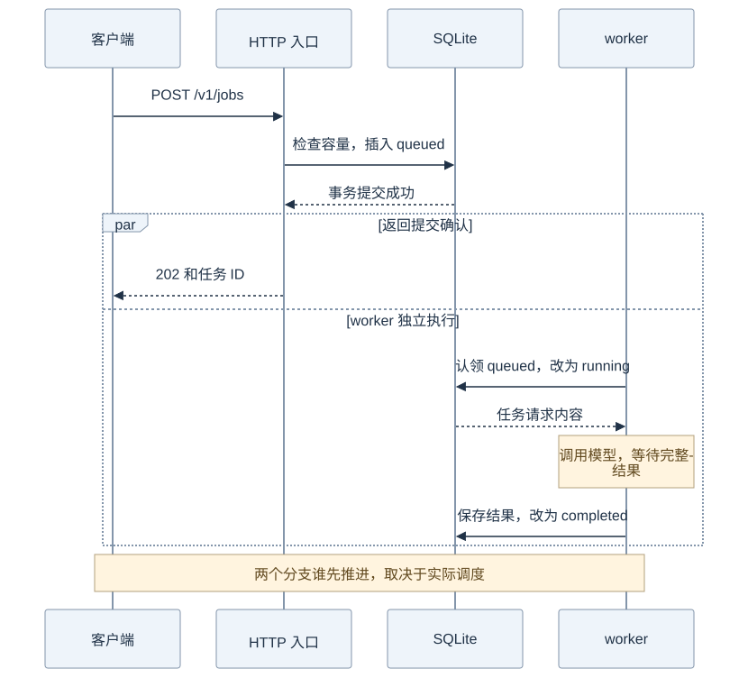

# 第 4 课：把慢请求交给后台任务

一次性聊天调用通常要等模型生成完才返回。后台任务把“收到请求”和“完成模型调用”分成两段：网关先把任务写进 SQLite，再回 `202 Accepted`；独立运行的 worker 调用上游并保存结果。客户端拿到任务 ID 后可以查询进度。

这节先看提交时到底确认了什么，再看 worker 的状态和崩溃恢复。队列适用于单个网关进程；容量和 worker 数量都有限。

## 第一步：提交成功代表已入库

提交任务时，网关先校验请求，再在 SQLite 事务中检查容量并插入 `queued` 记录。事务提交后 HTTP 才返回 `202`。worker 运行在另一段生命周期里；事务一提交，它就可能先认领并开始执行，早于客户端收到 `202`。因此 `202` 不是模型结果，也不保证任务仍停在 `queued`。

**图里提交响应与 worker 执行分开了：`202` 返回时，任务走到了哪一步？**



[查看 Mermaid 源图](diagrams/04-submit.mmd)

图中的 `par` 表示两个分支可以独立推进；画在上方的 202 响应不保证在真实运行中一定先到达。

按 `-workers 2 -queue 8` 启动后，提交一条请求，若返回 `202` 和任务 ID，就有一条任务记录已提交，最初状态为 `queued`；如果 worker 已认领，查询时可能已经是 `running`。两个 worker 表示最多两条任务同时调用上游，另外的任务可以继续排队，直到八条未完成记录的容量用满。

常见误解是把 `202` 当成“模型已完成”。它只确认请求已被接受并持久化；如果客户端没收到 `202`，可能是入库前失败，也可能是数据库已提交后响应在网络中丢失，因此不能据此断定任务没入库。请求返回后客户端断开，也不会取消已入库任务。

先按 [README 的本地演示](../README.md#不需要模型账号的本地演示) 启动三个 Mock，再在项目根目录启动网关：

```sh
go run ./cmd/gateway \
  -config config.example.json \
  -addr localhost:8080 \
  -db jobs-lab.sqlite \
  -workers 2 \
  -queue 8
```

如果配置文件中的 `api_key_env` 指向了环境变量，先在当前 shell 设置它。默认地址只监听本机。另开终端提交非流式请求；`model` 使用 `cheap`、`balanced` 或 `powerful` 逻辑档次：

```sh
curl -i http://localhost:8080/v1/jobs \
  -H 'Content-Type: application/json' \
  -d '{"model":"balanced","messages":[{"role":"user","content":"解释 Go 的 context。"}]}'
```

把响应里的 `id` 放入查询地址：

```sh
curl http://localhost:8080/v1/jobs/把任务ID放在这里
```

若设置了 `GATEWAY_TOKEN`，提交和查询都要带 `-H 'Authorization: Bearer 你的令牌'`。队列已满或任务存储不可用时返回 `503`；无效 JSON、缺少消息或 `stream:true` 会在入库前被拒绝。

## 第二步：从入队到结果处理

数据库里的 `state` 表示任务当前阶段。`completed` 的含义是上游结果已保存；它还要经过本地后处理，才会变成 `done`。

**如果网关在不同阶段退出，哪些工作会重新做？**



[查看 Mermaid 源图](diagrams/04-states.mmd)

例如任务 `job-17` 依次经历 5 个主要状态：`queued` → `running` → `completed` → `processing` → `done`。`completed` 时结果已写入 SQLite。若在 `running` 时崩溃，结果尚未保存，重启后回到 `queued`，上游调用可能再次发生；若在 `processing` 时崩溃，重启后回到 `completed`，会用已保存结果重做后处理，不再调用上游。

这里容易混淆两种恢复：`running` 可能重做上游调用，`processing` 只恢复本地后处理。执行函数返回错误会进入 `failed`；它不会自动重试。数据库操作错误则会让 `Run` 返回错误并取消其他 worker，不会伪装成某条任务的 `failed`；仍处于 `running` 或 `processing` 的任务可在下次启动时恢复。任务结果和状态都保存在 SQLite，但供应商可能已处理过一次中断前的请求，所以不能承诺 exactly-once。

## 容量与可重复的恢复实验

`-queue 8` 限制未完成任务总数：`queued`、`running`、`completed`、`processing` 都计入；`done` 和 `failed` 不计入容量，但记录不会自动删除。`-workers 2` 是固定后台 worker 数，至多两条任务同时调用上游。调高队列容量只会允许更多等待任务，不会增加执行并发。任务查询接口本身不占队列容量。

若要观察 `running` 恢复，可提交一条需要较长时间的任务，在查询到 `running` 后对网关按 `Ctrl-C`，再用相同数据库路径和参数启动。原任务会重新入队，worker 会再次调用上游。进程可能在上游已完成、结果尚未落库的窗口退出，因此恢复语义是至少一次。

保存结果后恰好在后处理期间退出的窗口很短，可运行已有测试覆盖两条恢复路径：

```sh
go test -v ./internal/jobs -run TestRecoveryRequeuesRunningAndPromotesSavedResult
```

该队列只支持单个网关进程使用一个 SQLite 文件；多个 worker 可以共享同一个进程内的 `Store`。它没有跨进程调度、分布式锁、无限重试或自动清理功能。

## 对照代码阅读

先看 [HTTP 提交与查询](../internal/gateway/http.go) 的 `submit` / `getJob`，再看 [任务存储与 worker](../internal/jobs/jobs.go) 的 `Submit`、`Run`、`saveResult`、`claimCompleted`。前者处理一次短 HTTP 请求，后者管理可能持续很久的任务。

提交请求的 context 只负责入库。任务执行使用 worker 的 context；关机时它会取消模型调用并等待 worker 退出。数据库错误会停止运行，修复后重启恢复，不应把数据库写入失败误记为任务成功。

下一步：[第 5 步：故障实验](05-labs.md)。
