# 05：故障实验与设计复盘

以下命令在 `go-llm-gateway` 目录执行。每次故障实验结束后恢复对应终端，避免后一项实验被前一项配置干扰。

## 一张图说明：看到报错，还不算验收结束



[查看 Mermaid 源图](diagrams/05-fault-lab.mmd)

以“首块之后停住”为例：客户端收到过 HTTP 200，之后仍可能截断。除了看到错误，还要确认上游停止占用资源、网关名额归还，并且下一次正常请求可以成功。

第一次动手可以只做三个实验：**A 看数据分块到达 → C 主动断开并重试 → E 保存任务后重启。**其余实验用来补齐失败边界。每次实验都记下“预期、实际、资源是否归还”三件事。

## 实验 A：看见流式输出

按 README 启动三个 mock 和网关。用 `curl -N` 调用 `stream:true`，每隔约 300ms 看见一段数据。换成 `stream:false`，得到一个完整 JSON。两种方式使用同一档次映射和 provider 代码。

只用 `curl` 不加 `-N` 可能是客户端缓冲，不能据此判断服务是否没有刷新。自动测试 `TestStreamingFlushAndDisconnect` 在上游尚未结束时读取首块，直接证明流式能力。

## 实验 B：负载均衡与 fallback

用 `curl -i` 观察 `X-Gateway-Provider`。重复发出请求，空闲端点之间应轮转。让一个端点保留长流，再发请求，网关倾向于负载较低的端点。

停止 9090 和 9091 的模拟服务，分别重启为：

```sh
go run ./cmd/mock-provider -addr localhost:9090 -status 503
go run ./cmd/mock-provider -addr localhost:9091 -status 503
```

新的请求应选择 backup。把 503 改成 400 后，请求应直接报错，因为当前策略不对无效参数/权限错误自动换模型。不要把示例中的“主/备”理解成硬编码名称，顺序来自配置的候选组。

## 实验 C：长流取消和容量

将临时配置中的所有端点 capacity 改为 1，用 `-streams 1` 启动网关。第一个流式请求没结束时，再发一个流式请求，应立即返回 503。按 Ctrl-C 断开第一个 curl，再发请求，应恢复成功。

这与“请求返回后才扣计数”相反：并发额度描述正在占用的资源。自动测试 `TestLoadBalanceCapacityTracksWholeStream` 验证占位直至 Body.Close，`TestConcurrentCallsBoundedRaceFree` 同时发起 256 次调用，确保供应商在途数量不突破容量 8。

不要把这个测试称为吞吐量压测。256 个瞬时请求中一部分会被正常拒绝，它验证的是容量上界和竞态安全。

## 实验 D：超时与截断

把三个 mock 都加上 `-stall-after 0`，它们会先发送响应头，然后不发送任何正文。网关设置 `-idle-timeout 500ms`，用 `stream:true` 请求：每个候选在首块之前读取超时，有限次 fallback 耗尽后返回 504。只增加 `-delay` 不一定产生这个结果，因为响应头也可能一起被延后发送。

如果只把第一个 mock 改慢，其他端点正常，请求可能成功走备用，这正是需要验证的行为。

将 mock 加 `-truncate`：它会发完若干 token 后省略 `[DONE]`。客户端应看到流截断，而不是补发另一模型的完整答案。自动测试还覆盖 `[DONE]` 跨网络包、多行 data、CR/LF 换行和终止标记后的多余内容。

慢下游实验由 `TestSlowDownstreamReleasesResources` 完成：客户端拿到响应头后不再读 body，上游快速持续输出，触发 TCP 背压；网关写入超时后必须取消上游并归还容量。

## 实验 E：后台恢复

参考第四课提交一个长任务，查询到 running 后停止服务，用同一个数据库文件重新启动，任务应被恢复。将三个 mock 都加上 `-delay 10s`，一次性响应会等待 10 秒，方便观察 running。停止的是网关进程，保持模拟供应商运行。

后台任务没有使用 HTTP 提交请求的 context，所以 202 返回后继续运行。但它仍受 worker 生命周期和调用时限管理，不是失去所有者的 goroutine。

## 一组完整验收命令

```sh
go test -timeout 60s -count=1 ./...
go test -timeout 60s -race -count=1 ./...
go vet ./...
go build ./...
go test -run '^$' -bench BenchmarkGatewayParallel -benchmem ./internal/gateway
```

benchmark 使用内存 provider，只衡量路由与分配的成本，不能当成真实模型服务 QPS。真实压测应报告流持续时间、首 token 延迟、并发拒绝率、内存、连接数和上下游速率，并计入模型费用。

## 按调用链复盘设计

1. **抽象**：客户端指定档次，配置映射真实模型；provider 只负责协议，路由只负责选择。
2. **调用链**：handler → 容量检查 → 路由 → 供应商 → JSON 或 SSE → Close。
3. **长流**：生命周期覆盖整个 body；逐块读取/刷新，不全量缓冲；背压连接上下游。
4. **失败**：区分连接、响应头、空闲读取、单候选、整体、下游写超时；context 取消真正停止 I/O。
5. **fallback**：有限尝试、显式候选、输出之前切换；开始输出之后中止而不拼接答案。
6. **异步**：先入库后 202，固定 worker，结果先保存再处理；重启能恢复，但可能重复生成和计费。
7. **取舍**：单进程 SQLite 简单可验证；多副本需要租约/分布式配额；真实公平性、幂等提交、熔断与监控是下一步。

结合对应测试，记录它制造的故障、检查的可观察结果，以及各段实现如何保证预期行为。

## 自己实现的下一批练习

- 增加提交幂等键，使 HTTP 重试不会创建重复任务；先定义同一键但不同 payload 如何处理。
- 增加供应商 429 冷却和熔断，防止并发请求一起 fallback 放大负载；定义恢复探测与总预算。
- 为前台/后台设置供应商保留配额，避免一类工作长期挤占另一类。
- 将后处理换成真正业务操作，使用 outbox 和消费者幂等，解释为什么数据库写入和外部调用不能简单组成单个原子事务。
- 若需要自然语言自动选择模型档次，可以引入语义分类并评估误判；错误/超时应回到明确的默认档次，不能成为所有请求的单点故障。

下一步：[第 6 步：Mock 与 pprof 压测](06-pprof.md)。
