# 第 6 步：Mock LLM、压力测试与 pprof

压测工具负责产生负载，pprof 负责解释网关把 CPU、内存、goroutine 和锁耗在哪里。不能用 pprof 的 CPU 样本数代替请求吞吐，也不能把模型生成等待算成网关计算时间。

## 先分清：谁发请求，谁被测量？



[查看 Mermaid 源图](diagrams/06-profile-lab.mmd)

沿实线看业务流量：`loadtest` 扮演很多客户端，Mock 扮演会等待、分块或报错的模型。沿虚线看诊断：pprof 采集的是**网关进程**，不是把 Mock 的模拟等待和客户端统计也一起算成网关开销。

先问“用户是否拿到了完整结果、用了多久”，看压测报告；再问“网关的 CPU、内存和协程在做什么”，看 pprof。两者回答的问题不同。

## 直接复现

安装 Go 后，在项目根目录运行：

```sh
bash scripts/stress.sh
```

脚本自动构建并启动两个 Mock LLM、一个网关，以及独立的压测客户端。全部调用留在本机，数据库是每个场景新建的实验文件；完成后关闭自己的子进程。默认显式使用 IPv4 回环地址 `127.0.0.1`（可用 `STRESS_HOST=localhost` 对比 IPv6 解析路径），业务端口 18080、pprof 16060、Mock 19090/19091，与默认业务端口 8080 分开。

可以用 `SCENARIOS="overload cancel jobs"` 只运行选定场景；输出目录仍须是新目录。

若端口已被占用，脚本会报错，不会停止已有进程。可以使用 `GW_PORT`、`DEBUG_PORT`、`MOCK_A_PORT`、`MOCK_B_PORT` 修改端口。输出默认位于 `artifacts/stress-日期时间`，可用 `OUT` 指定新目录。脚本拒绝复用已有输出目录，避免旧数据库干扰复测。

如果需要指定 Go 工具链，可通过 `GO` 环境变量设置其可执行文件路径；默认使用 PATH 中的 `go`。

## 本次负载模型

| 场景 | 并发客户端 | Mock 行为 | 观察点 |
| --- | ---: | --- | --- |
| unary | 64 | 等待 20ms 后完整 JSON | 完成吞吐、延迟、分配 |
| long-stream | 64 | 100 块 × 100ms，约 10 秒流 | 首块延迟、长连接资源、排空后恢复 |
| overload | 192 | 相同长流，网关流式上限 64 | 是否拒绝过量工作、在途是否有界 |
| cancel | 16 | 收到首块就取消，暂停 20ms 后下一次，剩余 99 块不用再生成 | 上游取消、槽位回收 |
| fallback | 16 | A 每三次调用失败一次，B 正常且有备用容量 | 故障是否转向其他候选 |
| jobs | 32 | 一次性等待 40ms；16 worker、容量 256 | 202 接受率与真正 done 完成率分开 |
| timeout | 16 | 首块后停住，网关 3 秒 idle timeout | 截断被识别、超时后 active 归零 |

设置 `FALLBACK_CONCURRENCY=64` 可以进一步观察满载时备用容量不足的情况；fallback 不能凭空增加后端容量，上游 503 在耗尽候选后继续返回 503。

每个场景调度新请求 12 秒，已经开始的请求允许完成。长流场景的总用时可能超过 12 秒，完成 RPS 必须使用实际观测时长。异步场景停止提交后仍等待已接受任务，不能只测提交接口。

这是固定数量客户端的闭环压测：一个调用完成后再发下一个。HTTP 错误或主动取消后暂停 20ms，避免把无成本的 503 重试风暴当成很高的业务吞吐。它不是恒定到达速率的开环压测，也不能完整展示生产排队延迟。

## 单独启动并手工观察

```sh
go run ./cmd/mock-provider -addr localhost:9090 -chunks 100 -delay 100ms -chunk-bytes 64
go run ./cmd/gateway -config config.example.json -pprof localhost:6060
go run ./cmd/loadtest -url http://localhost:8080 -mode stream -duration 15s -concurrency 32 -output result.json
```

示例配置引用三个 Mock 端点，完整手工运行仍需按 README 启动另外两个，或者复制配置只保留一个端点并同步修改全部档次路由。

pprof 默认关闭。`-pprof` 只接受本机地址，使用独立 mux 和端口；业务 API 不暴露这些调试端点。启用后同时采样 block 和 mutex，会有额外观测开销；采样中的 heap 快照还会触发 GC，因此本报告是带观测开销的结果，不是关闭诊断后的最高吞吐。

```sh
curl -o cpu.pb.gz 'http://localhost:6060/debug/pprof/profile?seconds=10'
curl -o heap.pb.gz 'http://localhost:6060/debug/pprof/heap?gc=1'
curl -o goroutine.pb.gz http://localhost:6060/debug/pprof/goroutine
curl -o block.pb.gz http://localhost:6060/debug/pprof/block
curl -o mutex.pb.gz http://localhost:6060/debug/pprof/mutex
go tool pprof -top cpu.pb.gz
go tool pprof -top -sample_index=inuse_space heap.pb.gz
go tool pprof -top block.pb.gz
go tool pprof -top mutex.pb.gz
```

脚本自动保存原始 `.pb.gz`、符号对应的二进制、各类 `*-top.txt` 和结果 JSON。需要交互分析时运行 `go tool pprof -http=localhost:8088 artifacts/.../bin/gateway artifacts/.../cpu.pb.gz`。图形视图可能需要 Graphviz；文本 top 不需要额外工具。

## 再看一个实际例子：排空后还有协程，是泄漏吗？



[查看 Mermaid 源图](diagrams/06-drain.mmd)

图中数字来自 [实测报告](STRESS-REPORT.md) 的同一长流场景。`active=0` 表示没有在途模型调用；此时还剩 153 个 goroutine，其中包含连接池保留的读写协程。额外等 95 秒后回到 25，才有证据区分“正常保留”与“没有退出”。

不要只凭某个数字比开始时大，就认定泄漏。这是一轮采样的结论，长期运行仍需重复比较。

## 怎么读数据

- **CPU**：flat 是函数自身执行时间，cum 包含子调用。阻塞在模型 I/O 的 goroutine 通常不消耗 CPU；CPU 很低不代表端到端延迟很低。
- **heap / inuse_space**：采样时仍在使用的堆；脚本在快照前触发 GC，使前后更可比。它不是进程 RSS。
- **allocs / alloc_space**：累计分配量，包括已经回收的对象；适合找分配热点，不能直接判断泄漏。
- **goroutine**：看阻塞栈及数量，而不是要求请求一结束就回到最初数量。共享 Transport 会保留空闲连接及读写 goroutine 90 秒；长流场景额外等待 95 秒后复查。
- **block**：累计的阻塞时间可能大于墙钟时间，因为许多 goroutine 同时等待。`select`、网络等待或 worker 等待未必是性能问题。
- **mutex**：关注热点锁及其占比，再决定是否优化。不要仅因使用 Mutex 就改成复杂无锁结构。

`/debug/stats` 给出网关每个 provider 的 active/capacity 和运行时内存统计；Mock 的 `/stats` 提供 active、peak、completed、canceled、faults。观测网关名额归零，还要交叉验证上游 active 也归零。

单轮排空恢复不能证明永久无泄漏，但可以发现没有关闭 body、定时器残留、不可取消的后台协程等明显问题。若怀疑缓慢泄漏，应重复相同场景，比较 GC 后存活对象及 goroutine 栈，而不是只比较累计分配。

## 与真实模型环境的差别

本机 Mock 没有 DNS、TLS、公网抖动、真实 token 分布、供应商限流或费用。生成时长和分块速率由参数人为控制；客户端、Mock 和网关共用一台机器，也会争用 CPU。这里得到的是可复现的本机实验结果，不是生产容量承诺。

场景选择、指标统计和状态校验均由程序执行；全部模型调用使用本地 Mock。

官方资料：[net/http/pprof](https://pkg.go.dev/net/http/pprof)、[runtime/pprof](https://pkg.go.dev/runtime/pprof)、[Go profiling tutorial](https://go.dev/blog/pprof)。

下一步：[第 7 步：请求速率限流](07-rate-limiting.md)。第 6 步原始压测关闭请求速率限制；并发与队列容量限制仍然开启。
