# 第 7 步：用令牌桶控制新请求速率

前面的并发限制控制“现在有多少请求还没结束”；这一课控制“单位时间内有多少新请求可以进入”。网关用一个令牌桶快速放行或拒绝请求，不会让请求排队等待令牌。

## 先看令牌怎样补充和消耗

**设置 `rate=2`、`burst=3` 时，启动后前三个请求和第四个请求会怎样？**



[查看 Mermaid 源图](diagrams/07-bucket.mmd)

桶刚启动时有 3 个令牌，前三个同时到达的请求各消耗 1 个并放行；同一时刻到来的第 4 个请求因桶空返回 `429`。`rate=2` 表示每秒补 2 个，经过 `0.5` 秒补足 1 个，第 5 个请求可以消耗它并放行。若立刻重试，响应中的 `Retry-After` 是整数秒建议；实际值向上取整，且多人共用桶时，等待到期不保证一定抢到令牌。

补充是惰性的：每次新请求到达时，程序根据距上次检查的时间计算令牌数，并将结果封顶在 3。它不启动定时 goroutine，也不在请求中睡眠等待。每个已放行请求扣掉的令牌都不会因请求完成、参数错误、队列已满或上游失败而退回；这里的“令牌”是请求通行额度，不是 LLM 输入/输出 token，也不是费用额度。

## 开启限流

在 `go-llm-gateway` 目录运行：

```sh
go run ./cmd/gateway -config config.example.json -rate 2 -burst 3
```

`-rate` 是每秒补充量，可以是小数；`-burst` 是桶容量，必须为正整数。两者必须同时设置，或都设为 `0` 关闭限流。允许范围分别是 `0.001`～`1000000` 个/秒和 `1`～`1000000` 个。令牌桶允许启动时突发 3 个，所以它不是“每个自然秒最多 2 次”的固定窗口计数器。

**请求还要经过哪些检查？哪些 `503` 与 `429` 不同？**



[查看 Mermaid 源图](diagrams/07-gates.mmd)

图从认证通过后开始；认证失败会更早返回 401。带有效认证的 `POST /v1/chat/completions` 和 `POST /v1/jobs` 才扣这个全局令牌桶中的令牌。以 `GET /healthz` 或 `GET /v1/jobs/{id}` 为例，即使令牌桶已经空了，它们仍可跳过速率桶；但如果设置了 `GATEWAY_TOKEN`，仍须认证，而且仍可能碰到 HTTP 入口的并发容量限制。聊天接口还会检查 unary/stream 并发名额，任务提交还可能遇到未完成队列容量限制。比如 `rate=2, burst=3` 的桶已空时，第 4 个有效 POST 得到入口 `429`，此时一个 `GET /healthz` 不扣令牌；若网关并发容量也耗尽，GET 仍可能收到网关 `503`。

常见误解是把所有 `429`/`503` 都当成同一层的限流。入口桶没令牌会返回入口 `429`；网关并发名额、HTTP 入口容量或任务队列容量不足会返回网关 `503`。上游的 `429` 和 `503` 会触发有限 fallback；若候选用尽后仍是这类错误，最终上游状态也可能透传。应结合错误消息判断来源。`429`/`503` 都可能包含 `Retry-After`，它只提供重试建议。

## 速率与并发各管一件事

| 控制 | 计量对象 | 超限结果 |
| --- | --- | --- |
| 令牌桶 | 新的聊天或任务提交请求 | `429`，带 `Retry-After` |
| 并发名额 | 尚未结束的 HTTP/上游调用 | 网关容量不足时 `503` |
| 后台任务容量 | 已入库、尚未 `done` 或 `failed` 的任务 | 队列满时 `503` |

例如一个 `rate=2` 的桶每秒最多新增约两个可放行机会，但如果每条模型请求持续 30 秒，稳定流量下同时在途请求仍可能累积到约 60 条。反过来，两个并发名额在请求快速结束时，一秒内也可能接待很多请求。因此速率限制不能替代并发限制。

入口令牌按请求计一次：流式回复不会每个 SSE 分块都扣令牌；一次请求里的 fallback 不会再次扣入口令牌，但可能产生多个上游调用。已接受的后台任务由 worker 执行，重启恢复也不会重新通过 HTTP 入口桶；这个限流器不限制后台处理速率或供应商实际 QPS。

## 本地观察

先按 README 启动本地 Mock，再用上面的参数启动网关。图里的“四个请求”假设几乎同时到达；如果逐条等待 curl 返回再发下一条，等待期间可能已经补充了令牌，不一定看到 429。建议使用下方 `-concurrency 8` 的压测命令同时产生请求，观察状态码分布。通过速率桶也不等于模型调用成功，之后仍可能遇到容量或上游错误。

下面的单次请求用于查看响应格式；若此时仍有令牌，它会正常通过。若启用了认证，请添加 `-H 'Authorization: Bearer 你的令牌'`：

```sh
curl -i http://localhost:8080/v1/chat/completions \
  -H 'Content-Type: application/json' \
  -d '{"model":"economy","messages":[{"role":"user","content":"hello"}]}'
```

也可以用已有压测客户端快速观察状态码分布：

```sh
go run ./cmd/loadtest -url http://localhost:8080 -mode unary \
  -duration 3s -concurrency 8 -output rate-limit.json
```

报告里的 `http_status_counts` 可区分 `429` 与 `503`。默认 `-rate 0 -burst 0` 关闭桶；限流是单进程全局共享，没有按用户/API key 分桶，也不是多副本统一配额。

## 对照代码与自动验证

[ratelimit.go](../internal/gateway/ratelimit.go) 中的 `Allow` 对应第一张图的判断；[http.go](../internal/gateway/http.go) 中的 `API.Handler` 对应第二张图的两道门。锁只包住补充、检查与扣除令牌，不会拿着锁等模型回复。

```sh
go test -race -v ./internal/gateway -run TestRateLimit
```

测试用受控时间精确验证“0.5 秒补出一个令牌”，并验证 512 个并发请求只拿到配置的 37 个突发令牌。还会检查任务查询不扣额度、fallback 只扣一次，以及已开始的流不被新请求的 429 打断。

第 6 步的压测默认关闭速率桶；本步没有消除其报告中已记录的高频取消连接异常。
